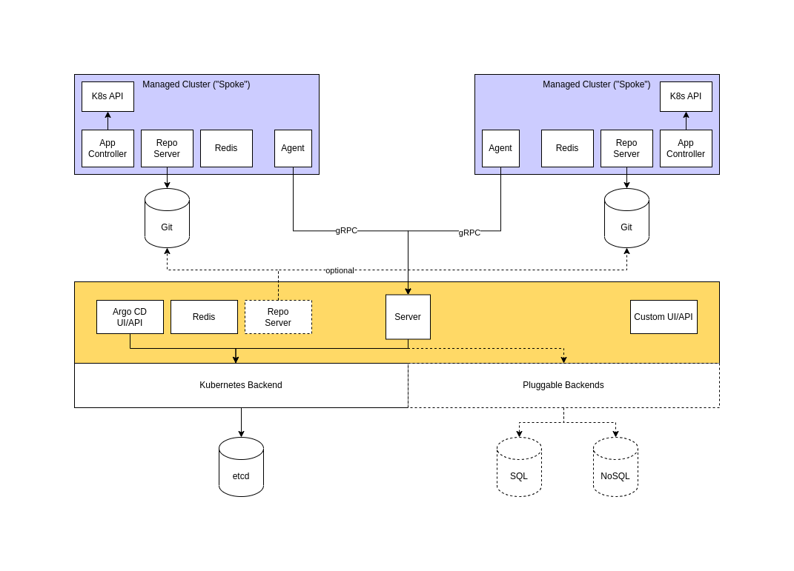

# argocd-agent

`argocd-agent` implements a hub/spoke architecture with a central control plane for the popular GitOps tool
[Argo CD](https://github.com/argoproj/argo-cd). It allows to scale out Argo CD in many-cluster scenarios by moving compute intensive parts of Argo CD (application controller, repository server) to the managed clusters, while keeping the control and observe components (API and UI) in a central location.

Some might refer to this architecture as the "pull model" with a "single pane of glass".

## Status and current limitations

**Important notice:** The `argocd-agent` project has just been born and is far from ready for general consumption. We decided to make the code available as early as possible to attract potential collaborators and contributors along the way, and to get input from the community as the project progresses.

You can check the
[roadmap](ROADMAP.md)
for things that we plan to work in the future.

Going forward, things *will* change dramatically. Do not use unless you can cope with that.

As of now, the following limitations apply to `argocd-agent`:

* Because `argocd-agent` makes extensive use of bidirectional streams, a HTTP/2 connection between the agents and the server is a hard requirement. None of the current RPC libaries (gRPC, connectrpc) support HTTP/1.x. If you have any forward or reverse proxies in between who do not support HTTP/2, many features of `argocd-agent` will not work.

## Quickstart

See the [quickstart guide](docs/quickstart.md) for more information.

## Compatibility

`argocd-agent` works with an out-of-the-box Argo CD. We aim to support the currently supported Argo CD versions. We also provide a
[compatibility matrix](docs/compat.md)

Binaries are available for the following CPU architectures (Linux only):

* x86-64
* amd64
* ppc64le
* s390x

## Architecture

`argocd-agent` consists of two basic components, which resemble a client/server model:

* The *control plane* aka the *principle*, which also hosts the Argo CD API server and some other requirements
* One or more *agents*

The *control plane* represents a central location that implements central management and observability, e.g. the Argo CD API and UI components. However, no reconciliation of Applications happens on the control plane.

An *agent* is deployed to each managed cluster. These clusters, however, are not connected from the control plane, like they would have been in the classical Argo CD multi-cluster setup. Instead, a subset of Argo CD (the application-controller, the applicationset-controller and the repo-server) is deployed to those servers as well. Depending on its configuration, the role of the agent is to either:

* Submit status information from the Applications on the managed cluster back to the control plane,
* Receive updates to Application configuration from the control plane
* A combination of above tasks

In all cases, it's the agent that initiates the connection to the control plane.

The following diagram displays an architecture in maximum autonomy mode:

## Design principles

The following paragraphs describe the design principles upon which `argocd-agent` is built. All enhancements and contributions should follow those principles.

### A permanent network connection is neither expected nor required

It is understood that managed clusters can be everywhere: In your black-fibre connected data centres, across different cloud providers, in a car, on a ship, wherever. Not all these locations will have a permanent, reliable and low-latency network connection.

Thus, `argocd-agent` is designed around the assumption that the connection between managed clusters (agents) and the control plane is not always available, and that it might not be possible to keep up a stable, good performing network connection between the components. However, the system will benefit from a stable network connection with low latency.

### Managed clusters are and will stay autonomous

When the agent cannot reach the control plane, the agent's cluster still is able to perform its operations in an autonomous way. Depending on the agent's mode of operation (see [Architecture](#Architecture) above), cluster admins may still be able to perform configuration (i.e. manage applications, etc) but those changes will only take effect once the agent is connected again.

There might be architectural variants where a managed cluster will be dependent upon the availability of the control plane, for example when the managed cluster uses a repository server on the control plane. However, there will always be a variant where fully autonomous managed clusters are supported.

### The initiating component is always the agent, not the control plane

Connections are established in one direction only: from the agent to the control plane. Neither the control plane nor the agents need to know exaxct details about the topology of the system, as long as the agents know which control plane to connect to. In some parts of this doucmentation, we mention something called a _bi-directional stream_. This refers to a gRPC mechanisms where both parties may randomly transmit and receive data from its peer, all while the connection is established only in one direction.

### Security

The control plane component of `argocd-agent` provides a gRPC API over HTTPS/2. The connections to the API require mutual TLS and strong authentication. The agent won't need access to the control plane's Kubernetes API, and the control plane component has limited capabilities on the cluster it is running in. 

## Operational variants

`argocd-agent` can run in two distinct modes of operation: A *managed* mode and an *autonomous* mode. Both modes cater for different types of setups, and the control plane can handle a mixed-mode scenario where some of the agents run in managed mode, and others run in autonomous mode. However, an agent can only run in either of the modes. Having some parts on the agent's system in managed, and others in autonomous mode, is not supported.

### Managed mode

In *managed mode*, the agent receives all of its configuration from the control plane. For example, if you create a new Application on the control plane, the agent will pull this Application to its local Argo CD. Any local changes to this Application will be overwritten by the primary copy on the control plane.

The agent will submit status updates for managed Applications, such as sync status and health, back to the control plane.

### Autonomous mode

In *autonomous mode*, the agent will not create or delete Applications on the agent's system. Instead, it is expected that the system runs in self-managed mode (i.e. Argo CD completely configured from Git, and all changes are made through Git). The agent will sync the state of the system to the control plane, so every CRUD operation through Argo CD on Applications will be reflected on the control plane.

## Contributing

We are grateful for all contributions to this project!

Please note that at this point in time, contributors are expected to hack. We do not have any guidelines, the build & test process is bumpy, things will change at high speed.