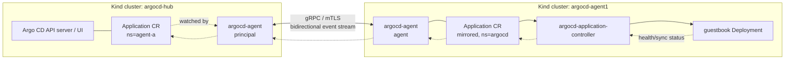
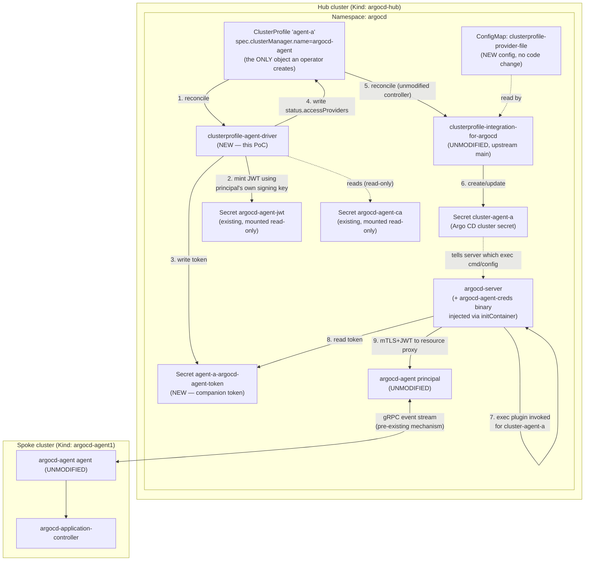
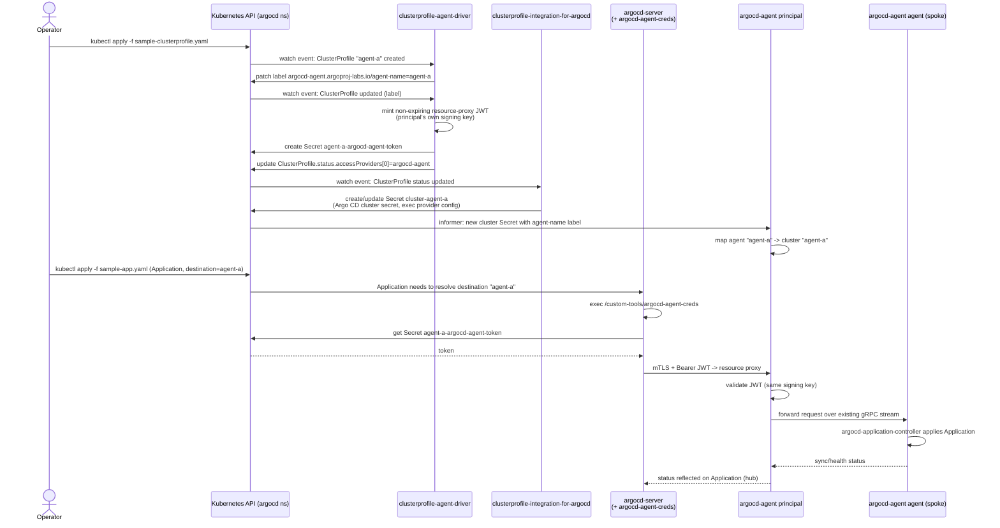

# Declarative `ClusterProfile` → `argocd-agent` Registration (PoC)

**Status:** proof-of-concept / exploratory. Not merged upstream, not
production-ready. Nothing in this directory modifies `argocd-agent`'s or
`clusterprofile-integration-for-argocd`'s existing behavior — everything here
is new, additive, optional code that a cluster operator can choose to deploy
next to the unmodified upstream components.

**Goal:** register an `argocd-agent` agent with Argo CD **entirely
declaratively**, by creating a single Kubernetes object (a
[`ClusterProfile`](https://github.com/kubernetes-sigs/cluster-inventory-api)),
instead of running `argocd-agentctl agent create` (or relying on OCM/ACM's
addon machinery, which this PoC deliberately does not use at all).

```
kubectl apply -f sample-clusterprofile.yaml
```

...is, by the end of this document, the *entire* imperative surface needed to
onboard a new agent's Argo CD cluster secret. No `argocd-agentctl agent
create`. No manually crafted `Secret`. No OCM `ManagedCluster` /
`ManagedServiceAccount` / `ClusterPermission` / addon anywhere.

---

## Table of contents

1. [Why](#1-why)
2. [Two phases of this exercise](#2-two-phases-of-this-exercise)
3. [Phase 1 — baseline argocd-agent (no ClusterProfile)](#3-phase-1--baseline-argocd-agent-no-clusterprofile)
4. [Phase 2 — the declarative design](#4-phase-2--the-declarative-design)
5. [Component-by-component walkthrough](#5-component-by-component-walkthrough)
6. [End-to-end sequence diagram](#6-end-to-end-sequence-diagram)
7. [Key design decisions](#7-key-design-decisions)
8. [What we deliberately did NOT change](#8-what-we-deliberately-did-not-change)
9. [Known issues / PoC limitations](#9-known-issues--poc-limitations)
10. [File map](#10-file-map)
11. [Reproducing this on Kind](#11-reproducing-this-on-kind)
12. [Manual verification walkthrough](#12-manual-verification-walkthrough)
    - [12.1 Proving the resource-proxy (Argo CD UI live-data) path](#121-proving-the-resource-proxy-argo-cd-ui-live-data-path-not-just-grpc-status-push)
13. [Imperative vs. declarative, side by side](#13-imperative-vs-declarative-side-by-side)

---

## 1. Why

`argocd-agent` lets one Argo CD control plane ("principal") manage
applications on many remote clusters ("agents"), without those clusters
needing inbound network access or their own Argo CD instance. Today, wiring
up a new agent means either:

- Running `argocd-agentctl agent create <name> ...`, which mints a per-agent
  mTLS client certificate and writes an Argo CD cluster `Secret` directly, or
- Letting the agent self-register on first connect (`AgentRegistrationManager`
  in the principal), which also ends by writing an Argo CD cluster `Secret`
  directly.

Both paths are **imperative**: a human or a script runs a command, or a
network event (first connection) triggers a side effect. There is no
Kubernetes object you can `kubectl apply`, GitOps, or reconcile against to
express "this agent should exist" ahead of time.

Separately, [`clusterprofile-integration-for-argocd`](https://github.com/argoproj-labs/clusterprofile-integration-for-argocd)
already knows how to turn a vendor-neutral
[`ClusterProfile`](https://github.com/kubernetes-sigs/cluster-inventory-api)
object's `status.accessProviders` into an Argo CD cluster `Secret` — that's
exactly what it does today for OCM. This PoC asks: **can the same pattern
work for `argocd-agent`, without OCM, and without changing either upstream
project?**

The answer, demonstrated end-to-end in this repo, is yes — via one small new
bridge controller.

## 2. Two phases of this exercise

Per the task's instructions, this was done in two phases:

- **Phase 1**: stand up plain `argocd-agent` (principal + agent) on two Kind
  clusters using only `argocd-agentctl`, with **no** ClusterProfile
  involved, to build a baseline understanding of how agent registration,
  application propagation, and status reflection actually work today. See
  [§3](#3-phase-1--baseline-argocd-agent-no-clusterprofile).
- **Phase 2**: tear the clusters down, rebuild from scratch, and layer the
  new declarative `ClusterProfile` integration on top — without touching
  argocd-agent's or clusterprofile-integration-for-argocd's source. See
  [§4](#4-phase-2--the-declarative-design) onward.

Both phases are captured by the same script,
[`setup-kind-poc.sh`](./setup-kind-poc.sh), which performs the Phase 2 setup
(Phase 1 was validated first, interactively, then discarded — its steps are
a strict subset of Phase 2's steps 1–7).

## 3. Phase 1 — baseline argocd-agent (no ClusterProfile)

Using the project's own
[Kind getting-started guide](../getting-started/kubernetes/kind/index.md) as
a reference, we:

1. Created two Kind clusters (podman provider): `argocd-hub` (runs Argo CD +
   the `argocd-agent` **principal**) and `argocd-agent1` (runs a thin Argo CD
   footprint + the `argocd-agent` **agent**, in **managed** mode — i.e. the
   agent runs its own `argocd-application-controller` against its own
   cluster).
2. Bootstrapped PKI (CA, principal server cert, resource-proxy server cert,
   JWT signing key, per-agent mTLS client cert) with `argocd-agentctl pki
   init` / `pki issue` / `jwt create-key`.
3. Connected the agent to the principal over a Kind `NodePort` (both clusters
   are separate Kind clusters, so the agent reaches the principal via the
   podman-network IP of the hub's control-plane container).
4. Deployed a `guestbook` `Application` on the principal in the agent's
   namespace and watched it propagate to, sync, and go `Healthy` on the
   spoke — with health/sync status reflected back to the principal's
   `Application` object.



This confirmed the mental model that everything below builds on: the
principal and agent talk over one long-lived, bidirectional gRPC stream;
`Application`/`AppProject`/`Repository`/`GPGKey` objects are mirrored between
principal and agent namespaces (spec one way, status/health the other way);
and which *cluster* an agent is allowed to write status back into is
controlled by an in-memory **agent → cluster mapping** inside the principal
(this becomes important in [§7.3](#73-the-hidden-second-label-requirement)).

Two non-obvious prerequisites we had to discover by reading logs (both are
called out again in [§12](#12-manual-verification-walkthrough) since Phase 2
hits them too):

- Managed-mode, namespaced `Application`s require the `default` `AppProject`
  to be **explicitly widened and re-synced** to the agent
  (`sourceNamespaces: ["*"]`, a wildcard `destinations` entry) — it is not
  automatically permissive.
- `Application`s must live in exactly the namespace configured via
  `principal.allowed-namespaces` on the principal's ConfigMap.

## 4. Phase 2 — the declarative design

Both Kind clusters were deleted and recreated from scratch for this phase
(per the task requirements) to prove the whole thing works from nothing.

### 4.1 The core idea

Reuse `clusterprofile-integration-for-argocd` completely unmodified. It
already:

- Watches `ClusterProfile` objects (namespace-scoped, see
  [§7.1](#71-why-a-single-watched-namespace)).
- Reads `status.accessProviders[]`, matches each entry's `name` against a
  `--clusterprofile-provider-file` (a config file describing named providers
  and, for exec-based ones, which binary to shell out to).
- Writes an Argo CD cluster `Secret` per matched `AccessProvider`, using the
  `AccessProvider.cluster` field verbatim (server URL, CA data, and any
  `client.authentication.k8s.io/exec` extension) as the `Secret`'s
  `tlsClientConfig` / `execProviderConfig`.

So all that's missing is: **something that watches `ClusterProfile` objects
and populates `status.accessProviders` with an entry that, when converted to
an Argo CD `Secret` by clusterprofile-integration-for-argocd, is a working
`argocd-agent` cluster secret** (i.e. the same shape of secret that
`argocd-agentctl agent create` or self-registration would have produced).

That "something" is the new **`clusterprofile-agent-driver`** controller,
plus a matching **`argocd-agent-creds`** exec-credential plugin (because a
static bearer token in a `Secret`, shared with the `ClusterProfile`'s own
namespace, is exactly the kind of credential material `client-go`'s exec
provider mechanism was designed to fetch dynamically instead of embedding in
plaintext).

### 4.2 Component diagram



### 4.3 What actually gets created, in order

1. **Operator action (the only one):**
   `kubectl apply -f sample-clusterprofile.yaml` — a `ClusterProfile` named
   `agent-a` in the `argocd` namespace, labeled
   `x-k8s.io/cluster-manager: argocd-agent` and
   `spec.clusterManager.name: argocd-agent`.
2. `clusterprofile-agent-driver` reconciles it:
   - Self-heals the label
     `argocd-agent.argoproj-labs.io/agent-name: agent-a` onto the
     `ClusterProfile` itself (see [§7.3](#73-the-hidden-second-label-requirement)
     for why).
   - Mints a **non-expiring** resource-proxy JWT using the *same RSA signing
     key* the `argocd-agent` principal uses
     (`internal/issuer.IssueResourceProxyToken`, issuer name
     `argocd-agent-server` to match `principal/server.go`).
   - Writes that token into a new companion `Secret`
     (`agent-a-argocd-agent-token`), in the **same namespace** as the
     `ClusterProfile`, owned by it (garbage-collected together).
   - Publishes `status.accessProviders[0]` on the `ClusterProfile`: provider
     name `argocd-agent`, `cluster.server` =
     `https://argocd-agent-resource-proxy.argocd.svc.cluster.local:9090?agentName=agent-a`,
     `cluster.certificate-authority-data` = the resource-proxy's CA, and a
     `client.authentication.k8s.io/exec` extension carrying
     `{agentName, tokenSecretName, tokenSecretNamespace, tokenSecretKey}`.
3. `clusterprofile-integration-for-argocd` (**unmodified**) reconciles the
   same `ClusterProfile`:
   - Looks up provider `argocd-agent` in its `--clusterprofile-provider-file`
     ConfigMap, finds an `execConfig` pointing at
     `/custom-tools/argocd-agent-creds`.
   - Writes `Secret cluster-agent-a` in the `argocd` namespace: a normal
     Argo CD cluster secret, `server` = the resource-proxy URL,
     `tlsClientConfig.caData` = the CA, `execProviderConfig` = the exec
     plugin command plus the `ExecExtension` payload as its `config`.
4. Whenever Argo CD's `argocd-server` (or app-controller/repo-server) needs
   to talk to cluster `agent-a`, `client-go` shells out to
   `/custom-tools/argocd-agent-creds` (**new** binary, injected via an
   `initContainer` that just `cp`'s it into an `emptyDir`, no image rebuild
   of `argocd-server` needed), passing the `ExecExtension` payload as
   `KUBERNETES_EXEC_INFO`. The plugin reads the referenced `Secret` and
   returns the token as an `ExecCredential`.
5. Argo CD presents that bearer token to the `argocd-agent` principal's
   resource proxy, which validates it exactly the way it validates any
   other resource-proxy JWT (unmodified principal code path) and proxies the
   request to the connected `agent-a` agent.

Everything from step 3 onward is 100% pre-existing, unmodified code from
both upstream projects.

## 5. Component-by-component walkthrough

| Component | New/Unmodified | Location | Purpose |
|---|---|---|---|
| `ClusterProfile` CRD | Unmodified (upstream `sigs.k8s.io/cluster-inventory-api`) | `ocm/manifests/cluster-manager/hub/crds/...` | The vendor-neutral cluster-inventory object we declare. |
| `clusterprofile-agent-driver` | **New** | [`internal/clusterprofiledriver/`](../../internal/clusterprofiledriver/), [`cmd/clusterprofile-agent-driver/`](../../cmd/clusterprofile-agent-driver/) | Bridges `ClusterProfile` → resource-proxy token + `status.accessProviders`. |
| `argocd-agent-creds` | **New** | [`cmd/argocd-agent-creds/`](../../cmd/argocd-agent-creds/) | `client-go` exec plugin; fetches the token `Secret` at credential-resolution time. |
| `clusterprofile-integration-for-argocd` | Unmodified (upstream `main`) | separate repo/checkout, referenced via `CPI_REPO` | Converts `ClusterProfile.status.accessProviders` into Argo CD cluster `Secret`s. |
| `argocd-agent` (principal + agent) | Unmodified | this repo, `principal/`, `agent/` | Existing hub-and-spoke pull-model Argo CD scaling component. |
| Provider file `ConfigMap` | New config, no code | [`manifests/clusterprofile-provider-file-cm.yaml`](./manifests/clusterprofile-provider-file-cm.yaml) | Tells the unmodified CPI controller which exec binary handles provider `argocd-agent`. |
| `argocd-server` patch | New config, no code | [`manifests/argocd-server-creds-patch.yaml`](./manifests/argocd-server-creds-patch.yaml) | `initContainer` that copies the `argocd-agent-creds` binary into `argocd-server`'s filesystem. |

### 5.1 `internal/clusterprofiledriver/types.go`

Defines the constants and the `ExecExtension` payload struct shared between
the driver (writer) and the exec plugin (reader). Also defines
`clusterAgentMappingLabel`, a **mirror** (not an import — see
[§7.3](#73-the-hidden-second-label-requirement)) of `argocd-agent`'s own
`internal/argocd/cluster.LabelKeyClusterAgentMapping` constant.

### 5.2 `internal/clusterprofiledriver/controller.go`

The reconciler. Key properties:

- **Idempotent token minting**: if the companion `Secret` already has a
  token, it's reused rather than rotated on every reconcile (the JWTs this
  driver mints never expire, so there's no rotation need — see
  [§7.2](#72-why-non-expiring-jwts)).
- **Label self-healing**: before doing anything else, ensures
  `argocd-agent.argoproj-labs.io/agent-name` is set correctly on the
  `ClusterProfile` (patches it and returns early if not; the resulting watch
  event re-triggers a full reconcile).
- **Conflict-safe status updates**: `updateAccessProvider` uses
  `retry.RetryOnConflict`, re-`Get`-ting the object on every attempt, because
  this driver's own label patch, the CPI controller's own writes, and this
  driver's status write can legitimately race on the same object.
- Sets an `ArgoCDAgentRegistered` status condition for observability.

### 5.3 `internal/clusterprofiledriver/controller.go` — RBAC & watch scope

`SetupWithManager` filters to `ClusterProfile`s whose
`spec.clusterManager.name == "argocd-agent"` only, and the binary's
`--watch-namespace` flag (wired to `cache.Options.DefaultNamespaces` in
`cmd/clusterprofile-agent-driver/main.go`) restricts the informer cache to a
single namespace, matching a `Role` (not `ClusterRole`) in
[`manifests/clusterprofile-agent-driver.yaml`](./manifests/clusterprofile-agent-driver.yaml).
This mirrors the same "one controller instance per managed namespace"
pattern discussed for `clusterprofile-integration-for-argocd` itself (see
[§7.1](#71-why-a-single-watched-namespace)) — you would run one
`clusterprofile-agent-driver` per Argo CD control-plane namespace, each
scoped to just that namespace.

### 5.4 `cmd/clusterprofile-agent-driver/main.go`

Wires up a `controller-runtime` manager: constructs an `issuer.Issuer` from
the principal's mounted signing key (`internal/issuer.WithRSAPrivateKeyFromFile`,
issuer name **must** be `"argocd-agent-server"` to match
`principal/server.go`, or minted tokens won't validate), reads the
resource-proxy CA file, and starts the `Reconciler`.

### 5.5 `cmd/argocd-agent-creds/main.go`

A `client-go`
[exec credential plugin](https://kubernetes.io/docs/reference/access-authn-authz/authentication/#client-go-credential-plugins):
reads `KUBERNETES_EXEC_INFO`, extracts the `Cluster.Config` extension (our
`ExecExtension`), fetches the referenced `Secret` using
`rest.InClusterConfig()` (i.e. `argocd-server`'s own `ServiceAccount`
credentials — no extra credential material needed), and prints an
`ExecCredential` JSON with the token on stdout. No `ExpirationTimestamp`
is set, matching the non-expiring token design.

### 5.6 `Dockerfile.clusterprofile-driver`

Multi-stage build producing a single ~40 MB Alpine image containing both new
binaries (`clusterprofile-agent-driver` as the image's entrypoint,
`argocd-agent-creds` copied out by the `argocd-server` `initContainer`).

### 5.7 `docs/clusterprofile-integration/manifests/*`

Pure Kubernetes/Helm-values YAML — RBAC, `Deployment`, `ConfigMap`s, a
strategic-merge patch for `argocd-server`, and the two sample objects
(`sample-clusterprofile.yaml`, `sample-app.yaml`) used to demonstrate the
flow.

## 6. End-to-end sequence diagram



## 7. Key design decisions

### 7.1 Why a single watched namespace

`clusterprofile-integration-for-argocd` defaults to watching only its own
namespace (`--cluster-profile-namespaces` unset ⇒ the controller's own
namespace), and only a separately-applied `cluster-rbac` Kustomize component
grants it cluster-wide read/write. Watching every namespace with one shared
controller instance reintroduces the "duplicate `ClusterProfile` for the same
logical cluster in different namespaces" problem discussed in
[kubernetes-sigs/cluster-inventory-api#75](https://github.com/kubernetes-sigs/cluster-inventory-api/issues/75):
whichever namespace's `ClusterProfile` reconciles last silently wins if two
namespaces happen to produce colliding Argo CD secret names. This PoC's
driver follows the same discipline: `--watch-namespace=argocd`, a
namespace-scoped `Role`, one controller replica per managed namespace. If you
run multiple Argo CD instances in multiple namespaces (a legitimate,
supported Argo CD multi-tenancy pattern), you'd deploy one
`clusterprofile-agent-driver` + one `clusterprofile-integration-for-argocd`
per namespace, each watching only its own.

### 7.2 Why non-expiring JWTs

`internal/issuer.IssueResourceProxyToken` (existing, unmodified) mints tokens
with no expiry. This is what makes the *"declare a `ClusterProfile` before
the agent ever connects"* pre-provisioning model tractable: there's no
rotation loop to build, no refresh-before-expiry race, no risk of an agent
being unable to authenticate because its driver-minted token expired while
nothing was watching. This mirrors exactly how `argocd-agentctl agent
create`'s own tokens behave today — we didn't invent a new token lifetime
policy, we reused the existing one.

### 7.3 The hidden second label requirement

The single hardest bug encountered in this PoC: `clusterprofile-integration-for-argocd`
happily produces a syntactically perfect Argo CD cluster `Secret` (right
server URL, right CA, right exec config) — but the **principal's own,
completely separate, pre-existing in-memory cluster-informer**
(`internal/argocd/cluster.Manager`, used for status routing and connection
tracking, and *not* the same code path CPI or Argo CD's own cluster informer
use) refuses to route anything to an agent whose Argo CD `Secret` is missing
the label `argocd-agent.argoproj-labs.io/agent-name: <agent-name>`. Without
it, the principal logs (forever, at a few times a second) `agent X is not
mapped to any cluster`, and `Application` events queued for that agent are
silently never delivered — nothing in the `ClusterProfile`,
`clusterprofile-integration-for-argocd`, or the generated `Secret` itself
looks wrong.

We could not add this label inside `clusterprofile-integration-for-argocd`
(off-limits — no source changes allowed there) or inside the Argo CD
`Secret` directly (the driver never writes that `Secret`, CPI does). The fix
that respects both constraints: **`clusterprofile-integration-for-argocd`
copies every label from the source `ClusterProfile` onto the `Secret` it
generates** (`controller.go`, `mutateSecret`, confirmed by reading its
source). So `clusterprofile-agent-driver` self-heals this label directly
onto the `ClusterProfile` object itself, and it rides along for free. The
[sample `ClusterProfile`](./manifests/sample-clusterprofile.yaml) also sets
it explicitly up front, purely to avoid one extra reconcile round-trip — the
driver would add it automatically either way.

### 7.4 Why an exec plugin instead of a static token in the Secret

Argo CD cluster `Secret`s support a static bearer token directly
(`config.bearerToken`). We used the exec-credential mechanism instead
because: (a) it's the same mechanism `clusterprofile-integration-for-argocd`
already supports for other providers (GCP, etc.), so there is zero new code
needed in the unmodified CPI controller to make this work; (b) it keeps the
actual secret **out of** the `ClusterProfile`'s `status` (which is visible
to anyone who can `get`/`watch` `ClusterProfile`s) and out of the Argo CD
`Secret` itself (visible to anyone with `Secret` read in the `argocd`
namespace) — instead, only a *pointer* to the companion token `Secret`
travels through those objects, and only `argocd-server`'s own
`ServiceAccount` (which already has broad `Secret` read access in its own
namespace) ever actually reads the token value.

### 7.5 Why a separate companion `Secret` instead of embedding the token as a `ClusterProfile` annotation/label

`ClusterProfile.status` is meant to be read broadly (it's the whole point of
the API — any consumer can inspect a cluster's access providers). Bearer
tokens should not live in `status` fields, which aren't subject to the same
RBAC granularity as `Secret`s and aren't typically treated as sensitive by
tooling that lists/exports `ClusterProfile` objects (backup tools, GitOps
diffing, `kubectl get -o yaml` in bug reports, etc.). A dedicated `Secret`,
owned by (and garbage-collected with) the `ClusterProfile`, keeps the
sensitive material where RBAC and tooling already expect it to be.

### 7.6 Why the companion `Secret` lives in the same namespace as the `ClusterProfile`

This follows directly from the broader "secrets should be co-located with
their source `ClusterProfile`" design discussed for
`clusterprofile-integration-for-argocd` itself: whichever namespace owns the
`ClusterProfile` should own everything derived from it, so a single-namespace
watch (this driver, and CPI) never needs cross-namespace RBAC, and deleting
the `ClusterProfile` cleanly deletes everything derived from it via owner
references, with no orphaned state in other namespaces.

## 8. What we deliberately did NOT change

- **No changes to `argocd-agent`'s existing packages** (`principal/`,
  `agent/`, `internal/argocd/cluster/`, `internal/issuer/`, etc.). The driver
  only *imports* `internal/issuer` as a library to mint tokens the same way
  the principal does; it never modifies that package.
- **No changes to `clusterprofile-integration-for-argocd`** — not even a
  fork. The Helm chart is installed straight from its `main` branch/repo
  checkout, driven purely by a `values.yaml` and a `ConfigMap` this PoC
  supplies.
- **No `argocd-agentctl agent create` calls, ever**, once the `ClusterProfile`
  is applied. `argocd-agentctl` is still used for the *cluster-level* PKI
  bootstrap (CA, principal cert, resource-proxy cert, JWT signing key,
  per-agent mTLS client cert) — that's transport-level trust, orthogonal to
  "which agents exist" and out of scope for what `ClusterProfile` is meant to
  express.
- **No OCM / Open Cluster Management / ACM** anywhere in Phase 2. No
  `clusteradm`, no `ManagedCluster`, no addons, no `ManagedServiceAccount`,
  no `ClusterProfileLifecycleController`-driven projection.

## 9. Known issues / PoC limitations

- **PKI is explicitly non-production** (`argocd-agentctl pki init` prints
  `NON-PROD!!` — self-signed CA, no rotation, no revocation list).
- **gRPC stream staleness under heavy setup churn.** While iterating on this
  PoC (many `kubectl`/`helm` operations against the `argocd` namespace in a
  short window, on a Kind + rootless-podman host), we repeatedly observed the
  principal's long-lived event-writer stream to an already-connected agent
  go stale (`transport is closing`, retried forever, events queued but never
  delivered) without either side's top-level connection state reporting a
  disconnect. A `kubectl rollout restart` of both the principal and the
  agent reliably clears it. `setup-kind-poc.sh` performs this restart as
  step 13, **after** all one-time setup and RBAC/patch operations are done,
  specifically to avoid hitting this. This appears to be pre-existing
  `argocd-agent` connection-handling behavior under this specific
  local/rootless-podman network environment, not something introduced by
  the `ClusterProfile` integration — we did not attempt to fix it, since
  doing so would require changing `argocd-agent`'s own source.
- **Token revocation isn't a thing yet.** Deleting the companion `Secret` or
  the `ClusterProfile` does not invalidate an already-minted JWT (it's
  stateless and non-expiring, exactly like every other resource-proxy token
  `argocd-agent` issues today) — the agent could still authenticate with a
  copy of the raw token string until the principal's signing key itself is
  rotated. This is an existing property of `IssueResourceProxyToken`, not
  something this PoC introduces.
- **One `ClusterProfile` per agent, `ClusterProfile.name == agent name`,
  enforced by convention, not validated.** A `ClusterProfile` named
  differently from the actual `argocd-agent` agent name would mint a token
  for a *fictional* agent that no real agent could ever present a matching
  mTLS client cert for; there's no admission-time check to catch a
  mismatch (mirrors how `argocd-agentctl agent create <name>` also just
  trusts the given name).
- **The resource-proxy live-data path (UI "live manifest"/"Logs"/"Events")
  needs its own RBAC on the spoke, separate from getting sync/health status
  to go green.** `argocd-agent`'s shipped `agent-clusterrole.yaml` only
  grants the agent's ServiceAccount RBAC on `namespaces` and
  `applications.argoproj.io` — not enough for `agent/resource.go`'s live
  `Get`/owner-chain-walk to succeed for arbitrary resource kinds. This PoC
  adds one additive `ClusterRoleBinding` (binding the builtin `view`
  `ClusterRole`) to close that gap without touching `argocd-agent` source;
  see §12.1 for the full failure mode and proof it's fixed.
- **No multi-agent load testing.** Verified with exactly one agent
  end-to-end; the design (namespace-scoped watch, one `Secret` per
  `ClusterProfile`) should scale the same way `clusterprofile-integration-for-argocd`
  already does for many `ClusterProfile`s in one namespace, but this wasn't
  stress-tested here.

## 10. File map

```
argocd-agent/
├── Dockerfile.clusterprofile-driver          # NEW: builds both new binaries
├── cmd/
│   ├── clusterprofile-agent-driver/main.go   # NEW: driver's main()
│   └── argocd-agent-creds/main.go            # NEW: exec plugin's main()
├── internal/
│   └── clusterprofiledriver/
│       ├── types.go                          # NEW: shared constants + ExecExtension
│       └── controller.go                     # NEW: the Reconciler
└── docs/clusterprofile-integration/
    ├── README.md                             # this file
    ├── setup-kind-poc.sh                     # full, idempotent, 14-step reproduction script
    └── manifests/
        ├── clusterprofile-agent-driver.yaml       # NEW: RBAC + Deployment for the driver
        ├── clusterprofile-provider-file-cm.yaml   # NEW: tells CPI about provider "argocd-agent"
        ├── clusterprofile-integration-values.yaml # NEW: Helm values for CPI's chart
        ├── argocd-server-creds-patch.yaml         # NEW: injects argocd-agent-creds into argocd-server
        ├── agent-resource-proxy-view-binding.yaml # NEW: additive RBAC so live views can read spoke resources
        ├── sample-clusterprofile.yaml             # NEW: the one object an operator applies
        └── sample-app.yaml                        # NEW: proves an app propagates through it
```

No file outside `docs/clusterprofile-integration/`, `cmd/clusterprofile-agent-driver/`,
`cmd/argocd-agent-creds/`, `internal/clusterprofiledriver/`, and
`Dockerfile.clusterprofile-driver` was created or modified by this PoC.

## 11. Reproducing this on Kind

**Prerequisites** (all pre-existing on the machine this was built on):
`kind`, `podman` (rootless, with the experimental podman provider enabled
for `kind`), `kubectl`, `helm`, `argocd-agentctl` (built from this repo:
`make cli`, or `go build ./cmd/ctl` — used only for cluster-level PKI
bootstrap, see [§8](#8-what-we-deliberately-did-not-change)), a checkout of
[`clusterprofile-integration-for-argocd`](https://github.com/argoproj-labs/clusterprofile-integration-for-argocd)
next to this repo (i.e. `../clusterprofile-integration-for-argocd`, or set
`CPI_REPO=/path/to/it`), and a checkout of
[`open-cluster-management-io/ocm`](https://github.com/open-cluster-management-io/ocm)
next to this repo too (only its vendored `ClusterProfile` CRD YAML is used —
`../ocm/manifests/cluster-manager/hub/crds/0000_00_multicluster.x-k8s.io_clusterprofiles.crd.yaml`
— no OCM component is ever deployed).

Build the two local images this script loads into Kind (built once, from the
repo root):

```bash
go build ./...   # sanity check
podman build -t localhost/argocd-agent:dev -f Dockerfile .
podman build -t localhost/argocd-agent-clusterprofile-driver:dev -f Dockerfile.clusterprofile-driver .
```

You also need `localhost/clusterprofile-integration-for-argocd:dev` built
from that project's own `Dockerfile` in its own checkout (`main` branch).

Then, from this repo:

```bash
./docs/clusterprofile-integration/setup-kind-poc.sh 2>&1 | tee /tmp/setup-kind-poc.log
```

The script is safe to re-run (cluster creation is skipped if the named Kind
clusters already exist; every `kubectl apply`/`helm upgrade --install` is
idempotent). It performs, in order: Kind cluster creation, a rootless-podman
`iptables-nft` NodePort workaround, image loading, Argo CD + principal
install on the hub, PKI bootstrap, a `NetworkPolicy` widening (kindnet
enforces `NetworkPolicy`; the shipped policy only allows same-cluster
traffic to the principal, which breaks genuinely cross-cluster Kind-to-Kind
traffic), Argo CD (agent footprint) + agent install on the spoke, agent mTLS
bootstrap, the `ClusterProfile` CRD, the new driver, the unmodified CPI
Helm chart + provider-file `ConfigMap`, the `argocd-server` exec-plugin
patch, the `AppProject` propagation fix (see [§3](#3-phase-1--baseline-argocd-agent-no-clusterprofile)),
a principal+agent restart (see [§9](#9-known-issues--poc-limitations)), the
sample `ClusterProfile`, and finally the sample `Application`.

## 12. Manual verification walkthrough

After running the script (or at any point after it's applied the
`ClusterProfile`), the following all held true in our test run:

```bash
# 1. The driver published an AccessProvider and a companion token Secret.
kubectl --context kind-argocd-hub -n argocd get clusterprofile agent-a -o yaml
kubectl --context kind-argocd-hub -n argocd get secret agent-a-argocd-agent-token

# 2. The unmodified CPI controller turned that into a normal Argo CD cluster Secret.
kubectl --context kind-argocd-hub -n argocd get secret cluster-agent-a -o yaml
#   -> data.server decodes to
#      https://argocd-agent-resource-proxy.argocd.svc.cluster.local:9090?agentName=agent-a
#   -> data.config decodes to a tlsClientConfig.caData + an execProviderConfig
#      pointing at /custom-tools/argocd-agent-creds

# 3. The principal's own (pre-existing) cluster informer picked up the mapping.
kubectl --context kind-argocd-hub -n argocd logs deploy/argocd-agent-principal \
  | grep "Mapped cluster agent-a to agent agent-a"

# 4. The exec plugin itself fetches the right token/cert (this only proves the plugin
#    invocation + Secret lookup work; it does NOT exercise the resource-proxy round
#    trip to the spoke — see §12.1 for that).
POD=$(kubectl --context kind-argocd-hub -n argocd get pod -l app.kubernetes.io/name=argocd-server -o jsonpath='{.items[0].metadata.name}')
kubectl --context kind-argocd-hub -n argocd exec "$POD" -c argocd-server -- \
  env KUBERNETES_EXEC_INFO='{"apiVersion":"client.authentication.k8s.io/v1beta1","kind":"ExecCredential","spec":{"cluster":{"server":"https://argocd-agent-resource-proxy.argocd.svc.cluster.local:9090?agentName=agent-a","config":{"agentName":"agent-a","tokenSecretKey":"token","tokenSecretName":"agent-a-argocd-agent-token","tokenSecretNamespace":"argocd"}}}}' \
  /custom-tools/argocd-agent-creds
#   -> prints an ExecCredential JSON with the same token stored in the Secret

# 5. A real Application, targeting destination "agent-a", actually syncs and goes Healthy.
kubectl --context kind-argocd-hub -n agent-a get application guestbook
#   NAME        SYNC STATUS   HEALTH STATUS
#   guestbook   Synced        Healthy

# 6. ...and the workload is really running on the spoke cluster.
kubectl --context kind-argocd-agent1 -n guestbook get pods
#   NAME                                      READY   STATUS    RESTARTS   AGE
#   kustomize-guestbook-ui-5d6468fd55-p7wlw   1/1     Running   0          34s
```

All six checks passed in our final, from-scratch, fully-scripted run.

**Reproducibility check.** After the above was verified, both Kind clusters
were deleted (`kind delete cluster --name argocd-hub / argocd-agent1`) and
`setup-kind-poc.sh` was re-run a second time from a completely clean slate
(no local images rebuilt — only the already-built `:dev` images were
reused). The script completed all 14 steps with no errors, and all six
verification checks above passed again, byte-for-byte the same shape of
output (differing only in resource ages/timestamps and the RSA key material,
which is regenerated per PKI bootstrap). No source, manifest, or script
changes were required to reproduce the result, confirming the first run
wasn't a fluke.

## 12.1 Proving the resource-proxy (Argo CD UI live-data) path, not just gRPC status push

Everything in section 12 above (`Synced`/`Healthy`, the workload running on
the spoke) is actually served by the **agent's own local
application-controller syncing against its own local API and pushing
sync/health status to the principal over the long-lived gRPC stream** — see
§7.1/§4.1. None of that exercises the resource-proxy / `argocd-agent-creds`
/ mTLS-JWT path at all. The Argo CD UI's "3 live manifest", "Logs", and
"Events" tabs are the only things that do — they call
`GetResource`/pod-logs, which the real `argocd-server` binary serves by
shelling out to the `execConfig` command (`argocd-agent-creds`) on the
`cluster-agent-a` Secret, which dials the principal's `:9090` resource-proxy
with the mTLS cert + JWT this PoC's driver provisioned, which forwards the
request to the connected `agent-a` agent, which does a **live** read against
its own in-cluster Kubernetes API on the spoke.

We drove this directly against the real, running `argocd-server` (not a
mock), through a `kubectl port-forward`, using the same REST API the Argo CD
web UI itself calls:

```bash
kubectl --context kind-argocd-hub -n argocd port-forward svc/argocd-server 8080:443 &

ADMIN_PW=$(kubectl --context kind-argocd-hub -n argocd get secret argocd-initial-admin-secret \
  -o jsonpath='{.data.password}' | base64 -d)
TOKEN=$(curl -sk -X POST https://localhost:8080/api/v1/session -H 'Content-Type: application/json' \
  -d "{\"username\":\"admin\",\"password\":\"$ADMIN_PW\"}" | python3 -c 'import json,sys;print(json.load(sys.stdin)["token"])')

POD=$(kubectl --context kind-argocd-agent1 -n guestbook get pods -o jsonpath='{.items[0].metadata.name}')

# Live manifest — the exact call the UI's "live manifest" diff view makes.
curl -sk "https://localhost:8080/api/v1/applications/guestbook/resource?appNamespace=agent-a&namespace=guestbook&resourceName=$POD&version=v1&kind=Pod" \
  -H "Authorization: Bearer $TOKEN"

# Live logs — the exact call the UI's "Logs" tab makes.
curl -sk "https://localhost:8080/api/v1/applications/guestbook/pods/$POD/logs?appNamespace=agent-a&namespace=guestbook&container=guestbook-ui&tailLines=3&follow=false" \
  -H "Authorization: Bearer $TOKEN"
```

**First attempt failed** with `HTTP 403` /
`rpc error: code = PermissionDenied desc = error getting resource: `
(empty inner message). The mTLS+JWT handshake through the resource-proxy had
already succeeded by this point — the failure was a *second*, independent
authorization layer: `argocd-agent`'s own shipped
`install/kubernetes/agent/agent-clusterrole.yaml` grants the
`argocd-agent-agent` ServiceAccount RBAC on only `namespaces` and
`applications.argoproj.io` (see `agent/resource.go`'s `getManagedResource` /
`isResourceManaged`, which does a real `Get` as that ServiceAccount and then
walks owner references to find an Argo CD tracking annotation). That RBAC
is deliberately minimal upstream and is a deployer's responsibility to widen
for whatever the resource-proxy's live views need to read. We fixed this
**without touching any `argocd-agent` file** by adding one purely-additive
`ClusterRoleBinding` (binding the Kubernetes builtin `view` `ClusterRole` to
the existing `argocd-agent-agent` ServiceAccount) — see
`manifests/agent-resource-proxy-view-binding.yaml`, applied as part of step 7
of `setup-kind-poc.sh`.

After that fix, both calls above returned `HTTP 200` with genuinely live
data (confirmed by cross-checking against `kubectl` on the spoke at the same
moment — `resourceVersion`, `podIP`, `hostIP`, and `startTime` matched
exactly, and the log lines were the Pod's actual Apache stdout):

```json
// GetResource response (truncated)
{"manifest":"{\"apiVersion\":\"v1\",\"kind\":\"Pod\", ... \"status\":{ ...
  \"phase\":\"Running\",\"podIP\":\"10.246.0.11\",\"hostIP\":\"10.89.0.23\", ... }}"}
```

```json
// pod-logs response (truncated, real Apache startup log lines from the container)
{"result":{"content":"AH00558: apache2: Could not reliably determine the server's fully qualified domain name, using 10.246.0.11. ...","podName":"kustomize-guestbook-ui-5d6468fd55-mwjht"}}
{"result":{"content":"[... ] [mpm_prefork:notice] [pid 1] AH00163: Apache/2.4.38 (Debian) PHP/7.4.33 configured -- resuming normal operations", ...}}
```

This was re-verified from a **third, completely clean, from-scratch**
`kind delete cluster` + `setup-kind-poc.sh` run (no manual patches this
time — the `ClusterRoleBinding` fix is now baked into the script), and both
calls returned `HTTP 200` with fresh live data on the first try, confirming
the fix is scripted and reproducible, not a one-off manual workaround.

**Why this matters:** this is the actual proof that the declarative
`ClusterProfile` → companion `Secret` → `argocd-agent-creds` exec plugin →
mTLS+JWT → resource-proxy → agent chain works end-to-end for *hub-initiated,
live* operations — the class of Argo CD UI feature (live manifest diff,
logs, `exec`, events) that cannot be satisfied by the gRPC-mirrored
sync/health status alone, and that a real user would notice immediately if
the `ClusterProfile` integration only "looked" wired up without actually
carrying live credentials correctly end-to-end.

## 13. Imperative vs. declarative, side by side

| | `argocd-agentctl agent create` (today) | `ClusterProfile` (this PoC) |
|---|---|---|
| How you register an agent | Run a CLI command against the principal's kubeconfig | `kubectl apply` a `ClusterProfile` object |
| Can you GitOps it? | No (imperative CLI invocation, not a reconciled object) | Yes — it's just another Kubernetes object |
| Credential material | Per-agent mTLS client cert, minted by the CLI | Non-expiring resource-proxy JWT, minted by the driver, fetched on demand via exec plugin |
| Where's the Argo CD `Secret` created | Directly, by the CLI, in the principal's namespace | By the unmodified `clusterprofile-integration-for-argocd` controller |
| Pre-provisioning (register before agent connects) | Supported | Supported (this was the assumed model throughout) |
| Vendor neutrality | argocd-agent-specific object shape | `ClusterProfile` is a generic multi-vendor API; the same object *shape* this PoC produces is structurally how OCM's `ClusterProfile`s already look to `clusterprofile-integration-for-argocd` |
| Requires OCM/ACM | No | No (this PoC proves it explicitly) |
| Code changes required upstream | N/A (existing feature) | None, in either upstream project |
