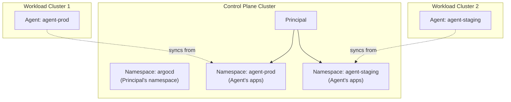
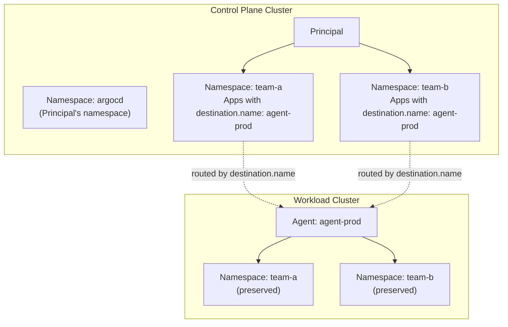

# Agent Mapping Modes

argocd-agent supports two modes for mapping applications to agents: **namespace-based mapping** (default) and **destination-based mapping**. This document explains both approaches, their trade-offs, and when to use each.

!!! important "Managed Mode Only"
    Destination-based mapping only applies to **managed agents**. Autonomous agents do not require this feature because the agent is the source of truth and controls where applications are stored locally. On the principal, autonomous apps are always stored in the `{agentName}` namespace for clear ownership.

## Overview

When an Application is created on the control plane (principal), argocd-agent needs to determine which agent should manage it. The mapping mode controls how this routing decision is made.

| Feature                  | Namespace-Based Mapping                  | Destination-Based Mapping              |
|--------------------------|------------------------------------------|----------------------------------------|
| Routing mechanism        | Application namespace                    | `spec.destination.name` on principal   |
| App namespaces per agent | Single namespace                         | Multiple namespaces                    |
| Multi-tenancy            | Limited                                  | Full support                           |
| Configuration            | Default (no config)                      | Requires flag                          |
| App namespace on agent   | Agent's namespace (typically `argocd`)   | Preserves original namespace           |
| Supported agent modes    | Managed and Autonomous                   | Managed only                           |

## Namespace-Based Mapping (Default)

In namespace-based mapping, the **namespace of the Application resource** determines which agent handles it. This is the default behavior and requires no additional configuration.

### How It Works

1. **Application Creation**: When you create an Application on the principal, place it in a namespace that matches the target agent's name.

2. **Routing**: The principal uses the Application's namespace to route events to the correct agent.

3. **Agent Processing**: The agent receives the Application and creates it in its configured namespace (typically `argocd`).

For detailed namespace configuration (access control, auto-creation, best practices), see [Namespaces Configuration](../configuration/namespaces.md).

### Example

```yaml
# Application targeting agent-managed
apiVersion: argoproj.io/v1alpha1
kind: Application
metadata:
  name: guestbook
  namespace: agent-managed  # This determines the target agent
spec:
  project: default
  source:
    repoURL: https://github.com/argoproj/argocd-example-apps
    path: guestbook
  destination:
    server: https://kubernetes.default.svc  # Ignored for routing
    namespace: guestbook
```

The diagram below shows namespace-based mapping with two agents. Each agent has a dedicated namespace on the control plane (`agent-prod`, `agent-staging`), and applications placed in those namespaces are synced to the corresponding agent.



### Limitations

1. **Single Agent Per Namespace**: Each namespace on the principal can only target one agent. You cannot have applications in the same namespace targeting different agents.

2. **Namespace Management Overhead**: Requires creating and managing a namespace for each agent on the principal cluster.

3. **Limited Multi-Tenancy**: Teams sharing an agent must either share a namespace or use separate agents.

4. **App Namespace Rewriting**: Applications are always stored in the agent's configured namespace (typically `argocd`), regardless of their original namespace on the principal.

## Destination-Based Mapping

With Destination-based mapping, the principal uses the Application's `spec.destination.name` field to determine the target agent. This enables more flexible routing and better multi-tenancy support.

### How It Works

1. **Application Creation**: Create Applications in any namespace. Set `spec.destination.name` to the target agent's name.

2. **Routing**: The principal maintains a lookup table (`appToAgent`) mapping applications to agents based on `destination.name`.

3. **Agent Processing**: The agent creates the Application in a namespace matching the original namespace from the principal (not forced to the agent's namespace).

The diagram below shows destination-based mapping where multiple namespaces (`team-a`, `team-b`) can route applications to the same agent using `spec.destination.name`. Unlike namespace-based mapping, the original namespace is preserved on the agent side.



### Configuration

Enable destination-based mapping on both the principal and agent:

**Principal:**

```bash
# Via flag
argocd-agent principal --destination-based-mapping

# Via environment variable
ARGOCD_PRINCIPAL_DESTINATION_BASED_MAPPING=true
```

**Agent:**

```bash
# Via flag
argocd-agent agent --destination-based-mapping --create-namespace

# Via environment variables
ARGOCD_AGENT_DESTINATION_BASED_MAPPING=true
ARGOCD_AGENT_CREATE_NAMESPACE=true
```

!!! note "Create Namespace"
    With destination-based mapping, the agent creates the apps in the same namespace as the principal.
    Users can manually create this namespace on the agent or use the `--create-namespace` flag to allow the agent to create namespaces automatically when applications target namespaces that don't exist.

!!! note "Allowed Namespaces"
    With destination-based mapping, applications can exist in any namespace. Both principal and agent have `--allowed-namespaces` flags to control which namespaces they will manage. The flag supports glob patterns for flexible namespace matching.

!!! note "RBAC Permissions"
    The default installation grants cluster-wide Application permissions. For tighter security, use RoleBindings per namespace instead of ClusterRoleBinding.

### Example

```yaml
# Application defined on principal targeting agent-managed via destination.name
apiVersion: argoproj.io/v1alpha1
kind: Application
metadata:
  name: guestbook
  namespace: team-alpha  # Can be any namespace
spec:
  project: default
  source:
    repoURL: https://github.com/argoproj/argocd-example-apps
    path: guestbook
  destination:
    name: agent-managed  # This determines the target agent
    namespace: guestbook
  syncPolicy:
    syncOptions:
      - CreateNamespace=true
```

### Benefits

1. **Multi-Tenancy**: Multiple teams can have applications in different namespaces all targeting the same agent.

2. **Namespace Preservation**: Applications retain their original namespace on the agent, enabling better isolation and RBAC.

3. **Flexible Organization**: Applications can be organized by team, environment, or any other criteria without coupling to agents.

4. **Apps-in-Any-Namespace**: Works seamlessly with ArgoCD's "apps-in-any-namespace" feature.

## AppProject Configuration

Destination-based mapping requires the AppProject on the agent to allow applications in any namespace:

```yaml
apiVersion: argoproj.io/v1alpha1
kind: AppProject
metadata:
  name: default
  namespace: argocd
spec:
  sourceNamespaces:
    - <namespaces>  # Required for destination-based mapping
  # ... other configuration
```

Unlike the namespace-based mapping where the `sourceNamespaces` field is removed, the `sourceNamespaces` field on AppProject is preserved when using destination-based mapping.

## Migration Guide

### From Namespace-Based to Destination-Based

!!! warning "Breaking Change"
    Switching mapping modes changes how applications are routed and stored. Plan for a maintenance window and test thoroughly in a non-production environment first.

#### What Happens During Migration

When migrating, be aware of these changes:

| Aspect | Before (Namespace-Based) | After (Destination-Based) |
|--------|-------------------------|--------------------------|
| App location on agent | `argocd/app-name` | `original-namespace/app-name` |
| Routing key | `app.metadata.namespace` | `app.spec.destination.name` |
| Redis key namespace | Agent name (e.g., `agent-managed_app`) | App namespace (e.g., `team-alpha_app`) |

#### Migration Issues to Expect

1. **Duplicate Applications**: Existing apps in `argocd` namespace on the agent will be orphaned. New copies will be created in the original namespace.

2. **Redis Cache Misses**: Key format changes will cause cache misses until ArgoCD refreshes.

3. **Namespace Creation**: Target namespaces may not exist on the agent cluster.

#### Recommended Migration Steps

1. **Backup**: Export all Application manifests.

2. **Update AppProjects**: Ensure `sourceNamespaces` includes all namespaces where apps will be created (or set to `["*"]`).

3. **Update ALL Applications FIRST**: Add `spec.destination.name` to every application:
   ```yaml
   spec:
     destination:
       name: agent-managed  # Must match agent name
       namespace: my-app-namespace
   ```

4. **Delete apps from agent** (optional but recommended): This ensures clean recreation in new namespaces.

5. **Enable on Principal**: Add `--destination-based-mapping` flag and restart.

6. **Enable on Agent**: Add `--destination-based-mapping` and `--create-namespace` flags and restart.

7. **Verify**: Check apps appear in correct namespaces on the agent.

8. **Cleanup**: Delete orphaned apps from `argocd` namespace on agent if step 4 was skipped.

## Choosing the Right Mode

### Use Namespace-Based Mapping When:

- You have a simple setup with one application namespace per agent
- You don't need multi-tenant isolation
- You want the simplest possible configuration
- Backward compatibility with existing deployments is required

### Use Destination-Based Mapping When:

- You are using **managed agents** (not autonomous)
- Multiple teams share agents but need namespace isolation
- You want applications organized by team/project rather than by agent
- You need the apps-in-any-namespace feature
- You're setting up a new deployment with multi-tenancy requirements

## Troubleshooting

### Application Not Appearing on Agent

1. **Namespace-Based**: Verify the Application namespace matches the agent name exactly.

2. **Destination-Based**: Verify `spec.destination.name` matches the agent name and both principal and agent have destination-based mapping enabled.

### Redis Cache Misses

If you see "error getting cached app managed resources" in the ArgoCD UI:

1. **Check Mapping Mode Consistency**: Ensure both principal and agent use the same mapping mode.

### Application Stuck in Wrong Namespace

If applications appear in the agent's namespace (e.g., `argocd`) when they should be in a custom namespace:

1. Verify destination-based mapping is enabled on the agent.
2. Check that the agent was restarted after configuration change.
3. Verify if the application namespace exists on the managed cluster.

## Related Documentation

- [Agent Modes (Managed vs Autonomous)](./agent-modes/index.md)
- [Namespaces Configuration](../configuration/namespaces.md)
- [Architecture Overview](./architecture.md)
