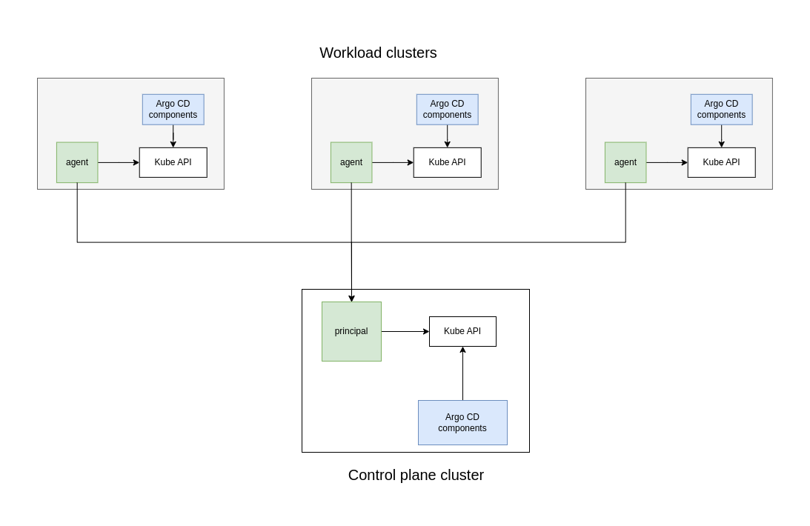

# Architectural overview

This section of the documentation gives a broad overview about *argocd-agent*'s architecture, the terminology used and how things will fit together. In order to get started, and to understand the functionality and limitations of *argocd-agent*, it is important to get familiar with the architecture and the components that make up the project.

## Problem statement

In the classical Argo CD multi-cluster architecture, scaling out can become a tedious and difficult task. Usually, scaling out comes with a couple of generic challenges, as well as environment specific ones.

The main challenges with traditional multi-cluster Argo CD deployments include:

**Resource consumption grows exponentially**: As the number of managed clusters increases, the central Argo CD instance must maintain persistent connections, cache cluster resources, and perform continuous resource watching for every cluster. This leads to significant memory consumption, CPU utilization, and network bandwidth requirements that scale poorly.

**Complex connection management**: Each workload cluster requires dedicated network ingress configuration, authentication credentials, and firewall rules from the central Argo CD instance. Managing hundreds or thousands of these connections becomes operationally complex and error-prone.

**Single point of failure**: The central Argo CD instance becomes a critical dependency for all workload clusters. Any maintenance, outage, or performance issues with the control plane affects GitOps operations across the entire multi-cluster environment.

**Network dependency and latency**: All GitOps operations depend on consistent, low-latency connectivity between the control plane and workload clusters. Network partitions, high latency, or bandwidth constraints can halt application deployments and synchronization across the fleet.

**Security surface area**: The control plane must store and manage credentials for every workload cluster, creating a concentrated security risk. Additionally, workload clusters must expose their Kubernetes API endpoints to the control plane, increasing the attack surface.

**Geographic and infrastructure diversity**: Managing clusters across different cloud providers, regions, edge locations, or air-gapped environments requires complex networking setups and often results in suboptimal performance due to network constraints.

## Architectural diagram

The following diagram shows a very simplified overview of *argocd-agent*'s architecture. In this particular example, there are three [workload clusters](./components-terminology.md#workload-cluster) connected to a single [control plane cluster](./components-terminology.md#control-plane-cluster). The light blue boxes are existing Argo CD components and assets, while the light green boxes are components added by *argocd-agent*.

In the context of the diagram, the term "Argo CD components" means one or more Argo CD workloads (such as, application controller, applicationset controller, repository server etc) depending on the concrete setup, and the term "configuration" means the configuration required to reconcile resources with Argo CD, e.g. `Applications`, `AppProjects` etc. What this exactly means in which scenario is described in more detail [here TODO](TODO)

As can be seen in the diagram, there is no connection between the central control plane cluster and the workload clusters except for the components of *argocd-agent*. Or in particular, a connection from the workload cluster's *agent* to the control plane's *principal* component. The reconciliation will happen local to the [workload clusters](./components-terminology.md#workload-cluster), as (at least) an Argo CD *application controller* will be running on each of them.

## Scope and function

The agent-based architecture is a major shift from that classical architecture. It outsources some of the compute requirements to the workload clusters and synchronizes configuration between the control plane cluster and the workload clusters using a component on the control plane cluster, the [principal](./components-terminology.md#principal), and an [agent](./components-terminology.md#agent) on the workload cluster.

The connection between an [agent](./components-terminology.md#agent) and the [principal](./components-terminology.md#principal) is much cheaper to establish and maintain than the connection from an *application controller* to the Kubernetes API endpoint of a remote cluster, as it does not need to watch or cache every resource on the cluster. Instead, it focuses on Argo CD configuration such as `Applications`, `AppProjects`, repository configuration and the likes. It is also much more resilient to bad/slow networks, connection drops, or high latency transmissions. And last but not least, the [control plane cluster](./components-terminology.md#control-plane-cluster) does not need to maintain credentials to any of the workload clusters anymore. Instead, the workload clusters will authenticate to the central control plane.

*argocd-agent* is not designed to nor does it intend to replace any existing functionality in Argo CD. Its scope is to change the way how Applications are being deployed in a multi-cluster scenario, especially when there are more than a couple of clusters involved. And the project intends to require as minimal changes to Argo CD as possible, using any out-of-the-box Argo CD installation as the ultimate target.

Under the hood, *argocd-agent* uses a message based protocol to establish a *bi-directional* exchange of messages. Bi-directional in this context means that both, the [principal](./components-terminology.md#principal) and the [agents](./components-terminology.md#agent) can send and receive messages simultaneously using the same connection, which is established exclusively by the agents. As of today, the underlying transport is gRPC based, but there are [plans](https://github.com/argoproj-labs/argocd-agent/issues/260) to make this extensible. The vision for this is that one could use a message bus implementation such as Kafka for the transport of messages if they wanted to.

## Design principles

The following describes the guiding design principles upon which *argocd-agent* is built. All enhancements and contributions should follow those principles.

**A permanent network connection is neither expected nor required**

It is understood that workload clusters can be everywhere: In your dark-fibre connected data centres, across different cloud providers, regions, and availability zones, in moving things such as cars, ships, or trains or wherever they are needed. Not all these locations will have a permanent, reliable and low-latency network connection.

Thus, *argocd-agent* is designed around the assumption that the connection between [workload clusters](./components-terminology.md#workload-cluster) and the [control plane cluster](./components-terminology.md#control-plane-cluster) is not always available and that it might not be possible to keep up a stable, good performing network connection between the components. The system will benefit from a stable network connection with low latency, however it will not require it to function properly.

**Workload clusters are and will stay autonomous**

When the [agent](./components-terminology.md#agent) cannot communicate with the [principal](./components-terminology.md#principal) for whatever reason, the [workload cluster](./components-terminology.md#workload-cluster) will still be able to perform its operations (i.e. reconciliation) in an autonomous way, if setup correctly. Also, depending on the agent's mode of operation, cluster admins may still be able to perform configuration tasks (i.e. create, update and delete applications) but those changes will only take effect once the agent is connected again.

There are architectural variants in which a workload cluster will be dependent upon the availability of the control plane, for example when the workload cluster uses a repository server or Redis cache on the control plane. However, there will always be a variant where fully autonomous workload clusters are supported.

**The initiating component is always the agent, not the control plane**

Connections are established in one direction only: from the agent to the control plane. Neither the control plane nor the agents need to know exact details about the topology of the system, as long as the agents know which control plane to connect to. In some parts of this documentation, we mention something called a _bi-directional stream_. This refers to a gRPC mechanisms where both parties may randomly transmit and receive data from its peer, all while the connection is established only in one direction.

**Be lightweight by default but keep extensibility in mind**

*argocd-agent* should not impose any mandatory, heavy runtime dependencies or operational patterns. The hurdle of getting started should be as low as possible. The project should stay unencumbered of requirements such as persistent storage or relational databases by default. 

We are aware that at some point in time we may hit a scaling limit, especially when it comes to etcd and the Kubernetes API. Thus, major parts such as Application backends on the principal are designed to be pluggable, so users can contribute and use different kinds of backends according to their scalability requirements and operational preferences.

