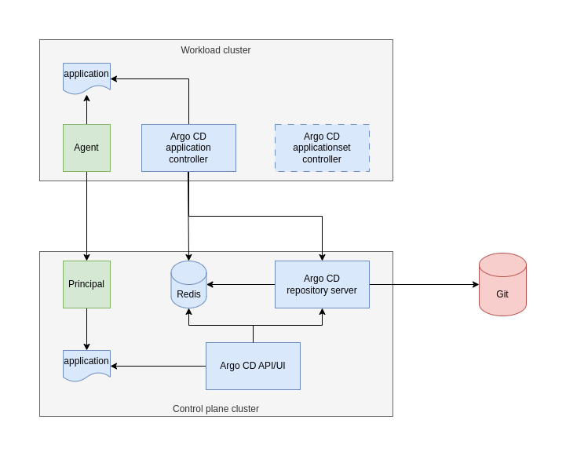
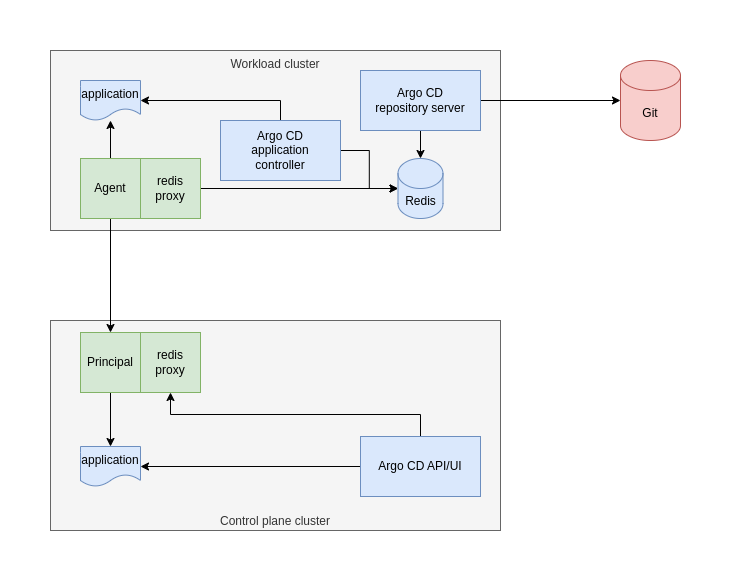

# Integration with Argo CD

## Overview

*argocd-agent* does not replace Argo CD, but instead integrates with it. There are several ways of integrating Argo CD and *argocd-agent*, each with their own pros and cons. This chapter gives an overview over the integration pattern that most people will likely want to use.

In the below diagrams,

* light green boxes are parts of *argocd-agent*
* light blue boxes are parts of Argo CD and
* light red boxes are external systems and components

Components drawn with a dotted outline indicate their location depend on the [operational mode](./agent-modes/index.md) of the agent.

!!! warning "Choosing which integration pattern to use"
    While it is possible to run agents with different operational modes connecting to the same control plane cluster, it is not (yet?) possible to have your workload clusters using different integration modes. Choosing which integration pattern to use is an architectural decision affecting the whole environment, spanning from the control plane cluster to each and every workload cluster. It will not be possible to switch between the two integration patterns without service interruption.

## Integration patterns

### Pattern 1: Lowest footprint workload clusters

This integration pattern requires some of the core components of Argo CD, specifically the *repository-server* and the *redis-server* to be shared on the control plane, while the only component on the workload clusters will be the *application-controller*.

As can be seen, the only component installed and running on the *workload cluster* is the *application-controller* (and the *applicationset-controller*, in case the agent runs in autonomous mode), and the *application-controller* is talking to a *repository-server* and a *redis-server* on the control plane cluster.

**Advantages of this scenario**

* Less compute requirements on the workload clusters, as some of the heavy lifting is done on the control plane
* Since the *repository-server* runs on the control plane cluster, the workload clusters don't need access to Git. They will only need to talk to the control plane cluster.
* Since more of the important state (such as, rendered manifests) is stored on the control plane cluster's *redis-server*, it is cheaper for the Argo CD API on the control plane cluster to actually access the state. However, it should be noted that most of the traffic to *redis-server* stems from the *application-controller* as well as the *repository-server*.

**Disadvantages of this scenario**

* The control plane cluster and its components become a single point of failure (SPoF) for the whole setup. If the workload cluster cannot reach the control plane cluster, or the components become unavailable, the *application-controller* on the workload clusters cannot render manifests anymore, or store important information in the cache. Reconciliation will stop working on the workload clusters.
* The network traffic flowing between the workload cluster and the control plane cluster increases, potentially significantly. This might become a bottleneck, or result in higher bills depending on how your traffic is charged.
* You will have to take steps for scaling of the *repository-server* and the *redis-server* workloads on the central control plane, depending on how many clusters you have, how many applications are deployed to them and how often they reconcile.
* You will have to manage additional ingress points on the central control plane, along with credentials for each 

### Pattern 2: Fully autonomous workload clusters

