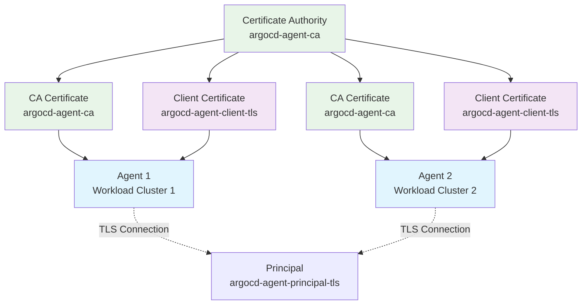

# PKI and TLS Certificates for the Agent Component

The argocd-agent agent component requires TLS certificates to establish secure connections with the principal component. This document explains the certificate requirements, how to create them using the `argocd-agentctl` CLI tool, and how to manage them manually.

## Overview

The agent component uses certificates for two primary purposes:

| Certificate/Key | Purpose | Secret Name | Required |
|----------------|---------|-------------|----------|
| **CA Certificate** | Validates the principal's server certificate | `argocd-agent-ca` | ✅ |
| **Client Certificate** | Authenticates the agent to the principal (mTLS) | `argocd-agent-client-tls` | ✅¹ |
| **Authentication Credentials** | User/password authentication (alternative to mTLS) | `argocd-agent-agent-userpass` | ✅¹ |

¹ Either client certificate (mTLS) or authentication credentials (userpass) is required, depending on the authentication method configured.

## Architecture Overview



## Authentication Methods

The agent supports two authentication methods:

### 1. UserPass Authentication (Default)

- **Agent** presents username/password credentials
- **Simpler setup** but requires credential management
- **Client certificate** still needed for TLS encryption (optional validation)

### 2. mTLS Authentication

- **Agent** presents a client certificate for authentication
- **More secure** as no passwords are transmitted
- **Certificate subject** can be validated to match agent name

## Using argocd-agentctl CLI (Recommended)

The `argocd-agentctl` CLI provides the simplest way to manage agent certificates. This approach automatically handles the PKI setup and certificate distribution.

> ⚠️ **Important**: The CLI-generated PKI is intended for **development and testing only**. For production environments, use certificates issued by your organization's PKI or a trusted Certificate Authority.

### Prerequisites

- `argocd-agentctl` binary installed and available in your PATH
- kubectl configured with access to both principal and agent clusters
- PKI already initialized on the principal cluster (see [Principal PKI documentation](../principal/pki-certificates.md))

### Step 1: Verify PKI Initialization

Ensure the PKI has been initialized on the principal:

```bash
argocd-agentctl pki inspect \
  --principal-context <control-plane-context> \
  --principal-namespace argocd
```

If not initialized, follow the [Principal PKI setup guide](../principal/pki-certificates.md#step-1-initialize-the-pki) first.

### Step 2: Create Agent Configuration

Create the agent configuration which includes generating certificates:

```bash
argocd-agentctl agent create <agent-name> \
  --principal-context <control-plane-context> \
  --principal-namespace argocd \
  --resource-proxy-server <principal-ip>:9090 \
  --resource-proxy-username <agent-name> \
  --resource-proxy-password <secure-password>
```

**What this does:**

- Generates a client certificate signed by the principal's CA
- Creates an Argo CD cluster secret with the certificate data
- Sets up credentials for resource proxy access

### Step 3: Issue Agent Client Certificate

Generate and deploy the client certificate to the agent cluster:

```bash
argocd-agentctl pki issue agent <agent-name> \
  --principal-context <control-plane-context> \
  --agent-context <workload-cluster-context> \
  --agent-namespace argocd \
  --upsert
```

**Parameters:**

- `<agent-name>`: Unique name for the agent (must be DNS-compliant)
- `--principal-context`: Kubernetes context for the principal cluster
- `--agent-context`: Kubernetes context for the workload cluster where the agent runs
- `--agent-namespace`: Namespace where the agent is deployed (default: `argocd`)
- `--upsert, -u`: Update existing certificate if it already exists

### Step 4: Propagate CA Certificate

Copy the CA certificate to the agent cluster for server certificate validation:

```bash
argocd-agentctl pki propagate \
  --principal-context <control-plane-context> \
  --agent-context <workload-cluster-context> \
  --principal-namespace argocd \
  --agent-namespace argocd
```

### Verification

Verify that the required secrets have been created on the agent cluster:

```bash
kubectl get secrets -n argocd --context <workload-cluster-context> | grep argocd-agent
```

Expected output:

```
argocd-agent-ca                           Opaque            1      5m
argocd-agent-client-tls                   kubernetes.io/tls 2      4m
```

## Manual Certificate Management

For production environments or when integrating with existing PKI infrastructure, you can manually create and manage the required certificates and secrets.

### Certificate Requirements

Agent certificates must meet the following requirements:

- **Key Type**: RSA with minimum 2048 bits (4096 bits recommended)
- **Certificate Format**: X.509 certificates in PEM format
- **Private Key Format**: PKCS#1 or PKCS#8 PEM format (unencrypted)
- **Client Certificate**: Must be signed by the same CA as the principal's certificates
- **Subject Common Name**: Should match the agent name for mTLS authentication

### Manual Setup Process

#### Step 1: Obtain CA Certificate

Get the CA certificate from the principal cluster:

```bash
# Extract CA certificate from principal cluster
kubectl get secret argocd-agent-ca -n argocd --context <control-plane-context> \
  -o jsonpath='{.data.tls\.crt}' | base64 -d > ca.crt

# Create CA secret on agent cluster
kubectl create secret generic argocd-agent-ca \
  --from-file=ca.crt=ca.crt \
  --namespace=argocd \
  --context <workload-cluster-context>
```

#### Step 2: Generate Agent Client Certificate

**Option A: Using Principal's CA (Recommended)**

If you have access to the principal's CA private key:

```bash
# Get CA private key from principal cluster (requires appropriate permissions)
kubectl get secret argocd-agent-ca -n argocd --context <control-plane-context> \
  -o jsonpath='{.data.tls\.key}' | base64 -d > ca.key

# Generate agent private key
openssl genrsa -out agent-client.key 4096

# Create certificate signing request
openssl req -new -key agent-client.key -out agent-client.csr \
  -subj "/CN=<agent-name>"

# Create certificate extensions for client authentication
cat > agent-client.ext << EOF
authorityKeyIdentifier=keyid,issuer
basicConstraints=CA:FALSE
keyUsage=keyEncipherment,dataEncipherment,digitalSignature
extendedKeyUsage=clientAuth
EOF

# Sign the certificate with the principal's CA
openssl x509 -req -in agent-client.csr -CA ca.crt -CAkey ca.key -CAcreateserial \
  -out agent-client.crt -days 365 -sha256 -extfile agent-client.ext
```

**Option B: Using Certificate Signing Request (CSR)**

If you don't have direct access to the CA private key:

```bash
# Generate agent private key
openssl genrsa -out agent-client.key 4096

# Create certificate signing request
openssl req -new -key agent-client.key -out agent-client.csr \
  -subj "/CN=<agent-name>"

# Submit CSR to your PKI team or certificate authority
# They will return the signed certificate as agent-client.crt
```

#### Step 3: Create Agent Client Certificate Secret

```bash
kubectl create secret tls argocd-agent-client-tls \
  --cert=agent-client.crt \
  --key=agent-client.key \
  --namespace=argocd \
  --context <workload-cluster-context>
```

#### Step 4: Create Authentication Credentials (UserPass Method)

If using userpass authentication, create the credentials secret:

```bash
# Create credentials file
echo "<agent-name>:<secure-password>" > userpass.creds

# Create secret
kubectl create secret generic argocd-agent-agent-userpass \
  --from-file=userpass.creds=userpass.creds \
  --namespace=argocd \
  --context <workload-cluster-context>
```

### Secret Structure Reference

#### CA Secret (`argocd-agent-ca`)

```yaml
apiVersion: v1
kind: Secret
metadata:
  name: argocd-agent-ca
  namespace: argocd
type: Opaque
data:
  ca.crt: <base64-encoded-ca-certificate>
```

#### Agent Client Certificate Secret (`argocd-agent-client-tls`)

```yaml
apiVersion: v1
kind: Secret
metadata:
  name: argocd-agent-client-tls
  namespace: argocd
type: kubernetes.io/tls
data:
  tls.crt: <base64-encoded-client-certificate>
  tls.key: <base64-encoded-client-private-key>
```

#### Authentication Credentials Secret (`argocd-agent-agent-userpass`)

```yaml
apiVersion: v1
kind: Secret
metadata:
  name: argocd-agent-agent-userpass
  namespace: argocd
type: Opaque
data:
  userpass.creds: <base64-encoded-credentials-file>
```

## Configuration Options

The agent component can be configured to load certificates from different sources:

### Environment Variables

| Variable | Description | Default |
|----------|-------------|---------|
| `ARGOCD_AGENT_TLS_ROOT_CA_SECRET_NAME` | Name of the CA secret | `argocd-agent-ca` |
| `ARGOCD_AGENT_TLS_ROOT_CA_PATH` | Path to CA certificate file | (empty) |
| `ARGOCD_AGENT_TLS_SECRET_NAME` | Name of the client certificate secret | `argocd-agent-client-tls` |
| `ARGOCD_AGENT_TLS_CLIENT_CERT_PATH` | Path to client certificate file | (empty) |
| `ARGOCD_AGENT_TLS_CLIENT_KEY_PATH` | Path to client private key file | (empty) |
| `ARGOCD_AGENT_TLS_INSECURE` | Skip TLS certificate verification | `false` |
| `ARGOCD_AGENT_CREDS` | Authentication method and credentials | (empty) |

### Command Line Flags

The agent can be configured to load certificates from files instead of secrets:

```bash
argocd-agent agent \
  --root-ca-path /path/to/ca.crt \
  --tls-client-cert /path/to/client.crt \
  --tls-client-key /path/to/client.key \
  --creds "userpass:/path/to/userpass.creds" \
  --insecure-tls=false
```

### Configuration File (ConfigMap)

Agent configuration via ConfigMap:

```yaml
apiVersion: v1
kind: ConfigMap
metadata:
  name: argocd-agent-params
  namespace: argocd
data:
  # TLS Configuration
  agent.tls.client.insecure: "false"
  agent.tls.root-ca-secret-name: "argocd-agent-ca"
  agent.tls.root-ca-path: ""
  agent.tls.secret-name: "argocd-agent-client-tls"
  agent.tls.client.cert-path: ""
  agent.tls.client.key-path: ""
  
  # Authentication
  agent.creds: "userpass:/app/config/creds/userpass.creds"
  
  # Connection
  agent.server.address: "<principal-address>"
  agent.server.port: "8443"
```

## Authentication Methods Configuration

### UserPass Authentication

Configure the agent to use username/password authentication:

```yaml
# ConfigMap
agent.creds: "userpass:/app/config/creds/userpass.creds"

# Or environment variable
ARGOCD_AGENT_CREDS: "userpass:/app/config/creds/userpass.creds"

# Or command line
argocd-agent agent --creds "userpass:/app/config/creds/userpass.creds"
```

### mTLS Authentication

Configure the agent to use client certificate authentication:

```yaml
# ConfigMap
agent.creds: "mtls:^CN=(.+)$"

# Or environment variable
ARGOCD_AGENT_CREDS: "mtls:^CN=(.+)$"

# Or command line
argocd-agent agent --creds "mtls:^CN=(.+)$"
```

The regex pattern extracts the agent ID from the certificate's Common Name.

## Security Considerations

### Production Recommendations

1. **Use Organization PKI**: Integrate with your organization's existing PKI infrastructure
2. **Certificate Rotation**: Implement automated certificate rotation before expiration
3. **Credential Security**: Store authentication credentials securely
4. **Network Security**: Use network policies to restrict agent-principal communication
5. **Monitoring**: Monitor certificate expiration and connection health

### TLS Security

**Never use insecure mode in production:**

```bash
# INSECURE - Development only
argocd-agent agent --insecure-tls=true
```

**Always validate certificates:**

```bash
# SECURE - Production
argocd-agent agent \
  --root-ca-path /path/to/ca.crt \
  --tls-client-cert /path/to/client.crt \
  --tls-client-key /path/to/client.key
```

### Authentication Security

**UserPass Authentication:**

- Use strong, unique passwords for each agent
- Rotate passwords regularly
- Store passwords in encrypted secrets

**mTLS Authentication:**

- Use separate certificates for each agent
- Implement certificate-based access control
- Monitor certificate usage and validity

## Troubleshooting

### Common Issues

#### Agent Cannot Connect to Principal

**Symptom**: Connection refused or timeout errors

**Solutions**:
```bash
# Check principal service accessibility
kubectl get svc -n argocd --context <control-plane-context> | grep principal

# Test network connectivity
kubectl run test-pod --image=busybox --context <workload-cluster-context> \
  --rm -it -- nc -zv <principal-address> <principal-port>

# Check agent configuration
kubectl get configmap argocd-agent-params -n argocd --context <workload-cluster-context> -o yaml
```

#### TLS Certificate Validation Errors

**Symptom**: "certificate signed by unknown authority" or similar TLS errors

**Solutions**:

```bash
# Verify CA certificate exists
kubectl get secret argocd-agent-ca -n argocd --context <workload-cluster-context>

# Check certificate validity
kubectl get secret argocd-agent-ca -n argocd --context <workload-cluster-context> \
  -o jsonpath='{.data.ca\.crt}' | base64 -d | openssl x509 -text -noout

# Verify certificate chain
kubectl get secret argocd-agent-client-tls -n argocd --context <workload-cluster-context> \
  -o jsonpath='{.data.tls\.crt}' | base64 -d | openssl x509 -text -noout
```

#### Authentication Failures

**Symptom**: "authentication failed" or "invalid credentials" errors

**Solutions**:

```bash
# Check authentication method configuration
kubectl logs -n argocd deployment/argocd-agent-agent --context <workload-cluster-context>

# Verify credentials secret exists
kubectl get secret argocd-agent-agent-userpass -n argocd --context <workload-cluster-context>

# Check client certificate for mTLS
kubectl get secret argocd-agent-client-tls -n argocd --context <workload-cluster-context>
```

#### Secret Not Found Errors

**Symptom**: Agent fails to start with "secret not found" errors

**Solutions**:

```bash
# List all agent-related secrets
kubectl get secrets -n argocd --context <workload-cluster-context> | grep argocd-agent

# Check secret names in configuration
kubectl get configmap argocd-agent-params -n argocd --context <workload-cluster-context> -o yaml

# Verify correct namespace
kubectl get pods -n argocd --context <workload-cluster-context>
```

### Diagnostic Commands

#### Certificate Inspection

```bash
# Check client certificate details
kubectl get secret argocd-agent-client-tls -n argocd --context <workload-cluster-context> \
  -o jsonpath='{.data.tls\.crt}' | base64 -d | openssl x509 -text -noout

# Check certificate expiration
kubectl get secret argocd-agent-client-tls -n argocd --context <workload-cluster-context> \
  -o jsonpath='{.data.tls\.crt}' | base64 -d | openssl x509 -enddate -noout

# Verify certificate is signed by expected CA
kubectl get secret argocd-agent-ca -n argocd --context <workload-cluster-context> \
  -o jsonpath='{.data.ca\.crt}' | base64 -d > ca.crt
kubectl get secret argocd-agent-client-tls -n argocd --context <workload-cluster-context> \
  -o jsonpath='{.data.tls\.crt}' | base64 -d > client.crt
openssl verify -CAfile ca.crt client.crt
```

#### Connection Testing

```bash
# Test TLS connection to principal
openssl s_client -connect <principal-address>:<principal-port> \
  -cert client.crt -key client.key -CAfile ca.crt -verify_return_error

# Check agent logs for detailed error information
kubectl logs -n argocd deployment/argocd-agent-agent --context <workload-cluster-context> -f
```

#### Agent Status

```bash
# Check agent deployment status
kubectl get deployment argocd-agent-agent -n argocd --context <workload-cluster-context>

# Check agent pod status
kubectl get pods -n argocd --context <workload-cluster-context> -l app.kubernetes.io/name=argocd-agent-agent

# View agent configuration
kubectl describe configmap argocd-agent-params -n argocd --context <workload-cluster-context>
```

## Certificate Rotation

### Using argocd-agentctl

Rotate agent certificates using the CLI:

```bash
# Rotate client certificate
argocd-agentctl pki issue agent <agent-name> \
  --principal-context <control-plane-context> \
  --agent-context <workload-cluster-context> \
  --agent-namespace argocd \
  --upsert

# Update CA certificate if needed
argocd-agentctl pki propagate \
  --principal-context <control-plane-context> \
  --agent-context <workload-cluster-context> \
  --principal-namespace argocd \
  --agent-namespace argocd
```

### Manual Rotation

1. **Generate new certificates** following the manual process above
2. **Update secrets** with new certificate data
3. **Restart agent** to load new certificates

```bash
# Update client certificate secret
kubectl create secret tls argocd-agent-client-tls \
  --cert=new-client.crt \
  --key=new-client.key \
  --namespace=argocd \
  --context <workload-cluster-context> \
  --dry-run=client -o yaml | kubectl apply -f -

# Restart agent deployment
kubectl rollout restart deployment argocd-agent-agent -n argocd --context <workload-cluster-context>
```

### Automated Rotation

For production environments, consider implementing automated certificate rotation using tools like:

- **cert-manager**: Kubernetes certificate management
- **External Secrets Operator**: Sync certificates from external systems
- **Custom controllers**: Automated rotation based on expiration dates

## Integration Examples

### cert-manager Integration

Using cert-manager to automatically manage agent certificates:

```yaml
apiVersion: cert-manager.io/v1
kind: Certificate
metadata:
  name: argocd-agent-client-tls
  namespace: argocd
spec:
  secretName: argocd-agent-client-tls
  issuerRef:
    name: argocd-agent-ca-issuer
    kind: ClusterIssuer
  commonName: <agent-name>
  usages:
    - digital signature
    - key encipherment
    - client auth
  renewBefore: 720h # 30 days
```

### External Secrets Integration

Using External Secrets Operator to sync certificates from external sources:

```yaml
apiVersion: external-secrets.io/v1beta1
kind: SecretStore
metadata:
  name: vault-backend
  namespace: argocd
spec:
  vault:
    server: "https://vault.example.com"
    path: "secret"
    version: "v2"
    auth:
      kubernetes:
        mountPath: "kubernetes"
        role: "argocd-agent"
---
apiVersion: external-secrets.io/v1beta1
kind: ExternalSecret
metadata:
  name: argocd-agent-client-tls
  namespace: argocd
spec:
  refreshInterval: 1h
  secretStoreRef:
    name: vault-backend
    kind: SecretStore
  target:
    name: argocd-agent-client-tls
    type: kubernetes.io/tls
  data:
  - secretKey: tls.crt
    remoteRef:
      key: argocd-agent/<agent-name>
      property: certificate
  - secretKey: tls.key
    remoteRef:
      key: argocd-agent/<agent-name>
      property: private_key
```

## Related Documentation

- [Principal PKI Configuration](../principal/pki-certificates.md) - PKI setup for the principal component
- [Adding New Agents](../../user-guide/adding-agents.md) - Complete agent setup guide