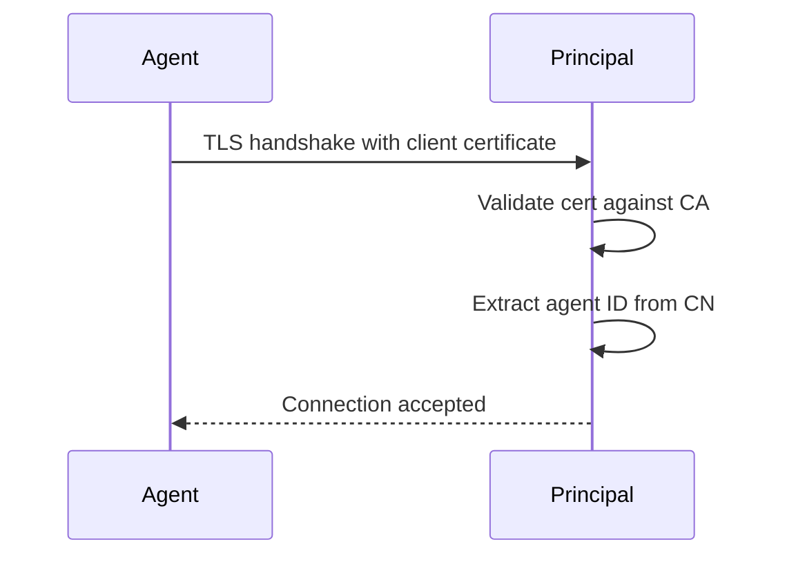
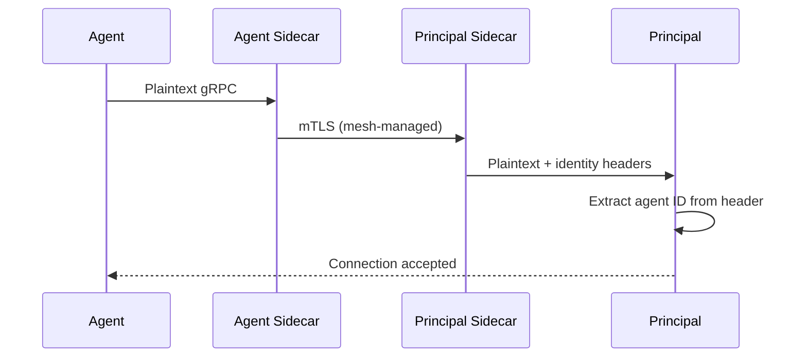

# Authentication

This document explains how to configure authentication between the agent and principal components. Authentication ensures that only authorized agents can connect to the principal and that the principal can verify agent identities.

## Authentication Methods Overview

argocd-agent supports three authentication methods:

| Method | Security Level | Use Case | Status |
|--------|---------------|----------|--------|
| **mTLS** | High | Direct agent-to-principal connections | Recommended |
| **Header-based** | High | Service mesh deployments (Istio, Linkerd) | Recommended for mesh |
| **UserPass** | Low | Development only | **Deprecated** |

## mTLS Authentication (Recommended)

Mutual TLS (mTLS) authentication uses client certificates to authenticate agents. This is the recommended method for most deployments.

### How It Works

1. The agent presents a client certificate when connecting to the principal
2. The principal validates the certificate against its CA
3. The principal extracts the agent identity from the certificate using one of:
   - **Subject DN** (default): Extract from Common Name (CN) or other subject fields
   - **URI SANs**: Extract from SPIFFE URIs in Subject Alternative Names



### Principal Configuration

Configure the principal to require and validate client certificates:

**Option 1: Extract from Subject DN (default)**

```yaml
# ConfigMap (argocd-agent-params)
principal.auth: "mtls:subject:CN=([^,]+)"
principal.tls.client-cert.require: "true"
principal.tls.client-cert.match-subject: "true"
principal.tls.server.root-ca-secret-name: "argocd-agent-ca"
```

Or via command line:

```bash
argocd-agent principal \
  --auth="mtls:CN=([^,]+)" \
  --require-client-certs=true \
  --client-cert-subject-match=true
```

**Option 2: Extract from URI SANs**

Agent identity can also be extracted from URI Subject Alternative Names (SANs) in the certificate. The regex is matched against each URI SAN until a match is found.

```yaml
# ConfigMap (argocd-agent-params)
principal.auth: "mtls:uri:spiffe://example\\.com/ns/argocd-agent/sa/(.+)"
principal.tls.client-cert.require: "true"
principal.tls.server.root-ca-secret-name: "argocd-agent-ca"
```

Or via command line:

```bash
argocd-agent principal \
  --auth="mtls:uri:spiffe://example\\.com/ns/argocd-agent/sa/(.+)" \
  --require-client-certs=true
```

**Auth Format:**

| Format | Identity Source | Example |
|--------|-----------------|---------|
| `mtls:<regex>` | Subject DN | `mtls:CN=([^,]+)` **(deprecated)** |
| `mtls:subject:<regex>` | Subject DN (explicit) | `mtls:subject:CN=([^,]+)` |
| `mtls:uri:<regex>` | URI SANs (first match) | `mtls:uri:spiffe://[^/]+/ns/[^/]+/sa/(.+)` |

**Parameter Explanation:**

- `principal.auth: "mtls:..."` - Use mTLS authentication with a regex to extract agent ID. The first capture group becomes the agent ID. For URI mode, all URIs are checked until one matches.
- `principal.tls.client-cert.require: "true"` - Require agents to present a client certificate
- `principal.tls.client-cert.match-subject: "true"` - Validate that the certificate CN matches the registered agent name (only relevant for subject-based auth)

### Agent Configuration

Configure the agent to use mTLS:

```yaml
# ConfigMap (argocd-agent-params)
agent.creds: "mtls:"
agent.tls.secret-name: "argocd-agent-client-tls"
agent.tls.root-ca-secret-name: "argocd-agent-ca"
agent.tls.client.insecure: "false"
```

Or via command line:

```bash
argocd-agent agent \
  --creds="mtls:" \
  --tls-secret-name=argocd-agent-client-tls \
  --root-ca-secret-name=argocd-agent-ca
```

### Certificate Requirements

For mTLS to work properly:

1. **Agent certificates** must be signed by the same CA configured on the principal
2. **Identity field** must contain an extractable agent ID:
   - For subject-based auth: Certificate CN (or other DN field) should match the agent's registered name
   - For URI-based auth: Certificate must include a URI SAN matching your regex pattern
3. **Certificate** must include `clientAuth` in extended key usage

**Example cert-manager Certificate for SPIFFE URI:**

```yaml
apiVersion: cert-manager.io/v1
kind: Certificate
metadata:
  name: argocd-agent
  namespace: argocd-agent
spec:
  secretName: argocd-agent-client-tls
  commonName: argocd-agent  # May be constrained by policy
  uris:
    - "spiffe://example.com/ns/argocd-agent/sa/cluster-west-1"
  usages:
    - client auth
  issuerRef:
    name: your-issuer
    kind: ClusterIssuer
```

See [TLS & Certificates](tls-certificates.md) for detailed certificate setup instructions.

## Header-Based Authentication (Service Mesh)

When running behind a service mesh like Istio or Linkerd, the mesh handles mTLS at the sidecar level. In this case, use header-based authentication to extract the agent identity from headers injected by the mesh.

### How It Works

1. The service mesh sidecar terminates mTLS
2. The mesh injects identity information into HTTP headers (e.g., `x-forwarded-client-cert`)
3. The principal extracts the agent ID from the configured header using a regex



### Principal Configuration for Istio

```yaml
# ConfigMap (argocd-agent-params)
principal.listen.host: "127.0.0.1"
principal.tls.insecure-plaintext: "true"
principal.auth: "header:x-forwarded-client-cert:^.*URI=spiffe://[^/]+/ns/[^/]+/sa/([^,;]+)"
```

Or via command line:

```bash
argocd-agent principal \
  --listen-host=127.0.0.1 \
  --insecure-plaintext=true \
  --auth="header:x-forwarded-client-cert:^.*URI=spiffe://[^/]+/ns/[^/]+/sa/([^,;]+)"
```

**Parameter Explanation:**

- `principal.listen.host: "127.0.0.1"` - Only accept connections from localhost (the sidecar)
- `principal.tls.insecure-plaintext: "true"` - Disable TLS on the principal (the sidecar handles it)
- `principal.auth: "header:..."` - Extract agent ID from the specified header using the regex

**Header Format:**

The header name and regex depend on your service mesh:

| Service Mesh | Header | Example Regex |
|--------------|--------|---------------|
| **Istio** | `x-forwarded-client-cert` | `^.*URI=spiffe://[^/]+/ns/[^/]+/sa/([^,;]+)` |
| **Linkerd** | `l5d-client-id` | `^(.+)\.serviceaccount\.identity` |
| **Custom** | Your header | Your regex (first capture group = agent ID) |

### Agent Configuration for Service Mesh

```yaml
# ConfigMap (argocd-agent-params)
agent.creds: "header:"
```

Or via command line:

```bash
argocd-agent agent --creds="header:"
```

### Security Requirements

!!! warning "Critical Security Requirements"
    When using header-based authentication with `--insecure-plaintext`:
     
    1. **Never expose the principal's plaintext port outside the service mesh**
    2. **Always bind to localhost** (`--listen-host=127.0.0.1`)
    3. **Use network policies** to restrict access to the principal pod
    4. **Verify mesh configuration** - ensure the mesh properly injects identity headers

### Valid Authentication Pairings

| Principal Config | Agent Config | Valid | Notes |
|-----------------|--------------|-------|-------|
| `--insecure-plaintext=true` + `--auth=header:...` | `--creds=header:` | Yes | Service mesh handles mTLS |
| `--insecure-plaintext=false` + `--auth=mtls:...` | `--creds=mtls:` | Yes | Direct mTLS to principal |
| `--insecure-plaintext=true` + `--auth=mtls:...` | Any | **No** | No client certs in plaintext mode |
| `--insecure-plaintext=false` + `--auth=header:...` | Any | **No** | Headers not injected without mesh |

## UserPass Authentication (Deprecated)

!!! warning "Deprecation Notice"
    The userpass authentication method is **deprecated** and not suited for use outside development environments. Use mTLS authentication for production deployments.

UserPass authentication uses username/password credentials stored in a file.

### Principal Configuration

```yaml
# ConfigMap (argocd-agent-params)
principal.auth: "userpass:/app/config/creds/userpass.creds"
```

### Agent Configuration

```yaml
# ConfigMap (argocd-agent-params)
agent.creds: "userpass:/app/config/creds/userpass.creds"
```

### Credentials File Format

```
<agent-name>:<password>
```

### Migration from UserPass to mTLS

1. Generate client certificates for all agents (see [TLS & Certificates](tls-certificates.md))
2. Deploy certificates to agent clusters
3. Update agent configuration: `agent.creds: "mtls:"`
4. Update principal configuration: `principal.auth: "mtls:CN=([^,]+)"`
5. Enable client certificate requirement: `principal.tls.client-cert.require: "true"`
6. Remove userpass secrets from all clusters

## Authentication Troubleshooting

### mTLS Authentication Failures

**Symptom**: "authentication failed" or "certificate required" errors

**Check:**

1. Verify client certificate exists:
   ```bash
   kubectl get secret argocd-agent-client-tls -n argocd
   ```

2. Verify certificate is signed by correct CA:
   ```bash
   # Get CA cert
   kubectl get secret argocd-agent-ca -n argocd -o jsonpath='{.data.ca\.crt}' | base64 -d > ca.crt
   
   # Get client cert
   kubectl get secret argocd-agent-client-tls -n argocd -o jsonpath='{.data.tls\.crt}' | base64 -d > client.crt
   
   # Verify chain
   openssl verify -CAfile ca.crt client.crt
   ```

3. Verify certificate CN matches agent name:
   ```bash
   kubectl get secret argocd-agent-client-tls -n argocd -o jsonpath='{.data.tls\.crt}' | base64 -d | openssl x509 -noout -subject
   ```

### Header Authentication Failures

**Symptom**: Agent connects but principal cannot extract identity

**Check:**

1. Verify the principal is receiving headers:
   ```bash
   kubectl logs -n argocd deployment/argocd-agent-principal --tail=100 | grep -i header
   ```

2. Test regex extraction:
   ```bash
   # Example: Test Istio SPIFFE extraction
   echo "x-forwarded-client-cert: URI=spiffe://cluster.local/ns/argocd/sa/my-agent" | \
     grep -oP '(?<=URI=spiffe://[^/]+/ns/[^/]+/sa/)[^,;]+'
   ```

3. Verify service mesh is injecting headers:
   ```bash
   # For Istio
   kubectl exec -it -n argocd deployment/argocd-agent-principal -c istio-proxy -- \
     curl -s localhost:15000/config_dump | grep -i x-forwarded-client-cert
   ```

### Connection Refused Errors

**Symptom**: Agent cannot establish connection

**Check:**

1. Verify principal is listening:
   ```bash
   kubectl get svc -n argocd | grep principal
   kubectl logs -n argocd deployment/argocd-agent-principal | head -20
   ```

2. Test network connectivity:
   ```bash
   kubectl run test --rm -it --image=busybox -- nc -zv <principal-service> <port>
   ```

3. Check TLS configuration matches:
   - If principal uses `--insecure-plaintext=false`, agent must use TLS
   - If principal uses `--insecure-plaintext=true`, agent should connect without TLS (mesh handles it)

## Related Documentation

- [TLS & Certificates](tls-certificates.md) - Certificate setup and management
- [Networking](networking.md) - Service mesh integration, keepalives, and connection management
- [Reference: Principal](reference/principal.md) - All principal authentication parameters
- [Reference: Agent](reference/agent.md) - All agent authentication parameters
