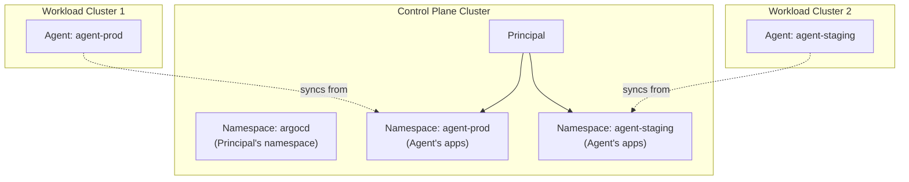
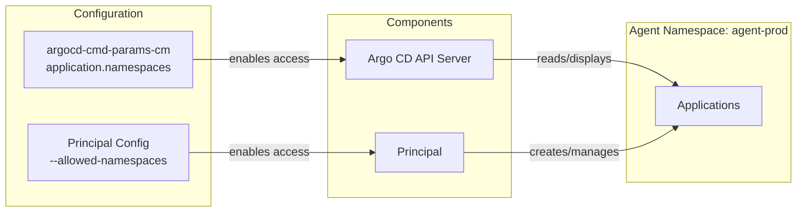

# Namespaces

This document explains how the principal handles namespaces, how to configure namespace access control, and how to enable automatic namespace creation for autonomous agents.

## Namespace Model Overview

By default, argocd-agent uses a "namespace per agent" model on the control plane cluster (**namespace-based mapping**). Each agent that connects to the principal has a corresponding namespace where its Applications are stored.

!!! tip "Alternative: Destination-Based Mapping"
    argocd-agent also supports **destination-based mapping**, where applications use `spec.destination.name` on the principal to specify the target agent. See [Agent Mapping Modes](../concepts/agent-mapping.md) for a comparison.

**Key concepts:**

- **Principal's namespace** (`--namespace`): The namespace where the principal runs and reads its configuration (typically `argocd`)
- **Agent namespaces** (`--allowed-namespaces`): The namespaces where the principal creates and manages Applications for each agent

For example, if an agent named `agent-prod` connects:

- Applications targeting that agent are stored in namespace `agent-prod` on the control plane
- The agent syncs these Applications to its local cluster



## Relationship to Argo CD's application.namespaces

The principal's namespace configuration must be coordinated with Argo CD's `application.namespaces` setting.

### Two Settings That Must Align

| Setting | Component | Purpose |
|---------|-----------|---------|
| `application.namespaces` | Argo CD API Server (`argocd-cmd-params-cm` ConfigMap) | Allows Argo CD UI/CLI/API to see Applications outside the `argocd` namespace |
| `--allowed-namespaces` | Principal | Allows the principal to create/manage Applications in agent namespaces |

!!! note
    Changing `application.namespaces` in `argocd-cmd-params-cm` requires a restart of the `argocd-server` deployment for the change to take effect.

**Both settings must include the same namespaces** for the system to work correctly.

### How They Work Together



### Configuration Examples

**Development (permissive):**

```yaml
# argocd-cmd-params-cm ConfigMap (restart argocd-server after changing)
apiVersion: v1
kind: ConfigMap
metadata:
  name: argocd-cmd-params-cm
  namespace: argocd
data:
  application.namespaces: "*"
```

```bash
# Running the principal from the command line in a development setup
argocd-agent principal --allowed-namespaces='*'
```

**Production (restrictive):**

```yaml
# argocd-cmd-params-cm ConfigMap (restart argocd-server after changing)
apiVersion: v1
kind: ConfigMap
metadata:
  name: argocd-cmd-params-cm
  namespace: argocd
data:
  application.namespaces: "agent-prod,agent-staging,agent-dev"
```

```yaml
# Principal ConfigMap
apiVersion: v1
kind: ConfigMap
metadata:
  name: argocd-agent-params
  namespace: argocd
data:
  principal.allowed-namespaces: "agent-prod,agent-staging,agent-dev"
```

### Multiple Argo CD Instances on the Control Plane

!!! warning "Namespace Conflicts with Other Argo CD Instances"

    When running more than one Argo CD instance on the control plane cluster, special care must be taken if the other instances also use `application.namespaces` (apps-in-any-namespace).

    Other Argo CD instances must be configured to **exclude** namespaces used by the principal. Their `application.namespaces` setting must not include any namespace that is listed in the principal's `--allowed-namespaces`.

    **Example:** If the principal is configured with `--allowed-namespaces='agent-*'`, other Argo CD instances on the same cluster must not have `application.namespaces` set to `*` or any pattern that includes `agent-*` namespaces.

For more details on Argo CD's apps-in-any-namespace feature, see the [Argo CD documentation](https://argo-cd.readthedocs.io/en/stable/operator-manual/app-any-namespace/).

## Namespace Access Control

The `--allowed-namespaces` parameter controls which namespaces the principal can operate in.

### Configuration

| | |
|---|---|
| **CLI Flag** | `--allowed-namespaces` |
| **Environment Variable** | `ARGOCD_PRINCIPAL_ALLOWED_NAMESPACES` |
| **ConfigMap Entry** | `principal.allowed-namespaces` |
| **Type** | String slice (comma-separated) |
| **Default** | `[]` (empty - no namespaces allowed) |

### Wildcard Support

The parameter supports shell-style wildcards:

| Pattern | Matches |
|---------|---------|
| `agent-prod` | Exactly `agent-prod` |
| `agent-*` | Any namespace starting with `agent-` |
| `*-production` | Any namespace ending with `-production` |
| `*` | All namespaces |

### Examples

**Explicit list:**

```bash
argocd-agent principal --allowed-namespaces='agent-prod,agent-staging,agent-dev'
```

**Wildcard pattern:**

```bash
argocd-agent principal --allowed-namespaces='agent-*'
```

**Multiple patterns:**

```bash
argocd-agent principal --allowed-namespaces='agent-*,cluster-*'
```

!!! warning "Security Consideration"
    Avoid using `--allowed-namespaces='*'` in production. This allows the principal to operate in any namespace, which can lead to unexpected side effects and potential security issues. Use explicit lists or restrictive patterns instead.

## Automatic Namespace Creation

When an autonomous agent connects, it may reference a namespace that doesn't exist on the control plane. The principal can automatically create these namespaces.

### When Is This Needed?

In autonomous mode, agents create Applications locally and sync them to the control plane. If the agent's namespace doesn't exist on the control plane, the sync fails. Automatic namespace creation solves this by creating the namespace on-demand.

### Configuration Options

#### Enable Namespace Creation

| | |
|---|---|
| **CLI Flag** | `--namespace-create-enable` |
| **Environment Variable** | `ARGOCD_PRINCIPAL_NAMESPACE_CREATE_ENABLE` |
| **ConfigMap Entry** | `principal.namespace-create.enable` |
| **Type** | Boolean |
| **Default** | `false` |

#### Restrict with Pattern

| | |
|---|---|
| **CLI Flag** | `--namespace-create-pattern` |
| **Environment Variable** | `ARGOCD_PRINCIPAL_NAMESPACE_CREATE_PATTERN` |
| **ConfigMap Entry** | `principal.namespace-create.pattern` |
| **Type** | String (regex) |
| **Default** | `""` (no restriction) |

Only namespaces matching this regex pattern will be auto-created.

#### Apply Labels

| | |
|---|---|
| **CLI Flag** | `--namespace-create-labels` |
| **Environment Variable** | `ARGOCD_PRINCIPAL_NAMESPACE_CREATE_LABELS` |
| **ConfigMap Entry** | `principal.namespace-create.labels` |
| **Type** | String slice (comma-separated key=value) |
| **Default** | `[]` |

Labels to apply to auto-created namespaces for organizational purposes.

### Example Configuration

```yaml
apiVersion: v1
kind: ConfigMap
metadata:
  name: argocd-agent-params
  namespace: argocd
data:
  principal.namespace-create.enable: "true"
  principal.namespace-create.pattern: "^agent-.*$"
  principal.namespace-create.labels: "managed-by=argocd-agent,auto-created=true"
```

Or via command line:

```bash
argocd-agent principal \
  --namespace-create-enable=true \
  --namespace-create-pattern='^agent-.*$' \
  --namespace-create-labels='managed-by=argocd-agent,auto-created=true'
```

!!! warning "Always Use a Pattern"
    When enabling automatic namespace creation, always set `--namespace-create-pattern` to restrict which namespaces can be created. Without a pattern, arbitrary namespaces could be created.

## Best Practices for Namespace Organization

### Use Consistent Naming Patterns

Adopt a consistent naming convention for all agents. This provides several benefits:

1. **Clear identification**: Easily distinguish agent namespaces from other namespaces on the control plane
2. **Simple configuration**: Use wildcards like `agent-*` instead of maintaining explicit lists
3. **Easier RBAC**: Create policies that apply to all agent namespaces using label selectors or name patterns
4. **Safer auto-creation**: Restrict namespace creation to your pattern (e.g., `^agent-.*$`)

### Recommended Naming Conventions

| Convention | Example | Use Case |
|------------|---------|----------|
| `agent-<name>` | `agent-production`, `agent-staging` | Simple deployments |
| `agent-<env>-<region>` | `agent-prod-us-east`, `agent-dev-eu-west` | Multi-region deployments |
| `cluster-<name>` | `cluster-eks-prod`, `cluster-gke-dev` | When managing multiple cluster types |

### Avoid These Patterns

- **Generic names**: `production`, `staging` - could conflict with application namespaces
- **System-like names**: `kube-*`, `default` - could be confused with system namespaces
- **Inconsistent naming**: Mixing `agent-foo`, `cluster-bar`, `prod-baz` - makes configuration harder

### Example: Well-Organized Setup

```yaml
# argocd-cmd-params-cm - Argo CD API Server (restart argocd-server after changing)
apiVersion: v1
kind: ConfigMap
metadata:
  name: argocd-cmd-params-cm
  namespace: argocd
data:
  application.namespaces: "agent-*"

---
# argocd-agent-params - Principal
apiVersion: v1
kind: ConfigMap
metadata:
  name: argocd-agent-params
  namespace: argocd
data:
  principal.allowed-namespaces: "agent-*"
  principal.namespace-create.enable: "true"
  principal.namespace-create.pattern: "^agent-[a-z0-9-]+$"
  principal.namespace-create.labels: "managed-by=argocd-agent"
```

With this setup:

- All agents must be named with the `agent-` prefix
- Both Argo CD and the principal can access agent namespaces
- New agent namespaces are created automatically (if they match the pattern)
- Auto-created namespaces are labeled for easy identification

## Configuration Examples

### Production Setup (Restrictive)

For production environments with known agents:

```yaml
# Explicit list of allowed namespaces
apiVersion: v1
kind: ConfigMap
metadata:
  name: argocd-agent-params
  namespace: argocd
data:
  principal.allowed-namespaces: "agent-prod-us,agent-prod-eu,agent-prod-asia"
  # Auto-creation disabled (default)
```

Coordinate with Argo CD (restart `argocd-server` after changing):

```yaml
apiVersion: v1
kind: ConfigMap
metadata:
  name: argocd-cmd-params-cm
  namespace: argocd
data:
  application.namespaces: "agent-prod-us,agent-prod-eu,agent-prod-asia"
```

### Development Setup (Flexible)

For development environments where agents are created frequently:

```yaml
apiVersion: v1
kind: ConfigMap
metadata:
  name: argocd-agent-params
  namespace: argocd
data:
  principal.allowed-namespaces: "agent-*"
  principal.namespace-create.enable: "true"
  principal.namespace-create.pattern: "^agent-.*$"
  principal.namespace-create.labels: "environment=development,managed-by=argocd-agent"
```

### Multi-Tenant Setup

For environments with multiple teams, use pattern-based restrictions:

```yaml
apiVersion: v1
kind: ConfigMap
metadata:
  name: argocd-agent-params
  namespace: argocd
data:
  # Allow team-specific patterns
  principal.allowed-namespaces: "team-a-*,team-b-*"
  principal.namespace-create.enable: "true"
  # Only allow namespaces matching team naming convention
  principal.namespace-create.pattern: "^team-[a-z]+-agent-[a-z0-9-]+$"
```

## Security Considerations

### Avoid Wildcards in Production

Using `--allowed-namespaces='*'` in production is risky and can lead to unexpected side effects and potential security issues.

**Recommendation**: Use explicit lists or restrictive patterns in production.

### Always Restrict Auto-Creation

When enabling `--namespace-create-enable`, always set `--namespace-create-pattern`:

```bash
# Good: Restricted to agent-* pattern
--namespace-create-enable=true --namespace-create-pattern='^agent-.*$'

# Bad: No restriction
--namespace-create-enable=true
```

### RBAC Considerations

The principal's ServiceAccount needs appropriate RBAC permissions:

- `get`, `list`, `watch`, `create`, `update`, `delete` on Applications in allowed namespaces
- `create` on Namespaces (if auto-creation is enabled)

Example RBAC for pattern-based access:

```yaml
apiVersion: rbac.authorization.k8s.io/v1
kind: ClusterRole
metadata:
  name: argocd-agent-principal
rules:
- apiGroups: ["argoproj.io"]
  resources: ["applications"]
  verbs: ["get", "list", "watch", "create", "update", "delete"]
- apiGroups: [""]
  resources: ["namespaces"]
  verbs: ["get", "list", "watch", "create"]  # create only if auto-creation enabled
```

Use a ClusterRoleBinding or namespace-scoped RoleBindings depending on your security requirements.

## Related Documentation

- [Concepts: Agent Mapping Modes](../concepts/agent-mapping.md) - Namespace-based vs destination-based mapping
- [Concepts: Agent Modes](../concepts/agent-modes/index.md) - Understanding managed vs autonomous mode
- [Reference: Principal](reference/principal.md) - Complete parameter reference
- [Getting Started: Kubernetes](../getting-started/kubernetes/index.md) - Initial setup including apps-in-any-namespace
- [Argo CD: Apps in Any Namespace](https://argo-cd.readthedocs.io/en/stable/operator-manual/app-any-namespace/) - Argo CD documentation
