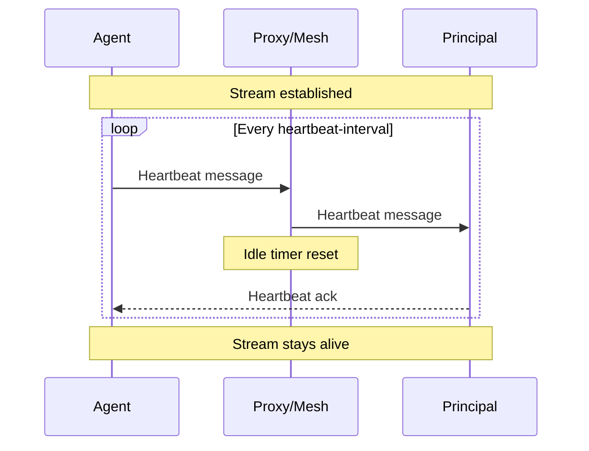

# Networking

This document covers transport protocols, connection management, compression, and service mesh integration for argocd-agent.

## Transport Protocols

argocd-agent uses gRPC for communication between the agent and principal components. By default, gRPC runs over HTTP/2, but WebSocket transport is also available.

### gRPC over HTTP/2 (Default)

HTTP/2 is the default transport protocol, providing:

- Multiplexed streams over a single connection
- Header compression
- Binary framing for efficiency
- Native support for long-lived streaming connections

This is the recommended transport for most deployments.

### gRPC over WebSocket

For environments that don't support HTTP/2 (some proxies, load balancers, or firewalls), you can enable WebSocket transport:

**Principal:**

```bash
argocd-agent principal --enable-websocket=true
```

**Agent:**

```bash
argocd-agent agent --enable-websocket=true
```

**When to use WebSocket:**

- Behind proxies that don't support HTTP/2
- Through firewalls that block HTTP/2
- Legacy infrastructure that only supports HTTP/1.1

!!! note
    Both principal and agent must have WebSocket enabled for this to work. WebSocket mode may have slightly higher overhead compared to native HTTP/2.

## Connection Management

### Keepalive Mechanisms

argocd-agent provides two keepalive mechanisms to maintain long-lived gRPC connections:

| Option | Type | Counts as HTTP Request | Use Case |
|--------|------|----------------------|----------|
| `--keep-alive-ping-interval` | HTTP/2 PING frames | No | Detecting dead TCP connections |
| `--heartbeat-interval` | Application-level messages | Yes | Preventing idle timeouts (proxies, service meshes) |

### HTTP/2 PING Frames

The `--keep-alive-ping-interval` option sends HTTP/2 PING frames at the transport level:

**Agent:**

```bash
argocd-agent agent --keep-alive-ping-interval=30s
```

**Principal (enforcement):**

```bash
argocd-agent principal --keepalive-min-interval=30s
```

The principal's `--keepalive-min-interval` drops connections that send pings more frequently than the specified interval.

**Use case:** Detecting dead TCP connections when the network silently drops packets.

### Application-Level Heartbeats

The `--heartbeat-interval` option sends actual gRPC messages over the stream:

**Agent:**

```bash
argocd-agent agent --heartbeat-interval=30s
```

**Use case:** Preventing idle connection timeouts from proxies, load balancers, and service meshes.

### Why HTTP/2 PINGs Don't Prevent Idle Timeouts

HTTP/2 PING frames are transport-level messages that don't count as HTTP requests. Many proxies and service meshes (including Istio) use request-based idle timeouts:

> "HTTP/2 PING frames do not count as requests for the purpose of idleTimeout"
> — [Istio Documentation](https://istio.io/latest/docs/reference/config/networking/destination-rule/#ConnectionPoolSettings-HTTPSettings)

This means `--keep-alive-ping-interval` alone won't prevent connection closures in service mesh deployments. You must use `--heartbeat-interval` instead.

### Heartbeat Flow



### Recommended Configuration

For most deployments, configure both mechanisms:

```bash
argocd-agent agent \
  --heartbeat-interval=30s \
  --keep-alive-ping-interval=30s
```

Or via environment variables:

```yaml
env:
  - name: ARGOCD_AGENT_HEARTBEAT_INTERVAL
    value: "30s"
  - name: ARGOCD_AGENT_KEEP_ALIVE_PING_INTERVAL
    value: "30s"
```

**Best Practice:** Set `--heartbeat-interval` to 50-75% of your proxy or service mesh's idle timeout.

## Compression

### gRPC Compression

Enable gRPC compression to reduce bandwidth usage between agent and principal:

**Agent:**

```bash
argocd-agent agent --enable-compression=true
```

**Trade-offs:**

- **Benefit:** Reduced network bandwidth
- **Cost:** Increased CPU usage for compression/decompression

Enable compression when:

- Network bandwidth is limited or expensive
- Syncing large numbers of applications or resources
- Operating over high-latency connections

### Redis Compression

Configure compression for Redis communication (used for application state caching):

**Principal:**

```yaml
# ConfigMap (argocd-agent-params)
principal.redis.compression-type: "gzip"
```

Or via command line:

```bash
argocd-agent principal --redis-compression-type=gzip
```

**Valid values:** `gzip`, `none`

**Default:** `gzip`

## Service Mesh Integration

When running behind a service mesh like Istio or Linkerd, the mesh handles mTLS at the sidecar level. This requires specific configuration for argocd-agent.

### Service Mesh Benefits

- **Automatic mTLS**: The mesh handles certificate management and TLS termination
- **Identity verification**: Agent identity can be extracted from mesh-injected headers
- **Traffic management**: Load balancing, retries, and circuit breaking
- **Observability**: Automatic metrics and tracing

### Service Mesh Challenges

- **Idle connection timeouts**: Meshes may close long-lived gRPC streams
- **Header-based authentication**: Different authentication flow required
- **Configuration complexity**: Both mesh and argocd-agent must be configured correctly

### Istio Configuration

#### Principal Configuration for Istio

When running behind Istio, configure the principal to:

1. Disable TLS (Istio sidecar handles it)
2. Use header-based authentication
3. Only accept local connections (from the sidecar)

```yaml
apiVersion: v1
kind: ConfigMap
metadata:
  name: argocd-agent-params
  namespace: argocd
data:
  # Only accept connections from localhost (the Istio sidecar)
  principal.listen.host: "127.0.0.1"
  principal.listen.port: "8443"
  
  # Disable TLS - Istio sidecar handles mTLS
  principal.tls.insecure-plaintext: "true"
  
  # Extract agent ID from SPIFFE URI in x-forwarded-client-cert header
  # Format: spiffe://cluster.local/ns/<namespace>/sa/<service-account>
  # This extracts the service account name as the agent ID
  principal.auth: "header:x-forwarded-client-cert:^.*URI=spiffe://[^/]+/ns/[^/]+/sa/([^,;]+)"
  
  principal.log.level: "info"
  principal.namespace: "argocd"
```

Or via command line:

```bash
argocd-agent principal \
  --listen-host=127.0.0.1 \
  --insecure-plaintext=true \
  --auth="header:x-forwarded-client-cert:^.*URI=spiffe://[^/]+/ns/[^/]+/sa/([^,;]+)"
```

#### Agent Configuration for Istio

```yaml
apiVersion: v1
kind: ConfigMap
metadata:
  name: argocd-agent-params
  namespace: argocd
data:
  agent.server.address: "argocd-agent-principal.argocd.svc.cluster.local"
  agent.server.port: "8443"
  agent.mode: "autonomous"
  agent.namespace: "argocd"
  
  # Use header-based authentication (mesh handles identity)
  agent.creds: "header:"
  
  # TLS is handled by the mesh
  agent.tls.client.insecure: "true"
```

#### Istio DestinationRule

Increase Istio's idle timeout to reduce reconnection frequency:

```yaml
apiVersion: networking.istio.io/v1beta1
kind: DestinationRule
metadata:
  name: argocd-agent-principal
  namespace: argocd
spec:
  host: argocd-agent-principal.argocd.svc.cluster.local
  trafficPolicy:
    connectionPool:
      http:
        idleTimeout: 300s  # 5 minutes
```

#### Istio PeerAuthentication

Ensure Istio requires mTLS for the argocd-agent namespace:

```yaml
apiVersion: security.istio.io/v1beta1
kind: PeerAuthentication
metadata:
  name: argocd-agent-mtls
  namespace: argocd
spec:
  mtls:
    mode: STRICT
```

### Linkerd Configuration

#### Principal Configuration for Linkerd

Linkerd uses a different header format for client identity:

```yaml
apiVersion: v1
kind: ConfigMap
metadata:
  name: argocd-agent-params
  namespace: argocd
data:
  principal.listen.host: "127.0.0.1"
  principal.tls.insecure-plaintext: "true"
  # Linkerd uses l5d-client-id header with format: 
  # <service-account>.<namespace>.serviceaccount.identity.linkerd.cluster.local
  principal.auth: "header:l5d-client-id:^([^.]+)\\..*"
```

#### Agent Configuration for Linkerd

```yaml
apiVersion: v1
kind: ConfigMap
metadata:
  name: argocd-agent-params
  namespace: argocd
data:
  agent.creds: "header:"
  agent.tls.client.insecure: "true"
```

### Complete Istio Example

#### Principal Deployment

```yaml
apiVersion: apps/v1
kind: Deployment
metadata:
  name: argocd-agent-principal
  namespace: argocd
spec:
  template:
    metadata:
      labels:
        app: argocd-agent-principal
        sidecar.istio.io/inject: "true"
    spec:
      containers:
      - name: principal
        image: ghcr.io/argoproj-labs/argocd-agent:latest
        args:
        - principal
        - --listen-host=127.0.0.1
        - --insecure-plaintext=true
        - --auth=header:x-forwarded-client-cert:^.*URI=spiffe://[^/]+/ns/[^/]+/sa/([^,;]+)
        ports:
        - containerPort: 8443
```

#### Agent Deployment

```yaml
apiVersion: apps/v1
kind: Deployment
metadata:
  name: argocd-agent-agent
  namespace: argocd
spec:
  template:
    metadata:
      labels:
        app: argocd-agent-agent
        sidecar.istio.io/inject: "true"
    spec:
      containers:
      - name: agent
        image: ghcr.io/argoproj-labs/argocd-agent:latest
        args:
        - agent
        - --server-address=argocd-agent-principal.argocd.svc.cluster.local
        - --server-port=8443
        - --creds=header:
        - --heartbeat-interval=30s
        - --keep-alive-ping-interval=30s
        env:
        - name: ARGOCD_AGENT_TLS_INSECURE
          value: "true"
```

#### Istio Resources

```yaml
---
apiVersion: security.istio.io/v1beta1
kind: PeerAuthentication
metadata:
  name: argocd-agent-mtls
  namespace: argocd
spec:
  mtls:
    mode: STRICT
---
apiVersion: networking.istio.io/v1beta1
kind: DestinationRule
metadata:
  name: argocd-agent-principal
  namespace: argocd
spec:
  host: argocd-agent-principal.argocd.svc.cluster.local
  trafficPolicy:
    connectionPool:
      http:
        idleTimeout: 300s
    tls:
      mode: ISTIO_MUTUAL
```

### Service Mesh Security Considerations

!!! warning "Critical Security Requirements"

    When using service mesh integration, anyone able to bypass the sidecar entry point (e.g., by accessing the principal's plaintext port directly) could inject arbitrary identity headers and impersonate any agent. To prevent this:

    1. **Never expose plaintext port externally**: The principal's `--insecure-plaintext` mode must only be accessible via the mesh sidecar

    2. **Bind to localhost**: Always use `--listen-host=127.0.0.1` to ensure only the local sidecar can connect

    3. **Enforce mesh mTLS**: Use PeerAuthentication (Istio) or similar to require mTLS

    4. **Use NetworkPolicies**: Restrict which pods can communicate with the principal

## Troubleshooting Connection Issues

### Connection Drops

**Symptoms:**

- `stream terminated by RST_STREAM with error code: NO_ERROR`
- Frequent reconnections in agent logs
- `context canceled` errors in principal logs

**Solutions:**

1. Enable heartbeats:
   ```bash
   --heartbeat-interval=30s
   ```

2. Check proxy/mesh idle timeout:
   ```bash
   # For Istio
   kubectl get destinationrule -n argocd -o yaml | grep idleTimeout
   ```

3. Increase timeout or decrease heartbeat interval

### Authentication Failures (Service Mesh)

**Symptoms:**

- "authentication failed" errors
- "unable to extract identity" in principal logs

**Solutions:**

1. Verify header is being injected:
   ```bash
   # For Istio - check envoy config
   kubectl exec -it -n argocd <principal-pod> -c istio-proxy -- \
     pilot-agent request GET config_dump | grep -i x-forwarded-client-cert
   ```

2. Test regex extraction manually:
   ```bash
   # Example header value from Istio
   HEADER="URI=spiffe://cluster.local/ns/argocd/sa/argocd-agent-agent"
   echo $HEADER | grep -oP '(?<=URI=spiffe://[^/]+/ns/[^/]+/sa/)[^,;]+'
   ```

3. Enable debug logging to see received headers:
   ```yaml
   principal.log.level: "debug"
   ```

### TLS Errors with Service Mesh

**Symptom:** TLS handshake failures even with `--insecure-plaintext=true`

**Solutions:**

1. Verify mesh sidecar is injected:
   ```bash
   kubectl get pods -n argocd -o jsonpath='{.items[*].spec.containers[*].name}' | tr ' ' '\n' | grep -E 'istio-proxy|linkerd-proxy'
   ```

2. Check mTLS mode:
   ```bash
   # For Istio
   kubectl get peerauthentication -n argocd -o yaml
   ```

3. Ensure both principal and agent pods have sidecars

### Network Policy Conflicts

**Symptom:** Agent cannot connect to principal

**Solutions:**

1. Verify network policies allow mesh traffic:
   ```bash
   kubectl get networkpolicies -n argocd -o yaml
   ```

2. Ensure policies allow traffic from mesh components (e.g., port 15001 for Istio)

### Agent Cannot Connect (General)

**Symptom:** Connection refused or timeout errors

**Solutions:**

1. Verify principal is running and listening:
   ```bash
   kubectl get svc -n argocd | grep principal
   kubectl logs -n argocd deployment/argocd-agent-principal | head -20
   ```

2. Test network connectivity:
   ```bash
   kubectl run test --rm -it --image=busybox -- nc -zv <principal-service> <port>
   ```

3. Check TLS configuration matches between agent and principal

## Configuration Summary

### Networking Parameters

| Parameter | Component | CLI Flag | Default |
|-----------|-----------|----------|---------|
| WebSocket | Both | `--enable-websocket` | `false` |
| Heartbeat Interval | Agent | `--heartbeat-interval` | `0` (disabled) |
| Keep-Alive Ping | Agent | `--keep-alive-ping-interval` | `0` (disabled) |
| Keep-Alive Min | Principal | `--keepalive-min-interval` | `0` (disabled) |
| Compression | Agent | `--enable-compression` | `false` |
| Redis Compression | Principal | `--redis-compression-type` | `gzip` |
| Plaintext Mode | Principal | `--insecure-plaintext` | `false` |

## Related Documentation

- [Authentication](authentication.md) - Header-based authentication for service mesh
- [TLS & Certificates](tls-certificates.md) - Certificate configuration for direct connections
- [Reference: Principal](reference/principal.md) - All principal parameters
- [Reference: Agent](reference/agent.md) - All agent parameters
