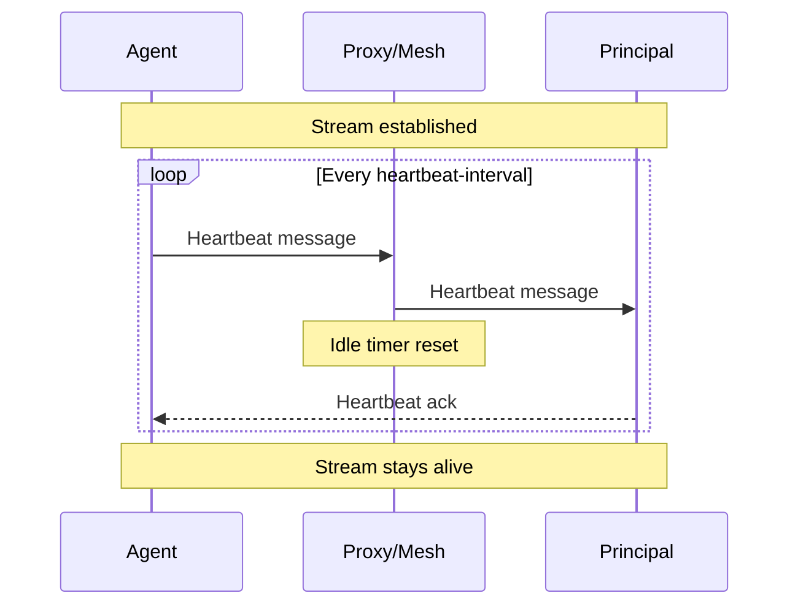

# Networking

This document covers transport protocols, connection management, and compression for argocd-agent.

## Transport Protocols

argocd-agent uses gRPC for communication between the agent and principal components. By default, gRPC runs over HTTP/2, but WebSocket transport is also available.

### gRPC over HTTP/2 (Default)

HTTP/2 is the default transport protocol, providing:

- Multiplexed streams over a single connection
- Header compression
- Binary framing for efficiency
- Native support for long-lived streaming connections

This is the recommended transport for most deployments.

### gRPC over WebSocket

For environments that don't support HTTP/2 (some proxies, load balancers, or firewalls), you can enable WebSocket transport:

**Principal:**

```bash
argocd-agent principal --enable-websocket=true
```

**Agent:**

```bash
argocd-agent agent --enable-websocket=true
```

**When to use WebSocket:**

- Behind proxies that don't support HTTP/2
- Through firewalls that block HTTP/2
- Legacy infrastructure that only supports HTTP/1.1

!!! note
    Both principal and agent must have WebSocket enabled for this to work. WebSocket mode may have slightly higher overhead compared to native HTTP/2.

## Connection Management

### Keepalive Mechanisms

argocd-agent provides two keepalive mechanisms to maintain long-lived gRPC connections:

| Option | Type | Counts as HTTP Request | Use Case |
|--------|------|----------------------|----------|
| `--keep-alive-ping-interval` | HTTP/2 PING frames | No | Detecting dead TCP connections |
| `--heartbeat-interval` | Application-level messages | Yes | Preventing idle timeouts (proxies, service meshes) |

### HTTP/2 PING Frames

The `--keep-alive-ping-interval` option sends HTTP/2 PING frames at the transport level:

**Agent:**

```bash
argocd-agent agent --keep-alive-ping-interval=30s
```

**Principal (enforcement):**

```bash
argocd-agent principal --keepalive-min-interval=30s
```

The principal's `--keepalive-min-interval` drops connections that send pings more frequently than the specified interval.

**Use case:** Detecting dead TCP connections when the network silently drops packets.

### Application-Level Heartbeats

The `--heartbeat-interval` option sends actual gRPC messages over the stream:

**Agent:**

```bash
argocd-agent agent --heartbeat-interval=30s
```

**Use case:** Preventing idle connection timeouts from proxies, load balancers, and service meshes.

### Why HTTP/2 PINGs Don't Prevent Idle Timeouts

HTTP/2 PING frames are transport-level messages that don't count as HTTP requests. Many proxies and service meshes (including Istio) use request-based idle timeouts:

> "HTTP/2 PING frames do not count as requests for the purpose of idleTimeout"
> — [Istio Documentation](https://istio.io/latest/docs/reference/config/networking/destination-rule/#ConnectionPoolSettings-HTTPSettings)

This means `--keep-alive-ping-interval` alone won't prevent connection closures in service mesh deployments. You must use `--heartbeat-interval` instead.

### Heartbeat Flow


```mermaid
sequenceDiagram
    participant Agent
    participant Proxy as Proxy/Mesh
    participant Principal
    
    Note over Agent,Principal: Stream established
    
    loop Every heartbeat-interval
        Agent->>Proxy: Heartbeat message
        Proxy->>Principal: Heartbeat message
        Note over Proxy: Idle timer reset
        Principal-->>Agent: Heartbeat ack
    end
    
    Note over Agent,Principal: Stream stays alive
```

### Recommended Configuration

For most deployments, configure both mechanisms:

```bash
argocd-agent agent \
  --heartbeat-interval=30s \
  --keep-alive-ping-interval=30s
```

Or via environment variables:

```yaml
env:
  - name: ARGOCD_AGENT_HEARTBEAT_INTERVAL
    value: "30s"
  - name: ARGOCD_AGENT_KEEP_ALIVE_PING_INTERVAL
    value: "30s"
```

**Best Practice:** Set `--heartbeat-interval` to 50-75% of your proxy or service mesh's idle timeout.

## Compression

### gRPC Compression

Enable gRPC compression to reduce bandwidth usage between agent and principal:

**Agent:**

```bash
argocd-agent agent --enable-compression=true
```

**Trade-offs:**

- **Benefit:** Reduced network bandwidth
- **Cost:** Increased CPU usage for compression/decompression

Enable compression when:

- Network bandwidth is limited or expensive
- Syncing large numbers of applications or resources
- Operating over high-latency connections

### Redis Compression

Configure compression for Redis communication (used for application state caching):

**Principal:**

```yaml
# ConfigMap (argocd-agent-params)
principal.redis.compression-type: "gzip"
```

Or via command line:

```bash
argocd-agent principal --redis-compression-type=gzip
```

**Valid values:** `gzip`, `none`

**Default:** `gzip`

## Troubleshooting Connection Issues

### Connection Drops

**Symptoms:**

- `stream terminated by RST_STREAM with error code: NO_ERROR`
- Frequent reconnections in agent logs
- `context canceled` errors in principal logs

**Solutions:**

1. Enable heartbeats:
   ```bash
   --heartbeat-interval=30s
   ```

2. Check proxy/mesh idle timeout:
   ```bash
   # For Istio
   kubectl get destinationrule -n argocd -o yaml | grep idleTimeout
   ```

3. Increase timeout or decrease heartbeat interval

### Agent Cannot Connect

**Symptom:** Connection refused or timeout errors

**Solutions:**

1. Verify principal is running and listening:
   ```bash
   kubectl get svc -n argocd | grep principal
   kubectl logs -n argocd deployment/argocd-agent-principal | head -20
   ```

2. Test network connectivity:
   ```bash
   kubectl run test --rm -it --image=busybox -- nc -zv <principal-service> <port>
   ```

3. Check TLS configuration matches between agent and principal

## Configuration Summary

### Networking Parameters

| Parameter | Component | CLI Flag | Default |
|-----------|-----------|----------|---------|
| WebSocket | Both | `--enable-websocket` | `false` |
| Heartbeat Interval | Agent | `--heartbeat-interval` | `0` (disabled) |
| Keep-Alive Ping | Agent | `--keep-alive-ping-interval` | `0` (disabled) |
| Keep-Alive Min | Principal | `--keepalive-min-interval` | `0` (disabled) |
| Compression | Agent | `--enable-compression` | `false` |
| Redis Compression | Principal | `--redis-compression-type` | `gzip` |
| Plaintext Mode | Principal | `--insecure-plaintext` | `false` |

## Related Documentation

- [Service Mesh Integration](service-mesh.md) - Istio, Linkerd, and mesh-specific configuration
- [Authentication](authentication.md) - Header-based authentication for service mesh
- [TLS & Certificates](tls-certificates.md) - Certificate configuration for direct connections
- [Reference: Principal](reference/principal.md) - All principal parameters
- [Reference: Agent](reference/agent.md) - All agent parameters
