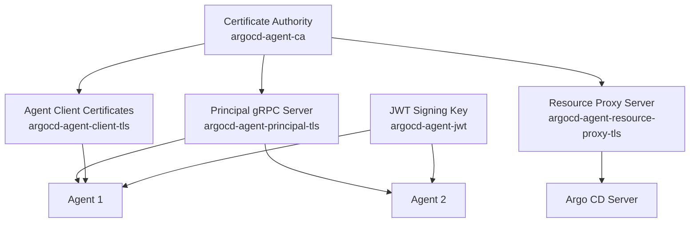

# PKI and TLS Certificates for the Principal Component

The argocd-agent principal component requires several TLS certificates and cryptographic keys to operate securely. This document explains the certificate requirements, how to create them using the `argocd-agentctl` CLI tool, and how to manage them manually.

## Overview

The principal component uses a Public Key Infrastructure (PKI) to secure all communications. The following certificates and keys are required:

| Certificate/Key | Purpose | Secret Name | Required |
|----------------|---------|-------------|----------|
| **CA Certificate** | Root certificate authority for signing other certificates | `argocd-agent-ca` | ✅ |
| **Principal gRPC Server Certificate** | Secures gRPC communication between agents and principal | `argocd-agent-principal-tls` | ✅ |
| **Resource Proxy Certificate** | Secures HTTP communication between Argo CD and principal | `argocd-agent-resource-proxy-tls` | ✅ |
| **JWT Signing Key** | Signs authentication tokens for agents | `argocd-agent-jwt` | ✅ |

## Architecture Overview



## Using argocd-agentctl CLI (Recommended)

The `argocd-agentctl` CLI provides an easy way to manage the entire PKI lifecycle. This is the recommended approach for development and testing environments.

> ⚠️ **Important**: The CLI-generated PKI is intended for **development and testing only**. For production environments, use certificates issued by your organization's PKI or a trusted Certificate Authority.

### Prerequisites

- `argocd-agentctl` binary installed and available in your PATH
- kubectl configured with access to the principal cluster
- Appropriate RBAC permissions to create/update secrets in the principal namespace

### Step 1: Initialize the PKI

Initialize the Certificate Authority that will be used to sign all other certificates:

```bash
argocd-agentctl pki init \
  --principal-context <control-plane-context> \
  --principal-namespace argocd
```

**What this does:**

- Generates a self-signed CA certificate and private key
- Creates the `argocd-agent-ca` secret containing the CA certificate and key
- The CA is valid for certificate signing and has a reasonable expiration period

**Options:**

- `--force, -f`: Overwrite existing CA if it already exists

### Step 2: Issue Principal gRPC Server Certificate

Generate the server certificate for the principal's gRPC service:

```bash
argocd-agentctl pki issue principal \
  --principal-context <control-plane-context> \
  --principal-namespace argocd \
  --ip "127.0.0.1,<principal-external-ip>" \
  --dns "localhost,<principal-dns-name>" \
  --upsert
```

**Parameters:**

- `--ip`: Comma-separated list of IP addresses where the principal will be accessible
- `--dns`: Comma-separated list of DNS names for the principal service
- `--upsert, -u`: Update existing certificate if it already exists

**Examples:**

```bash
# For local development
argocd-agentctl pki issue principal \
  --ip "127.0.0.1,192.168.1.100" \
  --dns "localhost,argocd-principal.local"

# For Kubernetes service
argocd-agentctl pki issue principal \
  --ip "10.96.0.100" \
  --dns "argocd-agent-principal.argocd.svc.cluster.local,argocd-principal.example.com"
```

### Step 3: Issue Resource Proxy Certificate

Generate the server certificate for the resource proxy service:

```bash
argocd-agentctl pki issue resource-proxy \
  --principal-context <control-plane-context> \
  --principal-namespace argocd \
  --ip "127.0.0.1,<resource-proxy-ip>" \
  --dns "localhost,<resource-proxy-dns>" \
  --upsert
```

**Resource Proxy Purpose**: The resource proxy enables Argo CD to access live Kubernetes resources on remote clusters through the principal. It requires its own certificate for mTLS authentication.

### Step 4: Create JWT Signing Key

Generate the RSA private key used to sign JWT tokens:

```bash
argocd-agentctl jwt create-key \
  --principal-context <control-plane-context> \
  --principal-namespace argocd \
  --upsert
```

**What this does:**

- Generates a 4096-bit RSA private key
- Stores the key in PKCS#8 PEM format in the `argocd-agent-jwt` secret

### Verification

Verify that all required secrets have been created:

```bash
kubectl get secrets -n argocd --context <control-plane-context> | grep argocd-agent
```

Expected output:

```
argocd-agent-ca                           kubernetes.io/tls     2      5m
argocd-agent-principal-tls                kubernetes.io/tls     2      4m
argocd-agent-resource-proxy-tls           kubernetes.io/tls     2      3m
argocd-agent-jwt                          Opaque                1      2m
```

## Manual Certificate Management

For production environments or when integrating with existing PKI infrastructure, you can manually create and manage the required certificates and secrets.

### Certificate Requirements

All certificates must meet the following requirements:

- **Key Type**: RSA with minimum 2048 bits (4096 bits recommended)
- **Certificate Format**: X.509 certificates in PEM format
- **Private Key Format**: PKCS#1 or PKCS#8 PEM format (unencrypted)
- **Certificate Validity**: Reasonable expiration period (1 year recommended)

### Manual PKI Setup

#### Step 1: Create Certificate Authority

Create your own CA or obtain CA certificates from your organization:

```bash
# Generate CA private key
openssl genrsa -out ca.key 4096

# Create CA certificate
openssl req -new -x509 -key ca.key -sha256 -subj "/CN=argocd-agent-ca" \
  -days 365 -out ca.crt
```

Create the CA secret:

```bash
kubectl create secret tls argocd-agent-ca \
  --cert=ca.crt \
  --key=ca.key \
  --namespace=argocd
```

#### Step 2: Create Principal gRPC Server Certificate

Generate a certificate signing request:

```bash
# Generate private key
openssl genrsa -out principal.key 4096

# Create certificate signing request
openssl req -new -key principal.key -out principal.csr \
  -subj "/CN=argocd-agent-principal"

# Create certificate extensions file
cat > principal.ext << EOF
authorityKeyIdentifier=keyid,issuer
basicConstraints=CA:FALSE
keyUsage=keyEncipherment,dataEncipherment,digitalSignature
extendedKeyUsage=serverAuth
subjectAltName=@alt_names

[alt_names]
DNS.1=localhost
DNS.2=argocd-agent-principal.argocd.svc.cluster.local
DNS.3=your-principal-domain.com
IP.1=127.0.0.1
IP.2=10.96.0.100
EOF

# Sign the certificate
openssl x509 -req -in principal.csr -CA ca.crt -CAkey ca.key -CAcreateserial \
  -out principal.crt -days 365 -sha256 -extfile principal.ext
```

Create the principal TLS secret:

```bash
kubectl create secret tls argocd-agent-principal-tls \
  --cert=principal.crt \
  --key=principal.key \
  --namespace=argocd
```

#### Step 3: Create Resource Proxy Certificate

Similar process for the resource proxy certificate:

```bash
# Generate private key
openssl genrsa -out resource-proxy.key 4096

# Create CSR
openssl req -new -key resource-proxy.key -out resource-proxy.csr \
  -subj "/CN=argocd-agent-resource-proxy"

# Create extensions file
cat > resource-proxy.ext << EOF
authorityKeyIdentifier=keyid,issuer
basicConstraints=CA:FALSE
keyUsage=keyEncipherment,dataEncipherment,digitalSignature
extendedKeyUsage=serverAuth,clientAuth
subjectAltName=@alt_names

[alt_names]
DNS.1=localhost
DNS.2=argocd-agent-principal.argocd.svc.cluster.local
IP.1=127.0.0.1
IP.2=10.96.0.100
EOF

# Sign the certificate
openssl x509 -req -in resource-proxy.csr -CA ca.crt -CAkey ca.key -CAcreateserial \
  -out resource-proxy.crt -days 365 -sha256 -extfile resource-proxy.ext
```

Create the resource proxy TLS secret:

```bash
kubectl create secret tls argocd-agent-resource-proxy-tls \
  --cert=resource-proxy.crt \
  --key=resource-proxy.key \
  --namespace=argocd
```

#### Step 4: Create JWT Signing Key

Generate the JWT signing key:

```bash
# Generate RSA private key
openssl genrsa -out jwt.key 4096

# Convert to PKCS#8 format (optional but recommended)
openssl pkcs8 -topk8 -inform PEM -outform PEM -nocrypt -in jwt.key -out jwt-pkcs8.key
```

Create the JWT secret:

```bash
kubectl create secret generic argocd-agent-jwt \
  --from-file=jwt.key=jwt-pkcs8.key \
  --namespace=argocd
```

### Secret Structure Reference

#### CA Secret (`argocd-agent-ca`)

```yaml
apiVersion: v1
kind: Secret
metadata:
  name: argocd-agent-ca
  namespace: argocd
type: kubernetes.io/tls
data:
  tls.crt: <base64-encoded-ca-certificate>
  tls.key: <base64-encoded-ca-private-key>
```

#### Principal TLS Secret (`argocd-agent-principal-tls`)

```yaml
apiVersion: v1
kind: Secret
metadata:
  name: argocd-agent-principal-tls
  namespace: argocd
type: kubernetes.io/tls
data:
  tls.crt: <base64-encoded-server-certificate>
  tls.key: <base64-encoded-server-private-key>
```

#### Resource Proxy TLS Secret (`argocd-agent-resource-proxy-tls`)

```yaml
apiVersion: v1
kind: Secret
metadata:
  name: argocd-agent-resource-proxy-tls
  namespace: argocd
type: kubernetes.io/tls
data:
  tls.crt: <base64-encoded-proxy-certificate>
  tls.key: <base64-encoded-proxy-private-key>
```

#### JWT Secret (`argocd-agent-jwt`)

```yaml
apiVersion: v1
kind: Secret
metadata:
  name: argocd-agent-jwt
  namespace: argocd
type: Opaque
data:
  jwt.key: <base64-encoded-rsa-private-key>
```

## Configuration Options

The principal component can be configured to load certificates from different sources:

### Environment Variables

| Variable | Description | Default |
|----------|-------------|---------|
| `ARGOCD_PRINCIPAL_TLS_SECRET_NAME` | Name of the principal TLS secret | `argocd-agent-principal-tls` |
| `ARGOCD_PRINCIPAL_TLS_SERVER_CERT_PATH` | Path to server certificate file | (empty) |
| `ARGOCD_PRINCIPAL_TLS_SERVER_KEY_PATH` | Path to server private key file | (empty) |
| `ARGOCD_PRINCIPAL_TLS_SERVER_ROOT_CA_SECRET_NAME` | Name of the CA secret | `argocd-agent-ca` |
| `ARGOCD_PRINCIPAL_TLS_SERVER_ROOT_CA_PATH` | Path to CA certificate file | (empty) |
| `ARGOCD_PRINCIPAL_RESOURCE_PROXY_SECRET_NAME` | Name of the resource proxy TLS secret | `argocd-agent-resource-proxy-tls` |
| `ARGOCD_PRINCIPAL_JWT_SECRET_NAME` | Name of the JWT signing key secret | `argocd-agent-jwt` |

### Command Line Flags

The principal can be configured to load certificates from files instead of secrets:

```bash
argocd-agent principal \
  --tls-cert /path/to/server.crt \
  --tls-key /path/to/server.key \
  --root-ca-path /path/to/ca.crt \
  --jwt-key /path/to/jwt.key \
  --resource-proxy-cert-path /path/to/proxy.crt \
  --resource-proxy-key-path /path/to/proxy.key \
  --resource-proxy-ca-path /path/to/ca.crt
```

## Security Considerations

### Production Recommendations

1. **Use Organization PKI**: Integrate with your organization's existing PKI infrastructure
2. **Certificate Rotation**: Implement automated certificate rotation
3. **Key Security**: Store private keys securely and never commit them to version control
4. **Least Privilege**: Use separate certificates for different components when possible
5. **Monitoring**: Monitor certificate expiration dates and set up alerts

### Client Certificate Authentication

The principal can be configured to require client certificates from agents:

```bash
argocd-agent principal \
  --require-client-certs \
  --client-cert-subject-match
```

When enabled:

- All agent connections must present valid client certificates
- Certificates must be signed by the configured CA
- Subject matching enforces that certificate CN matches the agent name

### TLS Configuration

Configure TLS settings for security:

```bash
argocd-agent principal \
  --tls-min-version tls1.3 \
  --tls-cipher-suite TLS_AES_256_GCM_SHA384
```

## Troubleshooting

### Common Issues

#### Certificate Validation Errors

**Symptom**: Agents cannot connect with TLS errors

**Solutions**:

- Verify certificate Subject Alternative Names (SANs) include all IP addresses and DNS names
- Check certificate expiration dates
- Ensure CA certificate is properly configured

#### Secret Not Found Errors

**Symptom**: Principal fails to start with "secret not found" errors

**Solutions**:

- Verify all required secrets exist in the correct namespace
- Check secret names match the expected names
- Ensure secrets have the correct data fields (`tls.crt`, `tls.key`, `jwt.key`)

#### Permission Denied Errors

**Symptom**: Principal cannot read secrets

**Solutions**:

- Verify ServiceAccount has appropriate RBAC permissions
- Check that secrets are in the same namespace as the principal

### Diagnostic Commands

```bash
# Check secret existence
kubectl get secrets -n argocd | grep argocd-agent

# Verify certificate details
kubectl get secret argocd-agent-principal-tls -n argocd -o jsonpath='{.data.tls\.crt}' | \
  base64 -d | openssl x509 -text -noout

# Check certificate expiration
kubectl get secret argocd-agent-principal-tls -n argocd -o jsonpath='{.data.tls\.crt}' | \
  base64 -d | openssl x509 -enddate -noout

# Validate certificate chain
kubectl get secret argocd-agent-ca -n argocd -o jsonpath='{.data.tls\.crt}' | base64 -d > ca.crt
kubectl get secret argocd-agent-principal-tls -n argocd -o jsonpath='{.data.tls\.crt}' | base64 -d > server.crt
openssl verify -CAfile ca.crt server.crt
```

## Certificate Rotation

### Using argocd-agentctl

Rotate certificates by re-issuing them with the `--upsert` flag:

```bash
# Rotate principal certificate
argocd-agentctl pki issue principal --upsert

# Rotate resource proxy certificate  
argocd-agentctl pki issue resource-proxy --upsert

# Rotate JWT signing key
argocd-agentctl jwt create-key --upsert
```

### Manual Rotation

1. Generate new certificates following the manual process above
2. Update the secrets with new certificate data
3. Restart the principal deployment to load new certificates

```bash
# Update secret with new certificate
kubectl create secret tls argocd-agent-principal-tls \
  --cert=new-principal.crt \
  --key=new-principal.key \
  --namespace=argocd \
  --dry-run=client -o yaml | kubectl apply -f -

# Restart principal to load new certificate
kubectl rollout restart deployment argocd-agent-principal -n argocd
```

## Related Documentation

- [Adding New Agents](../../user-guide/adding-agents.md) - How to create and configure agents