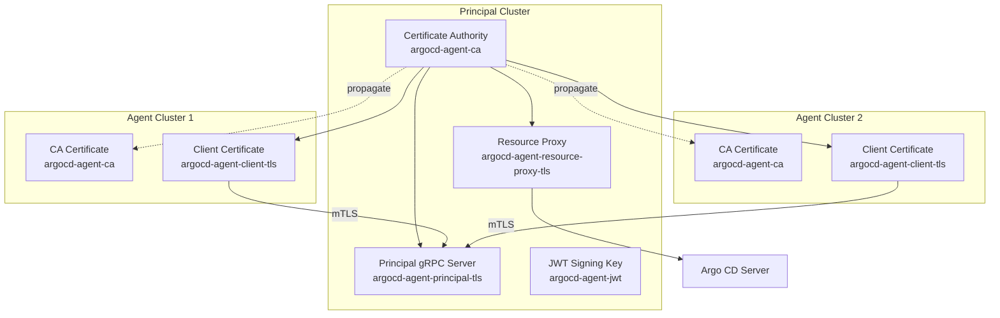

# TLS & Certificates

This document explains how to set up and manage the Public Key Infrastructure (PKI) for argocd-agent. Proper TLS configuration is essential for secure communication between the principal and agent components.

## Certificate Overview

argocd-agent uses a PKI to secure all communications. The following certificates and keys are required:

| Certificate/Key | Location | Purpose | Secret Name |
|----------------|----------|---------|-------------|
| **CA Certificate** | Principal | Root certificate authority for signing all other certificates | `argocd-agent-ca` |
| **Principal Server Certificate** | Principal | Secures gRPC communication from agents | `argocd-agent-principal-tls` |
| **Resource Proxy Certificate** | Principal | Secures HTTP communication between Argo CD and principal | `argocd-agent-resource-proxy-tls` |
| **JWT Signing Key** | Principal | Signs authentication tokens | `argocd-agent-jwt` |
| **CA Certificate** | Agent | Validates the principal's server certificate | `argocd-agent-ca` |
| **Client Certificate** | Agent | Authenticates the agent to the principal (mTLS) | `argocd-agent-client-tls` |

## Architecture Overview



## Using argocd-agentctl CLI (Recommended)

The `argocd-agentctl` CLI provides the simplest way to manage the entire PKI lifecycle.

!!! warning "Development and Testing Only"
    The CLI-generated PKI is intended for **development and testing only**. For production environments, use certificates issued by your organization's PKI or a trusted Certificate Authority.

### Prerequisites

- `argocd-agentctl` binary installed and available in your PATH
- kubectl configured with access to both principal and agent clusters
- Appropriate RBAC permissions to create/update secrets

### Step 1: Initialize the PKI

Initialize the Certificate Authority on the principal cluster:

```bash
argocd-agentctl pki init \
  --principal-context <control-plane-context> \
  --principal-namespace argocd
```

This creates the `argocd-agent-ca` secret containing the CA certificate and private key.

**Options:**

- `--force, -f`: Overwrite existing CA if it already exists

### Step 2: Issue Principal Server Certificate

Generate the server certificate for the principal's gRPC service:

```bash
argocd-agentctl pki issue principal \
  --principal-context <control-plane-context> \
  --principal-namespace argocd \
  --ip "127.0.0.1,<principal-external-ip>" \
  --dns "localhost,<principal-dns-name>" \
  --upsert
```

**Parameters:**

- `--ip`: Comma-separated list of IP addresses for the principal service
- `--dns`: Comma-separated list of DNS names for the principal service
- `--upsert, -u`: Update existing certificate if it already exists

**Example for Kubernetes:**

```bash
argocd-agentctl pki issue principal \
  --ip "10.96.0.100" \
  --dns "argocd-agent-principal.argocd.svc.cluster.local,argocd-principal.example.com" \
  --upsert
```

### Step 3: Issue Resource Proxy Certificate

```bash
argocd-agentctl pki issue resource-proxy \
  --principal-context <control-plane-context> \
  --principal-namespace argocd \
  --ip "127.0.0.1" \
  --dns "localhost,argocd-agent-resource-proxy.argocd.svc.cluster.local" \
  --upsert
```

### Step 4: Create JWT Signing Key

```bash
argocd-agentctl jwt create-key \
  --principal-context <control-plane-context> \
  --principal-namespace argocd \
  --upsert
```

### Step 5: Issue Agent Client Certificate

For each agent, generate and deploy a client certificate:

```bash
argocd-agentctl pki issue agent <agent-name> \
  --principal-context <control-plane-context> \
  --agent-context <workload-cluster-context> \
  --agent-namespace argocd \
  --upsert
```

### Step 6: Propagate CA Certificate to Agents

Copy the CA certificate to agent clusters (without the private key):

```bash
argocd-agentctl pki propagate \
  --principal-context <control-plane-context> \
  --agent-context <workload-cluster-context> \
  --principal-namespace argocd \
  --agent-namespace argocd
```

### Verification

Verify all required secrets have been created:

**On Principal Cluster:**

```bash
kubectl get secrets -n argocd --context <control-plane-context> | grep argocd-agent
```

Expected output:

```
argocd-agent-ca                           kubernetes.io/tls     2      5m
argocd-agent-principal-tls                kubernetes.io/tls     2      4m
argocd-agent-resource-proxy-tls           kubernetes.io/tls     2      3m
argocd-agent-jwt                          Opaque                1      2m
```

**On Agent Cluster:**

```bash
kubectl get secrets -n argocd --context <workload-cluster-context> | grep argocd-agent
```

Expected output:

```
argocd-agent-ca                           Opaque                1      5m
argocd-agent-client-tls                   kubernetes.io/tls     2      4m
```

## Using cert-manager

The [cert-manager](https://cert-manager.io/docs/) operator can automate certificate management using a CA issuer.

### Step 1: Create the CA

Create the CA private key and certificate:

```bash
openssl genrsa -out ca.key 4096
openssl req -new -x509 -sha256 -days 3650 -key ca.key -out ca.crt
```

Create the CA secret and cert-manager issuer:

```bash
kubectl create secret tls argocd-agent-ca --cert=ca.crt --key=ca.key -n argocd
```

```yaml
apiVersion: cert-manager.io/v1
kind: Issuer
metadata:
  name: argocd-agent-ca
  namespace: argocd
spec:
  ca:
    secretName: argocd-agent-ca
```

### Step 2: Principal Certificates

**Principal gRPC Server Certificate:**

```yaml
apiVersion: cert-manager.io/v1
kind: Certificate
metadata:
  name: argocd-agent-principal-tls
  namespace: argocd
spec:
  secretName: argocd-agent-principal-tls
  issuerRef:
    name: argocd-agent-ca
    kind: Issuer
  commonName: principal
  dnsNames:
  - argocd-agent-principal.argocd.svc.cluster.local
  - <your-external-dns-name>
```

**Resource Proxy Certificate:**

```yaml
apiVersion: cert-manager.io/v1
kind: Certificate
metadata:
  name: argocd-agent-resource-proxy-tls
  namespace: argocd
spec:
  secretName: argocd-agent-resource-proxy-tls
  issuerRef:
    name: argocd-agent-ca
    kind: Issuer
  commonName: resource-proxy
  dnsNames:
  - argocd-agent-resource-proxy.argocd.svc.cluster.local
```

### Step 3: Agent Certificates

For each agent, create certificates on the principal cluster and transfer them:

**Principal-side certificate (for cluster secret):**

```yaml
apiVersion: cert-manager.io/v1
kind: Certificate
metadata:
  name: <cluster-name>-principal
  namespace: argocd
spec:
  secretName: <cluster-name>-principal
  issuerRef:
    name: argocd-agent-ca
    kind: Issuer
  commonName: <cluster-name>
  dnsNames:
  - <cluster-name>.agents.local
```

**Agent-side certificate:**

```yaml
apiVersion: cert-manager.io/v1
kind: Certificate
metadata:
  name: <cluster-name>-agent
  namespace: argocd
spec:
  secretName: <cluster-name>-agent
  issuerRef:
    name: argocd-agent-ca
    kind: Issuer
  commonName: <cluster-name>
  dnsNames:
  - <cluster-name>.agents.local
```

Export and transfer the agent certificate to the agent cluster:

```bash
# Export agent certificate
kubectl get secret <cluster-name>-agent -o yaml -n argocd | kubectl neat > <cluster-name>-agent.yaml

# Export CA certificate (without private key)
kubectl get secret argocd-agent-ca -o yaml -n argocd | yq 'del(.data.["tls.key"])' > argocd-agent-ca-public.yaml
yq -i '.type = "Opaque"' argocd-agent-ca-public.yaml

# Rename secret for agent cluster
yq -i '.metadata.name = "argocd-agent-client-tls"' <cluster-name>-agent.yaml

# Apply on agent cluster
kubectl apply -f argocd-agent-ca-public.yaml --context <agent-context>
kubectl apply -f <cluster-name>-agent.yaml --context <agent-context>
```

### Verify Certificates

```bash
kubectl get certificate -n argocd
```

Expected output:

```
NAME                              READY   SECRET                            AGE
argocd-agent-principal-tls        True    argocd-agent-principal-tls        4m
argocd-agent-resource-proxy-tls   True    argocd-agent-resource-proxy-tls   3m
```

## Manual Certificate Management

For production environments or integration with existing PKI infrastructure.

### Certificate Requirements

All certificates must meet these requirements:

- **Key Type**: RSA with minimum 2048 bits (4096 bits recommended)
- **Certificate Format**: X.509 in PEM format
- **Private Key Format**: PKCS#1 or PKCS#8 PEM format (unencrypted)
- **Validity**: Reasonable expiration period (1 year recommended)

### Step 1: Create Certificate Authority

```bash
# Generate CA private key
openssl genrsa -out ca.key 4096

# Create CA certificate
openssl req -new -x509 -key ca.key -sha256 -subj "/CN=argocd-agent-ca" \
  -days 365 -out ca.crt

# Create CA secret
kubectl create secret tls argocd-agent-ca \
  --cert=ca.crt \
  --key=ca.key \
  --namespace=argocd
```

### Step 2: Create Principal Server Certificate

```bash
# Generate private key
openssl genrsa -out principal.key 4096

# Create certificate signing request
openssl req -new -key principal.key -out principal.csr \
  -subj "/CN=argocd-agent-principal"

# Create certificate extensions file
cat > principal.ext << EOF
authorityKeyIdentifier=keyid,issuer
basicConstraints=CA:FALSE
keyUsage=keyEncipherment,dataEncipherment,digitalSignature
extendedKeyUsage=serverAuth
subjectAltName=@alt_names

[alt_names]
DNS.1=localhost
DNS.2=argocd-agent-principal.argocd.svc.cluster.local
DNS.3=your-principal-domain.com
IP.1=127.0.0.1
EOF

# Sign the certificate
openssl x509 -req -in principal.csr -CA ca.crt -CAkey ca.key -CAcreateserial \
  -out principal.crt -days 365 -sha256 -extfile principal.ext

# Create secret
kubectl create secret tls argocd-agent-principal-tls \
  --cert=principal.crt \
  --key=principal.key \
  --namespace=argocd
```

### Step 3: Create Resource Proxy Certificate

```bash
# Generate private key
openssl genrsa -out resource-proxy.key 4096

# Create CSR
openssl req -new -key resource-proxy.key -out resource-proxy.csr \
  -subj "/CN=argocd-agent-resource-proxy"

# Create extensions file
cat > resource-proxy.ext << EOF
authorityKeyIdentifier=keyid,issuer
basicConstraints=CA:FALSE
keyUsage=keyEncipherment,dataEncipherment,digitalSignature
extendedKeyUsage=serverAuth,clientAuth
subjectAltName=@alt_names

[alt_names]
DNS.1=localhost
DNS.2=argocd-agent-resource-proxy.argocd.svc.cluster.local
IP.1=127.0.0.1
EOF

# Sign the certificate
openssl x509 -req -in resource-proxy.csr -CA ca.crt -CAkey ca.key -CAcreateserial \
  -out resource-proxy.crt -days 365 -sha256 -extfile resource-proxy.ext

# Create secret
kubectl create secret tls argocd-agent-resource-proxy-tls \
  --cert=resource-proxy.crt \
  --key=resource-proxy.key \
  --namespace=argocd
```

### Step 4: Create JWT Signing Key

```bash
# Generate RSA private key
openssl genrsa -out jwt.key 4096

# Convert to PKCS#8 format
openssl pkcs8 -topk8 -inform PEM -outform PEM -nocrypt -in jwt.key -out jwt-pkcs8.key

# Create secret
kubectl create secret generic argocd-agent-jwt \
  --from-file=jwt.key=jwt-pkcs8.key \
  --namespace=argocd
```

### Step 5: Create Agent Client Certificate

For each agent:

```bash
# Generate agent private key
openssl genrsa -out agent-client.key 4096

# Create CSR (CN must match agent name)
openssl req -new -key agent-client.key -out agent-client.csr \
  -subj "/CN=<agent-name>"

# Create extensions for client authentication
cat > agent-client.ext << EOF
authorityKeyIdentifier=keyid,issuer
basicConstraints=CA:FALSE
keyUsage=keyEncipherment,dataEncipherment,digitalSignature
extendedKeyUsage=clientAuth
EOF

# Sign with the CA
openssl x509 -req -in agent-client.csr -CA ca.crt -CAkey ca.key -CAcreateserial \
  -out agent-client.crt -days 365 -sha256 -extfile agent-client.ext

# Create secret on agent cluster
kubectl create secret tls argocd-agent-client-tls \
  --cert=agent-client.crt \
  --key=agent-client.key \
  --namespace=argocd \
  --context <workload-cluster-context>

# Create CA secret on agent cluster (without private key)
kubectl create secret generic argocd-agent-ca \
  --from-file=ca.crt=ca.crt \
  --namespace=argocd \
  --context <workload-cluster-context>
```

## TLS Configuration Options

### Principal TLS Settings

| Parameter | Description | Default |
|-----------|-------------|---------|
| `principal.tls.min-version` | Minimum TLS version | `"tls1.3"` |
| `principal.tls.max-version` | Maximum TLS version | `""` (highest) |
| `principal.tls.ciphersuites` | Allowed cipher suites | `""` (Go defaults) |
| `principal.tls.client-cert.require` | Require client certificates | `false` |
| `principal.tls.client-cert.match-subject` | Validate cert CN matches agent name | `false` |

**Example - Strict TLS Configuration:**

```yaml
# ConfigMap
principal.tls.min-version: "tls1.3"
principal.tls.client-cert.require: "true"
principal.tls.client-cert.match-subject: "true"
```

### Agent TLS Settings

| Parameter | Description | Default |
|-----------|-------------|---------|
| `agent.tls.min-version` | Minimum TLS version | `""` (Go default) |
| `agent.tls.max-version` | Maximum TLS version | `""` (highest) |
| `agent.tls.ciphersuites` | Allowed cipher suites | `""` (Go defaults) |
| `agent.tls.client.insecure` | Skip server cert verification | `false` |

**List Available Cipher Suites:**

```bash
argocd-agent principal --tls-ciphersuites=list
argocd-agent agent --tls-ciphersuites=list
```

## Certificate Rotation

### Using argocd-agentctl

```bash
# Rotate principal certificate
argocd-agentctl pki issue principal --upsert

# Rotate resource proxy certificate
argocd-agentctl pki issue resource-proxy --upsert

# Rotate JWT signing key
argocd-agentctl jwt create-key --upsert

# Rotate agent certificate
argocd-agentctl pki issue agent <agent-name> \
  --principal-context <control-plane-context> \
  --agent-context <workload-cluster-context> \
  --upsert
```

### Manual Rotation

1. Generate new certificates following the manual process above
2. Update secrets with new certificate data:
   ```bash
   kubectl create secret tls argocd-agent-principal-tls \
     --cert=new-principal.crt \
     --key=new-principal.key \
     --namespace=argocd \
     --dry-run=client -o yaml | kubectl apply -f -
   ```
3. Restart the component to load new certificates:
   ```bash
   kubectl rollout restart deployment argocd-agent-principal -n argocd
   ```

## Troubleshooting

### Certificate Validation Errors

**Symptom**: "certificate signed by unknown authority" errors

**Solutions**:

1. Verify certificate chain:
   ```bash
   kubectl get secret argocd-agent-ca -n argocd -o jsonpath='{.data.tls\.crt}' | base64 -d > ca.crt
   kubectl get secret argocd-agent-principal-tls -n argocd -o jsonpath='{.data.tls\.crt}' | base64 -d > server.crt
   openssl verify -CAfile ca.crt server.crt
   ```

2. Check certificate SANs include the connection hostname:
   ```bash
   kubectl get secret argocd-agent-principal-tls -n argocd -o jsonpath='{.data.tls\.crt}' | \
     base64 -d | openssl x509 -text -noout | grep -A1 "Subject Alternative Name"
   ```

### Certificate Expiration

**Check expiration dates:**

```bash
# Principal certificate
kubectl get secret argocd-agent-principal-tls -n argocd -o jsonpath='{.data.tls\.crt}' | \
  base64 -d | openssl x509 -enddate -noout

# Agent certificate
kubectl get secret argocd-agent-client-tls -n argocd -o jsonpath='{.data.tls\.crt}' | \
  base64 -d | openssl x509 -enddate -noout
```

### Secret Not Found Errors

**Symptom**: Component fails to start with "secret not found" errors

**Solutions**:

1. Verify secrets exist:
   ```bash
   kubectl get secrets -n argocd | grep argocd-agent
   ```

2. Check secret names match configuration:
   ```bash
   kubectl get configmap argocd-agent-params -n argocd -o yaml | grep -i secret
   ```

3. Verify secrets have correct data fields:
   ```bash
   kubectl get secret argocd-agent-principal-tls -n argocd -o jsonpath='{.data}' | jq 'keys'
   ```

## Security Best Practices

1. **Use Organization PKI**: For production, integrate with your organization's PKI infrastructure
2. **Automate Rotation**: Use cert-manager or similar tools for automated certificate rotation
3. **Protect Private Keys**: Never commit private keys to version control
4. **Use Separate Certificates**: Use separate certificates for each component and agent
5. **Monitor Expiration**: Set up alerts for certificate expiration
6. **Restrict CA Access**: Only the principal cluster should have the CA private key
7. **Use Strong TLS Settings**: Enable TLS 1.3 and disable weak cipher suites

## Related Documentation

- [Authentication](authentication.md) - Configure authentication methods
- [Networking](networking.md) - Service mesh integration and connection management
- [Adding New Agents](../user-guide/adding-agents.md) - Complete agent setup guide
