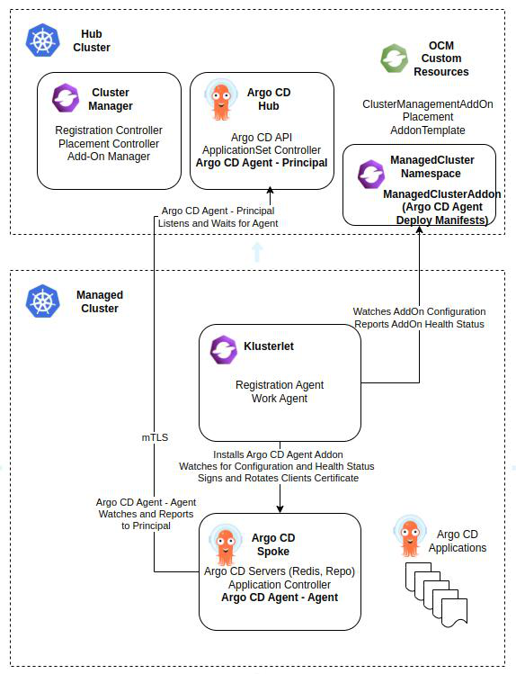

# Open Cluster Management (OCM)

## Overview

[Open Cluster Management (OCM)](https://open-cluster-management.io/) is a robust, modular,
and extensible platform for orchestrating multiple Kubernetes clusters.
It features an addon framework that allows other projects to develop extensions for managing clusters in custom scenarios.

Users of OCM can install and manage the *argocd-agent* as an OCM add-on.

## Benefits of Using the OCM *argocd-agent* Add-On

- **Centralized Deployment**  
With OCM spoke clusters registered to the OCM hub,
you can deploy the *argocd-agent* across all spoke clusters from a single, centralized hub.
Newly registered spoke clusters may also automatically receive the *argocd-agent*, eliminating manual deployments.

- **Advanced Placement and Rollout**  
Leverage the OCM [Placement API](https://open-cluster-management.io/docs/concepts/placement/)
for advanced placement strategies and controlled rollouts of the *argocd-agent* to spoke clusters.

- **Centralized Lifecycle Management & Maintenance**  
Manage the entire lifecycle of *argocd-agent* instances from the hub cluster.
Easily handle upgrades, rollbacks, and revoke access to compromised or malicious agents.

- **Fleet-wide Health Visibility**  
Gain centralized, real-time insights into the health and status of *argocd-agent* instances across your entire cluster fleet.

- **Secure Communication**  
Leverage the OCM Add-On [Custom Signer](https://open-cluster-management.io/docs/concepts/addon/#custom-signers)
registration type to automatically sign and manage *argocd-agent* client certificates on spoke clusters,
ensuring mTLS-secured connections.
The framework also handles automatic certificate rotation to prevent downtime from expired certificates.

- **Flexible Configuration**  
Customize the *argocd-agent* deployment with the OCM
[AddOnTemplate](https://open-cluster-management.io/docs/developer-guides/addon/#build-an-addon-with-addon-template).
This allows for custom template based modifications and deployments.

## Architecture

The following diagram shows a very simplified overview of OCM with *argocd-agent* add-on's architecture.
In this particular example, there is one managed cluster connected to a single hub cluster.

- **ClusterManagementAddOn**  
This resource registers the *argocd-agent* as an OCM add-on at the hub level.
It references the *argocd-agent* `AddOnTemplate` which specifies how the add-on is actually deployed.
It also references the `Placement`, telling OCM to install the *argocd-agent* add-on on all clusters matched by that Placement.

- **AddOnTemplate**  
This resource describes how the *argocd-agent* add-on is actually installed and configured on each target cluster.
It contains the *argocd-agent* deployment manifests.
It uses the `CustomSigner` registration type to automatically sign and manage *argocd-agent* client certificates on spoke clusters.
   
- **Placement**  
This resource specific scheduling rules for the *argocd-agent* add-on.
By tying this Placement to the *argocd-agent* `ClusterManagementAddOn`,
it instructs OCM to install the *argocd-agent* matched by that Placement.

## Setup

If you want to use OCM to bootstrap the *argocd-agent* environment, follow the guide provided
[here](https://github.com/open-cluster-management-io/ocm/tree/main/solutions/argocd-agent).
