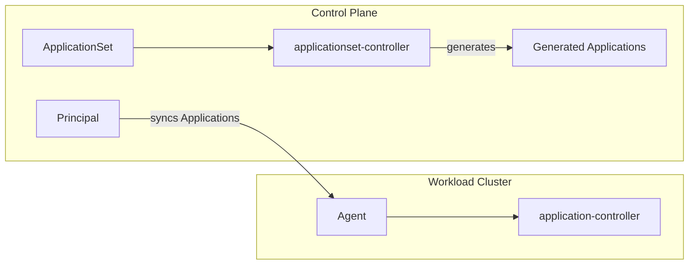

# ApplicationSets

## Overview

ApplicationSets work with argocd-agent by generating Applications that are synced through the normal agent protocol. The `argocd-applicationset-controller` can run on the control plane (for managed agents) or on workload clusters (for autonomous agents). In both cases, only the resulting `Application` resources are synced between principal and agent -- `ApplicationSet` resources themselves are never synced.



## Managed Mode: ApplicationSets on the Control Plane

In managed mode, run the `argocd-applicationset-controller` on the control plane cluster alongside the other Argo CD control plane components. The controller generates `Application` resources, which the principal then routes to the appropriate agents.

### Destination-based routing

With [destination-based mapping](../concepts/agent-mapping.md#destination-based-mapping) enabled, the principal routes each generated Application to an agent based on the Application's `spec.destination.name` field. This is the recommended approach for ApplicationSets because it allows a single ApplicationSet to target multiple agents.

For example, a cluster generator can produce one Application per registered agent, each with a different `destination.name`. The principal routes each Application to the matching agent automatically.

```yaml
apiVersion: argoproj.io/v1alpha1
kind: ApplicationSet
metadata:
  name: guestbook
  namespace: argocd
spec:
  generators:
    - list:
        elements:
          - cluster: agent-staging
          - cluster: agent-prod
  template:
    metadata:
      name: 'guestbook-{{cluster}}'
    spec:
      project: default
      source:
        repoURL: https://github.com/argoproj/argocd-example-apps
        path: guestbook
        targetRevision: HEAD
      destination:
        name: '{{cluster}}'
        namespace: guestbook
```

### Namespace-based routing

With namespace-based mapping (the default), ApplicationSets can still be used but each generated Application must be placed in the namespace that matches the target agent. This limits each ApplicationSet to targeting a single agent unless combined with additional namespace logic.

### Configuration

1. Deploy the `argocd-applicationset-controller` on the control plane cluster.
2. Enable [destination-based mapping](../concepts/agent-mapping.md#destination-based-mapping) on both the principal and agents for multi-agent ApplicationSets.
3. Ensure AppProjects have the appropriate `sourceNamespaces` configured (see [AppProject Configuration](../concepts/agent-mapping.md#appproject-configuration)).

## Autonomous Mode: ApplicationSets on Workload Clusters

In autonomous mode, run the `argocd-applicationset-controller` on the workload cluster alongside the agent and application controller. The controller generates Applications locally, and the agent syncs them back to the principal for central observability.

Local generators such as list, git, pull request, and matrix work as expected. Generators that require cross-cluster state (e.g., the cluster generator spanning multiple clusters) are limited to the local cluster's perspective.

The [Kind getting-started guide](../getting-started/kubernetes/kind/index.md) includes an optional install step for deploying the applicationset-controller on autonomous agents.

## Limitations

- **ApplicationSet resources are not synced.** Only the `Application` resources generated by an ApplicationSet are synced between principal and agent. The `ApplicationSet` resource itself stays on whichever side created it.
- **No cross-side generators in autonomous mode.** An autonomous agent's applicationset-controller only sees its own cluster, so generators that depend on multi-cluster state (e.g., cluster generator listing all clusters) are scoped to the local cluster.

## Related Documentation

- [Agent Mapping Modes](../concepts/agent-mapping.md) -- destination-based vs. namespace-based routing
- [Managing Applications](applications.md) -- how Applications are synced between principal and agents
- [Agent Modes](../concepts/agent-modes/index.md) -- managed vs. autonomous mode
