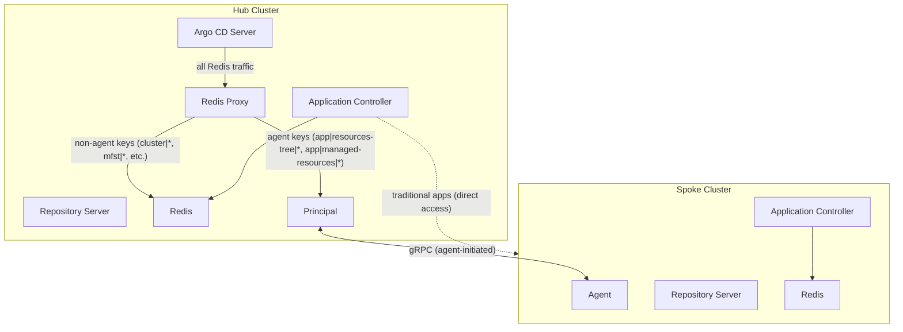

# Hybrid Architecture: Running Agent alongside an existing Argo CD instance

This guide explains how to run argocd-agent (principal + agent) alongside a pre-existing Argo CD installation on the same hub cluster. This enables you to try out argocd-agent without replacing your existing setup, gradually migrate applications, or run both architectures long-term. This document assumes the agent is running in [managed mode](../concepts/agent-mapping.md) with [destination-based mapping](../concepts/agent-mapping.md#destination-based-mapping).

!!! tip "Who is this for?"
    This guide is for teams that already have a working Argo CD installation managing applications and want to adopt argocd-agent incrementally. If you are setting up argocd-agent from scratch, see the [Getting Started](../getting-started/index.md) guide instead.

## Overview

In a hybrid architecture, the traditional Argo CD components (server, application controller, repository server, Redis) continue to operate on the hub cluster. The argocd-agent principal is installed alongside them. Both systems share the same Argo CD UI and API, but each manages a distinct set of applications:

- **Traditional apps**: managed by the Argo CD application controller on the hub, deployed to spokes via direct cluster access
- **Agent apps**: managed by the principal, deployed to spokes via the agent pull model

The two systems coexist through isolation mechanisms on both sides: label selectors on the principal and agent, the `skip-reconcile` annotation on agent cluster secrets, and the `ignore-unmanaged-apps` flag as an additional safety net.

## Architecture



**Hub cluster** runs all existing Argo CD components unchanged, plus the principal and its Redis proxy. The Argo CD server is reconfigured to talk to the Redis proxy instead of Redis directly. The proxy transparently routes traffic: traditional app data goes to the Redis on the hub cluster, agent app data is forwarded to the appropriate agent via the principal.

**Spoke cluster** runs the agent, a local Argo CD application controller, repository server, and Redis. The agent initiates a gRPC connection to the principal. The local application controller reconciles applications that the principal pushes to the spoke.

## How Isolation Works

The following mechanisms prevent conflicts between the traditional setup and the agent setup. The principal/agent label selector and `skip-reconcile` annotation are required for a correct hybrid setup. The `ignore-unmanaged-apps` flag is an optional but recommended defense-in-depth measure.

### Label Selector

**Configure this in all hybrid setups.** The principal and agent are configured with a label selector. They only watch and process Kubernetes resources (Applications, AppProjects, Repositories) that carry the matching label. Apply the matching label to every Application, AppProject, and Repository secret you want the agent to manage. Resources without the label remain invisible to both the principal and the agent, so the existing Argo CD application controller continues to process them without interference.

```yaml
# Principal configuration (argocd-agent-params ConfigMap)
principal.label-selector: "argocd-agent=true"

# Agent configuration (argocd-agent-params ConfigMap on spoke)
agent.label-selector: "argocd-agent=true"
```

!!! note "Label selector value"
    Any valid Kubernetes label selector can be used. The value must be consistent between the principal and agent configurations. `argocd-agent=true` is used throughout this guide, but you can choose any key/value that fits your labeling conventions.

The label selector is combined with a built-in exclusion of resources labeled `argocd-agent.argoproj-labs.io/ignore-sync=true`, using Kubernetes label selector AND semantics.

### skip-reconcile Annotation

When you create an agent using `argocd-agentctl agent create`, the resulting cluster secret is stamped with the annotation `argocd.argoproj.io/skip-reconcile: "true"`. This tells the Argo CD application controller on the hub to skip reconciliation for all applications targeting that cluster.

This is the key mechanism that prevents the hub's application controller from interfering with applications that have been migrated to the agent. The agent cluster secret can coexist with a traditional cluster secret for the same physical spoke cluster because they have different names and point to different endpoints (the agent secret points to the resource proxy).

**Required on every agent cluster secret.** This annotation must be present on any cluster secret that points to an agent-managed cluster, to ensure the hub's Argo CD application controller does not reconcile applications targeting that cluster. `argocd-agentctl agent create` applies it automatically. If you create cluster secrets by other means (e.g. manually or via GitOps), add the annotation explicitly.

!!! warning "Requires Argo CD v3.4+"
    The `skip-reconcile` annotation is only supported in Argo CD v3.4 and later. On older versions, the Argo CD application controller on the hub will still attempt to reconcile applications targeting agent clusters, which will cause conflicts.

### Agent Label Selector

The agent also supports a label selector (`agent.label-selector`), which filters resources at the Kubernetes API level on the spoke cluster. When configured, the agent's informers only list and watch Applications, AppProjects, and Repository secrets that match the selector. Pre-existing apps on the spoke that lack the label are invisible to the agent.

```yaml
# Agent configuration (argocd-agent-params ConfigMap on spoke)
agent.label-selector: "argocd-agent=true"
```

When the principal pushes an application to the spoke, it preserves the application's existing labels. Since only labeled apps are picked up by the principal in the first place, the spoke-side label selector naturally ensures the agent only processes apps that came through the principal.

**Configure this in all hybrid setups.** Set it to the same value as the principal's label selector. Without it, pre-existing spoke applications would be visible to the agent, which could cause spurious status events or conflicts with applications the agent did not create.

### ignore-unmanaged-apps (Additional Safety Net)

The `ignore-unmanaged-apps` flag tells the agent to skip any application that lacks the `argocd.argoproj.io/source-uid` annotation, which is automatically set by the agent when it creates an application locally on the spoke.

This flag is passed via the `--ignore-unmanaged-apps` CLI flag or the `ARGOCD_AGENT_IGNORE_UNMANAGED_APPS` environment variable on the agent Deployment:

```yaml
# Add to the agent Deployment's container env
- name: ARGOCD_AGENT_IGNORE_UNMANAGED_APPS
  value: "true"
```

Enable this in hybrid setups where the spoke has pre-existing applications — it prevents the agent from picking up apps that coincidentally carry the agent label but were not created by the agent. Although harmless, this flag may not be required for spoke clusters with no pre-existing apps.

## Prerequisites

Before setting up the hybrid architecture, ensure:

- **Argo CD v3.4+** is installed on the hub cluster (required for `skip-reconcile`)
- The hub cluster has a working Argo CD installation with server, application controller, repository server, and Redis
- Spoke clusters are network-accessible from the hub (for the traditional setup) and can initiate outbound connections to the hub (for the agent setup)
- You have `argocd-agentctl` installed for PKI management and agent creation

## Setup Guide

### Step 1: Install the Principal

Deploy the principal on the hub cluster alongside the existing Argo CD installation. Configure the label selector to ensure the principal only watches resources you explicitly label.

```yaml
# argocd-agent-params ConfigMap
apiVersion: v1
kind: ConfigMap
metadata:
  name: argocd-agent-params
  namespace: argocd
data:
  principal.label-selector: "argocd-agent=true"
  principal.destination-based-mapping: "true"
  # (...)
```

!!! note "Destination-based mapping"
    Enabling destination-based mapping is strongly recommended for hybrid setups. It allows applications to reside in any namespace on the hub and routes to agents based on `spec.destination.name` rather than the application's namespace. This means your existing applications can stay in their current namespaces during migration. Without it, users would have to move applications to the corresponding agent namespaces, making the migration more disruptive. See [destination-based mapping](../concepts/agent-mapping.md#destination-based-mapping) for more details.

### Step 2: Point the Argo CD Server to the Redis Proxy

The Redis proxy is a component of the principal that intercepts Redis traffic from the Argo CD server. It routes agent-related keys (resource trees, managed resources) to the correct agent and forwards everything else to the Redis on the hub cluster.

Update the Argo CD configuration to use the Redis proxy:

```bash
kubectl patch configmap argocd-cmd-params-cm -n argocd --type merge \
  -p '{"data":{"redis.server":"argocd-agent-redis-proxy:6379"}}'
```

After patching, restart the Argo CD server to pick up the change:

```bash
kubectl rollout restart deployment argocd-server -n argocd
```

!!! important
    This step is critical. Without it, the Argo CD UI cannot display resource trees or managed resources for agent-managed applications. The Redis proxy is transparent for traditional apps: their data continues to flow through to the Redis on the hub cluster.

### Step 3: Create the Agent

Use `argocd-agentctl` to create the agent on the hub. This creates a cluster secret with the `skip-reconcile` annotation and TLS credentials for the agent.

```bash
argocd-agentctl agent create agent-spoke-1 \
  --namespace argocd
  # (...) additional parameters required here
```

This creates:

- A Kubernetes secret named `cluster-agent-spoke-1` in the `argocd` namespace
- The secret has the annotation `argocd.argoproj.io/skip-reconcile: "true"` which tells the hub's application controller to skip reconciliation for all applications targeting that cluster
- The cluster's `server` URL points to the principal's resource proxy ensuring Argo CD has visibility (via agent) into spoke cluster resources
- TLS client credentials for the agent to authenticate with the principal

You can verify the secret:

```bash
kubectl get secret cluster-agent-spoke-1 -n argocd \
  -o jsonpath='{.metadata.annotations.argocd\.argoproj\.io/skip-reconcile}'
# Output: true
```

### Step 4: Install the Agent on the Spoke

Deploy the agent, Argo CD application controller, repository server, and Redis on the spoke cluster. Configure the agent to connect to the principal and enable the same label selector and mapping mode.

```yaml
# argocd-agent-params ConfigMap on the spoke cluster
apiVersion: v1
kind: ConfigMap
metadata:
  name: argocd-agent-params
  namespace: argocd
data:
  agent.destination-based-mapping: "true"
  agent.create-namespace: "true"
  agent.allowed-namespaces: "*"
  agent.label-selector: "argocd-agent=true"
  # (...)
```

### Step 5: Verify Connectivity

Check that the agent has connected to the principal:

```bash
# On the hub, check principal logs for the agent connection event.
kubectl logs deployment/argocd-agent-principal -n argocd | grep "An agent connected to the subscription stream"

# On the spoke, confirm the agent has opened the event stream to the principal.
kubectl logs deployment/argocd-agent-agent -n argocd | grep "Starting to receive events from event stream"
```

Verify that existing applications are unaffected:

```bash
# Traditional apps should still be Synced/Healthy
argocd app list
```

## Migrating Applications

Migration in this context means moving responsibility for an Application from the hub's Argo CD application controller (push-based) to the spoke's local application controller, managed via the agent's pull-based model. Once the hybrid setup is running, you can migrate applications from the traditional setup to the agent-based setup, one application at a time. This allows you to validate each application is synced and healthy via the agent before proceeding to the next.

### Step 1: Sync the AppProject to the spoke cluster

Before migrating Applications, the AppProjects referenced by these Applications needs to be synced to the spoke cluster. Update the AppProject on the hub cluster to include the agent name in the project's `.spec.destinations` and `sourceNamespaces` fields. Then add the label (e.g. `argocd-agent=true`) that matches the principal's label selector. See the [AppProjects](appprojects.md) page for full details on how AppProjects are managed and distributed to agents.

```yaml
apiVersion: argoproj.io/v1alpha1
kind: AppProject
metadata:
  name: my-project
  namespace: argocd
  labels:
    argocd-agent: "true"    # Matches the principal's label selector
spec:
  sourceNamespaces:
    - "agent-spoke-1"  # Must match agent name
  destinations:
    - namespace: '*'
      name: agent-spoke-1   # Must match agent name
  sourceRepos:
    - '*'
```

### Step 2: Sync the Repository Secrets to the spoke cluster

If your application uses private repositories, ensure the repository secret is project-scoped and labeled. Only project-scoped repository secrets are distributed to agents. See the [Repository](repository.md) page for full details on how repository secrets are managed and distributed to agents.

```yaml
apiVersion: v1
kind: Secret
metadata:
  name: my-private-repo
  namespace: argocd
  labels:
    argocd.argoproj.io/secret-type: repository
type: Opaque
stringData:
  type: git
  url: https://github.com/myorg/backend-services.git
  project: my-project  # Associates with AppProject above
  #(...)
```

```bash
kubectl label secret my-private-repo -n argocd argocd-agent=true
```

### Step 3: Migrate the Application

Migration involves two changes to the Application: updating the destination (.spec.destination's name field) to point to the agent cluster, and adding the shared selector label (in our case argocd-agent=true).

**Update the destination** to point to the agent cluster name. Since the agent cluster secret has `skip-reconcile`, the hub's Argo CD application controller will stop reconciling this application:

```bash
kubectl patch application my-app -n argocd --type merge \
  -p '{"spec":{"destination":{"name":"agent-spoke-1"}}}'
```

**Add the shared selector label** (in our case `argocd-agent=true`) so the principal picks up the application:

```bash
kubectl label application my-app -n argocd argocd-agent=true
```

The principal will now sync this application to the spoke agent. The spoke's local Argo CD application controller will reconcile it and deploy the resources.

### Step 4: Verify

```bash
# Check app status in the UI or CLI
argocd app get my-app

# Verify the resource tree loads in the UI (goes through Redis proxy -> agent)
# Verify the app shows Synced/Healthy
```

## How the UI Works in Hybrid Mode

The Argo CD UI works seamlessly for both traditional and agent-managed applications. All applications appear in the same UI, and users interact with them the same way. See [Live Resources](../user-guide/live-resources.md) for more details around how Argo CD UI displays resources from the spoke cluster.

## Other Topologies

While this guide focuses on the most common single-hub, multi-spoke topology, the hybrid approach applies to other patterns as well.

### Dual-Instance (Config vs Apps)

Some teams run two Argo CD instances: one for cluster configuration and one for applications, to segregate roles. With the agent architecture, this separation happens naturally:

- Cluster configuration can remain with the hub Argo CD instance
- Application delivery moves to agents on the spoke clusters

The agent architecture eliminates the need for a second Argo CD instance purely for role separation.

### Hub-Per-Environment

Teams that run separate Argo CD instances per environment (dev, staging, production) can consolidate to a single principal serving agents across all environments. Each environment gets its own agent, and AppProjects control which applications can target which agents.

### ApplicationSet-Centric

If you rely heavily on ApplicationSets for fleet management:

- The ApplicationSet controller stays on the hub cluster
- Generated Application CRs follow the normal migration flow (label + destination change)
- The ApplicationSet CR itself is **not** synced to agents; only the generated Applications are

This means you can continue using cluster generators, Git generators, and other ApplicationSet features. The generated applications are picked up by the principal when they match the label selector.

!!! note
    ApplicationSets work best with destination-based mapping, as one ApplicationSet can target multiple agents by varying `spec.destination.name` across generated applications.

## Known Issues and Limitations

### skip-reconcile Requires Argo CD v3.4+

The `argocd.argoproj.io/skip-reconcile` annotation is only supported in Argo CD v3.4 and later. On older versions, the hub's application controller will still attempt to reconcile applications targeting agent clusters, leading to conflicts.

## Validation Checklist

After setting up the hybrid architecture, verify the following:

### Infrastructure

- [ ] Principal is running and logs show the configured label selector
- [ ] Agent is connected to the principal (check principal logs)
- [ ] Redis proxy is running (the `argocd-agent-redis-proxy` service has endpoints)
- [ ] `argocd-cmd-params-cm` has `redis.server` pointing to the Redis proxy
- [ ] Agent cluster secrets have `argocd.argoproj.io/skip-reconcile: "true"`
- [ ] Traditional cluster secrets do NOT have `skip-reconcile`

### Traditional Apps

- [ ] Existing apps without the label (e.g. `argocd-agent=true`) continue to sync normally
- [ ] The principal logs show NO activity for unlabeled apps
- [ ] Resource tree loads in the UI for traditional apps

### Agent Apps

- [ ] Labeled apps are picked up by the principal
- [ ] Apps are synced to the spoke and show Synced/Healthy
- [ ] Resource tree loads in the UI for agent apps
- [ ] Pod logs are accessible through the UI
- [ ] The hub's application controller does NOT reconcile agent apps

### Coexistence

- [ ] Both traditional and agent apps can be synced simultaneously without interference
- [ ] Modifying a traditional app does not affect agent apps, and vice versa
