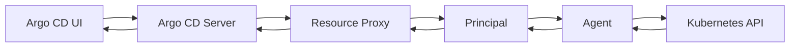

# Live Resources

This document explains the live resources functionality in argocd-agent, which allows users to view and interact with Kubernetes resources on agent clusters directly from the principal (control plane) through the Argo CD UI.

## Overview

The resource proxy is a core feature of argocd-agent that enables transparent access to live resources on agent clusters. When users view resources in the Argo CD UI, requests are automatically proxied through the principal to the appropriate agent, allowing seamless resource inspection without direct network connectivity to the workload clusters.

**Key Benefits:**

- **Seamless Integration**: Works automatically with standard Argo CD UI once RBAC is configured
- **Security**: All communication is authenticated using mTLS and goes through the established agent connection
- **Transparency**: Users interact with resources exactly as they would in a standard Argo CD installation
- **Performance**: Efficient proxying with request timeouts and proper error handling

**⚠️ Important**: By default, agents have minimal RBAC permissions. For the resource proxy to work with your application resources, **enhanced RBAC permissions are required**. See the [RBAC Requirements](#rbac-requirements) section for details.

## How It Works

The resource proxy operates as an HTTP proxy server that:

1. **Intercepts** Kubernetes API requests from the Argo CD server
2. **Authenticates** the request using client certificates (agent name in certificate subject)
3. **Routes** the request to the appropriate connected agent via the event queue
4. **Forwards** the response back to the Argo CD server



## Configuration

### Principal Configuration

The resource proxy is **enabled by default** on the principal and requires no additional configuration. It listens on port `9090` by default.

#### Environment Variables

| Variable | Default | Description |
|----------|---------|-------------|
| `ARGOCD_PRINCIPAL_ENABLE_RESOURCE_PROXY` | `true` | Enable/disable the resource proxy |
| `ARGOCD_PRINCIPAL_RESOURCE_PROXY_*` | Various | TLS configuration options |

#### Command Line Options

The principal supports several options for resource proxy configuration:

```bash
# Disable resource proxy
argocd-agent principal --enable-resource-proxy=false

# Configure TLS certificates (handled automatically in most cases)
argocd-agent principal \
  --resource-proxy-cert-path=/path/to/cert.pem \
  --resource-proxy-key-path=/path/to/key.pem \
  --resource-proxy-ca-path=/path/to/ca.pem
```

### Agent Configuration

**No additional configuration is required on the agent side.** The agent automatically processes resource requests received from the principal through the standard event queue mechanism.

## RBAC Requirements

**IMPORTANT**: By default, agents are installed with minimal RBAC permissions that only allow access to Argo CD's own resources (Applications, AppProjects, etc.) and basic resources like Secrets and ConfigMaps. For the resource proxy to work correctly with live application resources, **agents need enhanced RBAC permissions**.

### Default Agent Permissions

The default agent installation includes these limited permissions:

```yaml
# ClusterRole permissions (cluster-wide)
- apiGroups: [""]
  resources: ["namespaces"]
  verbs: ["list", "watch"]

# Role permissions (namespace-scoped)
- apiGroups: ["argoproj.io"]
  resources: ["applications", "appprojects", "applicationsets"]
  verbs: ["create", "get", "list", "watch", "update", "delete", "patch"]
- apiGroups: [""]
  resources: ["secrets", "configmaps"]
  verbs: ["create", "get", "list", "watch", "update", "patch", "delete"]
- apiGroups: [""]
  resources: ["events"]
  verbs: ["create", "list"]
```

### Enhanced RBAC for Resource Proxy

To enable full resource proxy functionality, agents need permissions to access the Kubernetes resources managed by your Argo CD applications. The specific permissions required depend on what resource types your applications deploy.

#### Common Application Resources

For applications that deploy standard Kubernetes workloads, add these permissions:

```yaml
apiVersion: rbac.authorization.k8s.io/v1
kind: ClusterRole
metadata:
  name: argocd-agent-enhanced
rules:
# Core Kubernetes resources
- apiGroups: [""]
  resources: 
    - pods
    - services
    - endpoints
    - persistentvolumeclaims
    - configmaps
    - secrets
    - serviceaccounts
    - namespaces
  verbs: ["get", "list", "watch", "create", "update", "patch", "delete"]

# Apps resources
- apiGroups: ["apps"]
  resources:
    - deployments
    - replicasets
    - statefulsets
    - daemonsets
  verbs: ["get", "list", "watch", "create", "update", "patch", "delete"]

# Networking resources
- apiGroups: ["networking.k8s.io"]
  resources:
    - ingresses
    - networkpolicies
  verbs: ["get", "list", "watch", "create", "update", "patch", "delete"]

# RBAC resources
- apiGroups: ["rbac.authorization.k8s.io"]
  resources:
    - roles
    - rolebindings
    - clusterroles
    - clusterrolebindings
  verbs: ["get", "list", "watch", "create", "update", "patch", "delete"]

# Argo CD resources
- apiGroups: ["argoproj.io"]
  resources: ["*"]
  verbs: ["*"]

# API discovery (required for resource proxy)
- apiGroups: [""]
  resources: ["*"]
  verbs: ["get", "list"]
- apiGroups: ["*"]
  resources: ["*"]
  verbs: ["get", "list"]
```

#### Application-Specific Resources

For applications using custom resources or specific APIs, add permissions for those resources:

```yaml
# Example: For applications using cert-manager
- apiGroups: ["cert-manager.io"]
  resources: ["certificates", "issuers", "clusterissuers"]
  verbs: ["get", "list", "watch", "create", "update", "patch", "delete"]

# Example: For applications using Istio
- apiGroups: ["networking.istio.io"]
  resources: ["virtualservices", "destinationrules", "gateways"]
  verbs: ["get", "list", "watch", "create", "update", "patch", "delete"]

# Example: For applications using monitoring stack
- apiGroups: ["monitoring.coreos.com"]
  resources: ["servicemonitors", "prometheusrules"]
  verbs: ["get", "list", "watch", "create", "update", "patch", "delete"]
```

### Applying Enhanced RBAC

To apply enhanced RBAC permissions to your agent:

1. **Create Enhanced ClusterRole:**
```bash
kubectl apply -f - <<EOF
apiVersion: rbac.authorization.k8s.io/v1
kind: ClusterRole
metadata:
  name: argocd-agent-enhanced
rules:
# Add rules from examples above
EOF
```

2. **Update ClusterRoleBinding:**
```bash
kubectl patch clusterrolebinding argocd-agent-agent \
  --type='merge' \
  -p='{"roleRef":{"name":"argocd-agent-enhanced"}}'
```

Or create a new binding:
```bash
kubectl apply -f - <<EOF
apiVersion: rbac.authorization.k8s.io/v1
kind: ClusterRoleBinding
metadata:
  name: argocd-agent-enhanced
roleRef:
  apiGroup: rbac.authorization.k8s.io
  kind: ClusterRole
  name: argocd-agent-enhanced
subjects:
- kind: ServiceAccount
  name: argocd-agent-agent
  namespace: default  # Replace with your agent namespace
EOF
```

### Security Considerations for Enhanced RBAC

While enhanced RBAC enables full resource proxy functionality, consider these security implications:

- **Principle of Least Privilege**: Only grant permissions for resources your applications actually use
- **Namespace Isolation**: Consider using Role/RoleBinding instead of ClusterRole/ClusterRoleBinding to limit access to specific namespaces
- **Resource Filtering**: The agent only exposes resources with Argo CD tracking labels/annotations, providing additional security
- **Regular Audits**: Periodically review and update RBAC permissions as applications change

### Namespace-Scoped Alternative

For environments requiring stricter security, you can use namespace-scoped permissions:

```yaml
apiVersion: rbac.authorization.k8s.io/v1
kind: Role
metadata:
  name: argocd-agent-enhanced
  namespace: my-app-namespace
rules:
# Same rules as ClusterRole but applied per namespace
- apiGroups: [""]
  resources: ["pods", "services", "configmaps", "secrets"]
  verbs: ["get", "list", "watch", "create", "update", "patch", "delete"]
# ... other rules
---
apiVersion: rbac.authorization.k8s.io/v1
kind: RoleBinding
metadata:
  name: argocd-agent-enhanced
  namespace: my-app-namespace
roleRef:
  apiGroup: rbac.authorization.k8s.io
  kind: Role
  name: argocd-agent-enhanced
subjects:
- kind: ServiceAccount
  name: argocd-agent-agent
  namespace: default  # Agent's namespace
```

## Supported Operations

The resource proxy supports the following Kubernetes API operations:

### Read Operations
- **GET** - Retrieve individual resources or resource lists
- **API Discovery** - List available APIs and resource types

### Write Operations
- **POST** - Create new resources
- **PATCH** - Update existing resources  
- **DELETE** - Remove resources

### Resource Actions
- **Custom Actions** - Execute custom resource actions defined in Argo CD
- **Sync Operations** - Trigger application syncs
- **Refresh Operations** - Refresh application state

## Security and Access Control

### Authentication
- **mTLS Required**: All requests must include valid client certificates
- **Agent Identity**: The agent name is extracted from the certificate subject
- **Certificate Validation**: Certificates are validated against the configured CA

### Authorization
- **Managed Resources Only**: Only resources managed by Argo CD applications are accessible
- **Agent Isolation**: Each agent can only access its own resources
- **Connection Dependency**: Requests fail if the target agent is not connected

### Resource Filtering

The agent applies strict filtering to ensure only managed resources are accessible:

```go
// Example: Only resources with Argo CD annotations/labels are returned
func isResourceManaged(resource *unstructured.Unstructured) bool {
    // Check for Argo CD application annotations
    // Validate resource ownership
    // Return true only if managed by Argo CD
}
```

## Using Live Resources

### Viewing Resources in Argo CD UI

1. **Navigate to Application**: Open any application in the Argo CD UI
2. **View Resource Tree**: Click on any resource in the application tree
3. **Live State**: The resource details are automatically fetched from the agent cluster
4. **Real-time Updates**: Resource state reflects the current state on the agent

### Accessing Resource Details

Live resources support all standard Argo CD resource operations:

#### Resource Manifest
```yaml
# View the live manifest of any resource
# Available through the "Live Manifest" tab in the UI
apiVersion: apps/v1
kind: Deployment
metadata:
  name: my-app
  namespace: default
# ... rest of manifest
```

#### Resource Events
```bash
# Events are automatically fetched from the agent cluster
Normal   Created    Pod    Successfully created
Warning  Failed     Pod    Failed to pull image
```

#### Resource Logs
```bash
# Container logs are streamed from the agent cluster
2024-01-15 10:30:00 INFO  Application started
2024-01-15 10:30:01 INFO  Listening on port 8080
```

### Resource Actions

Custom resource actions defined in the `argocd-cm` ConfigMap work seamlessly:

```yaml
# Example: Custom action in argocd-cm
apiVersion: v1
kind: ConfigMap
metadata:
  name: argocd-cm
data:
  resource.customizations.actions.apps_Deployment: |
    discovery.lua: |
      actions = {}
      actions["restart"] = {["disabled"] = false}
      return actions
    definitions:
    - name: restart
      action.lua: |
        local os = require("os")
        obj.spec.template.metadata.annotations["kubectl.kubernetes.io/restartedAt"] = os.date("!%Y-%m-%dT%H:%M:%SZ")
        return obj
```

## Limitations and Considerations

### Performance
- **Request Timeout**: Default 10-second timeout for all resource requests
- **Connection Dependency**: Requests fail immediately if agent is disconnected
- **Resource Scope**: Limited to resources managed by Argo CD applications

### Network Requirements
- **No Direct Connectivity**: No direct network access to agent clusters required
- **Proxy Dependency**: All requests go through the principal's resource proxy
- **TLS Termination**: Requires proper TLS configuration on the principal

### Security Considerations
- **Certificate Management**: Proper certificate lifecycle management is critical
- **Access Control**: Only managed resources are accessible - no cluster-wide access
- **Audit Logging**: All resource access is logged through the principal

## Troubleshooting

### Common Issues

#### Agent Not Connected
```
Status: 502 Bad Gateway
Error: Agent is not connected, stop proxying
```
**Solution**: Ensure the agent is connected to the principal and check agent logs.

#### Certificate Issues
```
Status: 400 Bad Request
Error: no authorization found
```
**Solution**: Verify client certificate configuration in the cluster secret.

#### Resource Not Found
```
Status: 404 Not Found
Error: resource not managed by app
```
**Solution**: Ensure the resource is managed by an Argo CD application.

#### Timeout Errors
```
Status: 504 Gateway Timeout
Error: Timeout communicating to the agent
```
**Solution**: Check agent connectivity and resource availability.

#### RBAC Permission Denied
```
Status: 403 Forbidden
Error: deployments.apps is forbidden: User "system:serviceaccount:default:argocd-agent-agent" cannot get resource "deployments" in API group "apps"
```
**Solution**: The agent lacks the necessary RBAC permissions to access the requested resource. 

1. **Identify Missing Permissions**: Check the error message to identify which resource and verb are missing
2. **Update Agent RBAC**: Add the required permissions to the agent's ClusterRole or Role
3. **Apply Enhanced RBAC**: Use the enhanced RBAC examples provided in the [RBAC Requirements](#rbac-requirements) section

```bash
# Quick fix: Grant broad permissions (use with caution)
kubectl create clusterrole argocd-agent-enhanced --verb=get,list,watch,create,update,patch,delete --resource=*.*
kubectl patch clusterrolebinding argocd-agent-agent --type='merge' -p='{"roleRef":{"name":"argocd-agent-enhanced"}}'

# Restart agent pod to pick up new permissions
kubectl rollout restart deployment/argocd-agent-agent
```

#### Resource Not Found vs Permission Denied
The agent returns different error codes based on the issue:
- **404 Not Found**: Resource exists but is not managed by Argo CD
- **403 Forbidden**: Agent lacks RBAC permissions to access the resource  
- **500 Internal Server Error**: Agent has permissions but Kubernetes API call failed

**Solution**: Check both RBAC permissions and whether the resource has Argo CD tracking labels/annotations.

### Debugging

#### Check Principal Logs
```bash
# View resource proxy logs
kubectl logs -n argocd deployment/argocd-agent-principal | grep "resource"
```

#### Check Agent Logs
```bash
# View agent resource processing logs
kubectl logs -n argocd deployment/argocd-agent | grep "processIncomingResourceRequest"
```

#### Test Resource Proxy
```bash
# Test direct access to resource proxy (if accessible)
curl -k --cert client.crt --key client.key \
  https://principal-address:9090/api/v1/namespaces/default/pods
```

## Best Practices

### Certificate Management
- Use automated certificate rotation
- Monitor certificate expiration
- Implement proper CA management

### Monitoring
- Monitor resource proxy request latency
- Track agent connectivity status
- Alert on resource access failures

### Security
- Regularly audit resource access patterns
- Implement network policies for additional security
- Use dedicated service accounts with minimal permissions

### RBAC Management
- **Start Minimal**: Begin with default RBAC and add permissions as needed based on application requirements
- **Application-Specific**: Create separate RBAC configurations for different application types or environments
- **Version Control**: Store RBAC configurations in Git and apply them through GitOps workflows
- **Test Permissions**: Verify RBAC changes in non-production environments before applying to production
- **Monitor Access**: Use audit logs to track resource access patterns and identify unused permissions
- **Automated Updates**: Consider using tools to automatically generate RBAC based on application manifests

## Related Documentation

- [Application Synchronization](./applications.md) - How Applications are managed
- [Agent Modes](../concepts/agent-modes/) - Understanding managed vs autonomous modes
- [Architecture](../concepts/architecture.md) - Overall system architecture 