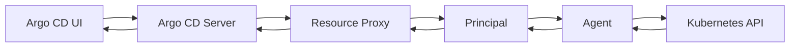

# Live Resources

This document explains the live resources functionality in argocd-agent, which allows users to view and interact with Kubernetes resources on agent clusters directly from the principal (control plane) through the Argo CD UI.

## Overview

The resource proxy is a core feature of argocd-agent that enables transparent access to live resources on agent clusters. When users view resources in the Argo CD UI, requests are automatically proxied through the principal to the appropriate agent, allowing seamless resource inspection without direct network connectivity to the workload clusters.

**Key Benefits:**

- **Seamless Integration**: No additional setup required - works automatically with standard Argo CD UI
- **Security**: All communication is authenticated using mTLS and goes through the established agent connection
- **Transparency**: Users interact with resources exactly as they would in a standard Argo CD installation
- **Performance**: Efficient proxying with request timeouts and proper error handling

## How It Works

The resource proxy operates as an HTTP proxy server that:

1. **Intercepts** Kubernetes API requests from the Argo CD server
2. **Authenticates** the request using client certificates (agent name in certificate subject)
3. **Routes** the request to the appropriate connected agent via the event queue
4. **Forwards** the response back to the Argo CD server



## Configuration

### Principal Configuration

The resource proxy is **enabled by default** on the principal and requires no additional configuration. It listens on port `9090` by default.

#### Environment Variables

| Variable | Default | Description |
|----------|---------|-------------|
| `ARGOCD_PRINCIPAL_ENABLE_RESOURCE_PROXY` | `true` | Enable/disable the resource proxy |
| `ARGOCD_PRINCIPAL_RESOURCE_PROXY_*` | Various | TLS configuration options |

#### Command Line Options

The principal supports several options for resource proxy configuration:

```bash
# Disable resource proxy
argocd-agent principal --enable-resource-proxy=false

# Configure TLS certificates (handled automatically in most cases)
argocd-agent principal \
  --resource-proxy-cert-path=/path/to/cert.pem \
  --resource-proxy-key-path=/path/to/key.pem \
  --resource-proxy-ca-path=/path/to/ca.pem
```

### Agent Configuration

The resource proxy is **enabled by default** on the agent and requires no additional configuration in most cases. However, it can be disabled if live resource access is not needed.

#### Environment Variables

| Variable | Default | Description |
|----------|---------|-------------|
| `ARGOCD_AGENT_ENABLE_RESOURCE_PROXY` | `true` | Enable/disable resource proxy processing on the agent |

#### Command Line Options

```bash
# Disable resource proxy on the agent
argocd-agent agent --enable-resource-proxy=false

# Enable resource proxy (default behavior)
argocd-agent agent --enable-resource-proxy=true
```

**Note**: When disabled, the agent will not process resource requests from the principal, making live resource viewing unavailable for applications on this agent cluster.

## Supported Operations

The resource proxy supports the following Kubernetes API operations:

### Read Operations
- **GET** - Retrieve individual resources or resource lists
- **API Discovery** - List available APIs and resource types

### Write Operations
- **POST** - Create new resources
- **PATCH** - Update existing resources  
- **DELETE** - Remove resources

### Resource Actions
- **Custom Actions** - Execute custom resource actions defined in Argo CD
- **Sync Operations** - Trigger application syncs
- **Refresh Operations** - Refresh application state

## Security and Access Control

### Authentication
- **mTLS Required**: All requests must include valid client certificates
- **Agent Identity**: The agent name is extracted from the certificate subject
- **Certificate Validation**: Certificates are validated against the configured CA

### Authorization
- **Managed Resources Only**: Only resources managed by Argo CD applications are accessible
- **Agent Isolation**: Each agent can only access its own resources
- **Connection Dependency**: Requests fail if the target agent is not connected

### Resource Filtering

The agent applies strict filtering to ensure only managed resources are accessible:

```go
// Example: Only resources with Argo CD annotations/labels are returned
func isResourceManaged(resource *unstructured.Unstructured) bool {
    // Check for Argo CD application annotations
    // Validate resource ownership
    // Return true only if managed by Argo CD
}
```

## Using Live Resources

### Viewing Resources in Argo CD UI

1. **Navigate to Application**: Open any application in the Argo CD UI
2. **View Resource Tree**: Click on any resource in the application tree
3. **Live State**: The resource details are automatically fetched from the agent cluster
4. **Real-time Updates**: Resource state reflects the current state on the agent

### Accessing Resource Details

Live resources support all standard Argo CD resource operations:

#### Resource Manifest
```yaml
# View the live manifest of any resource
# Available through the "Live Manifest" tab in the UI
apiVersion: apps/v1
kind: Deployment
metadata:
  name: my-app
  namespace: default
# ... rest of manifest
```

#### Resource Events
```bash
# Events are automatically fetched from the agent cluster
Normal   Created    Pod    Successfully created
Warning  Failed     Pod    Failed to pull image
```

#### Resource Logs
```bash
# Container logs are streamed from the agent cluster
2024-01-15 10:30:00 INFO  Application started
2024-01-15 10:30:01 INFO  Listening on port 8080
```

### Resource Actions

Custom resource actions defined in the `argocd-cm` ConfigMap work seamlessly:

```yaml
# Example: Custom action in argocd-cm
apiVersion: v1
kind: ConfigMap
metadata:
  name: argocd-cm
data:
  resource.customizations.actions.apps_Deployment: |
    discovery.lua: |
      actions = {}
      actions["restart"] = {["disabled"] = false}
      return actions
    definitions:
    - name: restart
      action.lua: |
        local os = require("os")
        obj.spec.template.metadata.annotations["kubectl.kubernetes.io/restartedAt"] = os.date("!%Y-%m-%dT%H:%M:%SZ")
        return obj
```

## Limitations and Considerations

### Performance
- **Request Timeout**: Default 10-second timeout for all resource requests
- **Connection Dependency**: Requests fail immediately if agent is disconnected
- **Resource Scope**: Limited to resources managed by Argo CD applications

### Network Requirements
- **No Direct Connectivity**: No direct network access to agent clusters required
- **Proxy Dependency**: All requests go through the principal's resource proxy
- **TLS Termination**: Requires proper TLS configuration on the principal

### Security Considerations
- **Certificate Management**: Proper certificate lifecycle management is critical
- **Access Control**: Only managed resources are accessible - no cluster-wide access
- **Audit Logging**: All resource access is logged through the principal

## Troubleshooting

### Common Issues

#### Agent Not Connected
```
Status: 502 Bad Gateway
Error: Agent is not connected, stop proxying
```
**Solution**: Ensure the agent is connected to the principal and check agent logs.

#### Certificate Issues
```
Status: 400 Bad Request
Error: no authorization found
```
**Solution**: Verify client certificate configuration in the cluster secret.

#### Resource Not Found
```
Status: 404 Not Found
Error: resource not managed by app
```
**Solution**: Ensure the resource is managed by an Argo CD application.

#### Timeout Errors
```
Status: 504 Gateway Timeout
Error: Timeout communicating to the agent
```
**Solution**: Check agent connectivity and resource availability.

### Debugging

#### Check Principal Logs
```bash
# View resource proxy logs
kubectl logs -n argocd deployment/argocd-agent-principal | grep "resource"
```

#### Check Agent Logs
```bash
# View agent resource processing logs
kubectl logs -n argocd deployment/argocd-agent | grep "processIncomingResourceRequest"
```

#### Test Resource Proxy
```bash
# Test direct access to resource proxy (if accessible)
curl -k --cert client.crt --key client.key \
  https://principal-address:9090/api/v1/namespaces/default/pods
```

## Best Practices

### Certificate Management
- Use automated certificate rotation
- Monitor certificate expiration
- Implement proper CA management

### Monitoring
- Monitor resource proxy request latency
- Track agent connectivity status
- Alert on resource access failures

### Security
- Regularly audit resource access patterns
- Implement network policies for additional security
- Use dedicated service accounts with minimal permissions

## Related Documentation

- [Agent Configuration](../configuration/agent/configuration.md#resource-proxy-configuration) - Agent resource proxy configuration options
- [Principal Configuration](../configuration/principal/configuration.md#resource-proxy-configuration) - Principal resource proxy configuration options
- [Application Synchronization](./applications.md) - How Applications are managed
- [Agent Modes](../concepts/agent-modes/) - Understanding managed vs autonomous modes
- [Architecture](../concepts/architecture.md) - Overall system architecture 