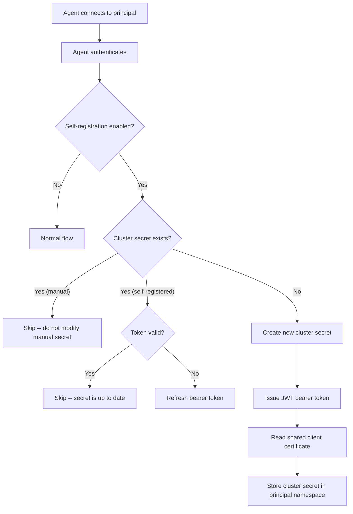

# Agent Self-Registration

!!! warning "Experimental Feature"
    Agent self-registration is an **experimental feature** and may change or be removed in future releases. Use it with caution in production environments.

## Overview

By default, adding an agent to argocd-agent requires an administrator to manually
create a cluster secret on the principal using `argocd-agentctl agent create`
(see [Adding an agent](./adding-agents.md)). This works well for small
deployments, but can become cumbersome when many agents need to be onboarded.

**Agent self-registration** automates the cluster secret creation step. When
enabled, the principal automatically creates an Argo CD cluster secret the first
time an agent connects with valid credentials. No manual `argocd-agentctl agent
create` step is required -- agents only need valid authentication credentials
(e.g., a client certificate) to be onboarded.

## How It Works

When self-registration is enabled, the following happens during agent
authentication:



1. The agent connects to the principal and authenticates using its configured
   method (mTLS, userpass, or header-based).
2. If self-registration is enabled, the principal checks whether a cluster
   secret already exists for this agent.
3. If a **manually created** secret exists (created via `argocd-agentctl`), it
   is left untouched -- manual secrets always take precedence.
4. If a **self-registered** secret exists, the principal validates its JWT
   bearer token. If the token is invalid (e.g., after a signing key rotation),
   it is refreshed automatically.
5. If **no secret exists**, the principal creates a new cluster secret
   containing:
      - A JWT bearer token that identifies the agent to the resource proxy
      - The shared client certificate for mTLS between Argo CD and the resource
        proxy
      - The label `argocd-agent.argoproj-labs.io/self-registered-cluster: "true"`

## Prerequisites

Before enabling self-registration, ensure you have:

- **Principal running** with the [resource proxy enabled](./live-resources.md)
  (`--enable-resource-proxy=true`, which is the default)
- **PKI initialized** -- CA, principal TLS certificate, and resource proxy TLS
  certificate (see [Step 1 in Adding an agent](./adding-agents.md#step-1-setup-pki-one-time))
- **JWT signing key** created (see [JWT key management](../operations/jwt-signing-keys.md))
- **Shared client certificate secret** -- a Kubernetes TLS secret on the
  principal cluster (see [Step 1](#step-1-create-the-shared-client-certificate-secret) below)

## Setup

### Step 1: Create the Shared Client Certificate Secret

Self-registered cluster secrets need a TLS client certificate so that Argo CD
can authenticate to the resource proxy via mTLS. Rather than issuing a unique
certificate per agent, self-registration uses a **shared client certificate**
stored in a Kubernetes secret on the principal cluster.

The secret must contain three keys:

| Key | Description |
|-----|-------------|
| `tls.crt` | Client certificate (PEM) |
| `tls.key` | Client private key (PEM) |
| `ca.crt` | CA certificate that signed the client cert (PEM) |

You can create this secret from existing certificate files:

```bash
kubectl create secret generic argocd-agent-shared-client-cert \
  --from-file=tls.crt=client.crt \
  --from-file=tls.key=client.key \
  --from-file=ca.crt=ca.crt \
  --namespace argocd \
  --context <control-plane-context>
```

!!! important
    The client certificate must be trusted by the resource proxy's CA. If you are
    using the argocd-agent PKI, you can issue a client certificate with
    `argocd-agentctl pki issue agent` and use its `tls.crt` and `tls.key` along
    with the CA's `tls.crt` as `ca.crt`.

### Step 2: Enable Self-Registration on the Principal

Configure the principal with two flags:

```bash
argocd-agent principal \
  --enable-self-cluster-registration \
  --self-registration-client-cert-secret argocd-agent-shared-client-cert \
  ...
```

Or via environment variables:

```bash
ARGOCD_PRINCIPAL_ENABLE_SELF_CLUSTER_REGISTRATION=true
ARGOCD_PRINCIPAL_SELF_REGISTRATION_CLIENT_CERT_SECRET=argocd-agent-shared-client-cert
```

!!! important
    Self-registration requires the resource proxy to be enabled
    (`--enable-resource-proxy=true`). The principal will refuse to start if
    self-registration is enabled without the resource proxy.

### Step 3: Deploy Agents

Deploy agents to your workload clusters as usual (see
[Step 5 in Adding an agent](./adding-agents.md#step-5-deploy-agent-to-workload-cluster)).
The key difference is that you **skip** the manual `argocd-agentctl agent create`
step -- the principal creates the cluster secret automatically when the agent
first connects.

Agents still need valid authentication credentials to connect. For example, with
mTLS authentication, each agent needs its own client certificate issued by the
principal's CA.

### Step 4: Verify

After deploying an agent, verify that the cluster secret was created:

```bash
kubectl get secrets -n argocd --context <control-plane-context> \
  -l argocd-agent.argoproj-labs.io/self-registered-cluster=true
```

You should see a secret named `cluster-<agent-name>` for each self-registered
agent.

Check the principal logs for registration messages:

```
INFO Creating self-registered cluster secret for agent  agent=my-agent
INFO Successfully created self-registered cluster secret with shared client cert and bearer token
```

## Behavior Details

### Manual Secrets Take Precedence

If a cluster secret already exists for an agent and was created manually (via
`argocd-agentctl agent create`), self-registration will **not** modify or
replace it. This allows you to mix manual and self-registered agents in the
same deployment.

### Automatic Token Refresh

Self-registered cluster secrets contain a JWT bearer token for resource proxy
authentication. If the principal's JWT signing key is rotated, existing tokens
become invalid. The principal detects this on the next agent connection and
automatically issues a fresh token, updating the cluster secret in place.

### Labels

Self-registered cluster secrets are distinguished from manually created ones by
the label:

```
argocd-agent.argoproj-labs.io/self-registered-cluster: "true"
```

You can use this label to list or manage self-registered secrets:

```bash
kubectl get secrets -n argocd \
  -l argocd-agent.argoproj-labs.io/self-registered-cluster=true
```

### Resource Proxy Authentication

The resource proxy supports two authentication methods, depending on how the
cluster secret was created:

| Method | Used by | How it works |
|--------|---------|-------------|
| JWT bearer token | Self-registered clusters | Argo CD sends the token in the `Authorization: Bearer` header; the resource proxy validates it and extracts the agent name from the token's subject claim |
| TLS client certificate CN | Manually created clusters | Argo CD authenticates via mTLS; the resource proxy extracts the agent name from the client certificate's Common Name |

Both methods are supported simultaneously. The resource proxy tries JWT bearer
token authentication first, then falls back to client certificate CN extraction.

## Self-Registered vs Manually Created Secrets

| Aspect | Self-registered | Manually created |
|--------|----------------|-----------------|
| **Creation** | Automatic on first agent connection | `argocd-agentctl agent create` |
| **Resource proxy auth** | JWT bearer token | TLS client certificate CN |
| **Client certificate** | Shared across all self-registered agents | Unique per agent |
| **Token management** | Automatic (issued and refreshed by principal) | N/A |
| **Label** | `self-registered-cluster: "true"` | No self-registration label |
| **Modification by principal** | Yes (token refresh) | Never |

## Security Considerations

- **Authentication is still required.** Self-registration does not bypass agent
  authentication. Agents must present valid credentials (e.g., a trusted client
  certificate) to connect. Self-registration only automates the cluster secret
  creation that would otherwise be done manually.

- **Shared client certificate.** All self-registered agents use the same client
  certificate for resource proxy mTLS. This means the certificate does not
  identify individual agents -- agent identity is established via the JWT bearer
  token instead. Protect the shared certificate secret with appropriate RBAC.

- **JWT signing key security.** The JWT signing key is used to issue bearer
  tokens stored in cluster secrets. Protect the `argocd-agent-jwt` secret and
  rotate the key periodically. Token refresh happens automatically on the next
  agent connection after rotation.

- **Any authenticated agent can register.** When self-registration is enabled,
  any agent that can authenticate to the principal will get a cluster secret
  created for it. Ensure your authentication setup (CA trust, credential
  distribution) limits which agents can connect.

## Next Steps

- [Adding an agent](./adding-agents.md) -- manual agent onboarding workflow
- [Live Resources](./live-resources.md) -- resource proxy configuration and usage
- [Configuration Reference: Principal](../configuration/reference/principal.md) -- all principal configuration options
